# 一、高效构建Java应用：Maven入门和进阶

## 目录

-   [一、Maven简介和快速入门](#一Maven简介和快速入门)
    -   [1.1 Maven介绍](#11-Maven介绍)
    -   [1.2 Maven主要作用理解](#12-Maven主要作用理解)
    -   [1.3 Maven安装和配置](#13-Maven安装和配置)
-   [二、基于IDEA的Maven工程创建](#二基于IDEA的Maven工程创建)
    -   [2.1梳理Maven工程GAVP属性](#21梳理Maven工程GAVP属性)
    -   [2.2 Idea构建Maven JavaSE工程](#22-Idea构建Maven-JavaSE工程)
    -   [2.3 Idea构建Maven JavaEE工程](#23-Idea构建Maven-JavaEE工程)
    -   [2.4 Maven工程项目结构说明](#24-Maven工程项目结构说明)
-   [三、Maven核心功能依赖和构建管理](#三Maven核心功能依赖和构建管理)
    -   [3.1 依赖管理和配置](#31-依赖管理和配置)
    -   [3.2依赖传递和冲突](#32依赖传递和冲突)
    -   [3.3 依赖导入失败场景和解决方案](#33-依赖导入失败场景和解决方案)
    -   [3.4 扩展构建管理和插件配置](#34-扩展构建管理和插件配置)
-   [四、Maven继承和聚合特性](#四Maven继承和聚合特性)
    -   [4.1 Maven工程继承关系](#41-Maven工程继承关系)
    -   [4.2 Maven工程聚合关系](#42-Maven工程聚合关系)
-   [五、Maven实战案例：搭建微服务Maven工程架构](#五Maven实战案例搭建微服务Maven工程架构)
    -   [5.1 项目需求和结构分析](#51-项目需求和结构分析)
    -   [5.2项目搭建和统一构建](#52项目搭建和统一构建)
-   [六、Maven核心掌握总结](#六Maven核心掌握总结)

***

## 一、Maven简介和快速入门

### 1.1 Maven介绍

<https://maven.apache.org/what-is-maven.html>

Maven 是一款为 Java 项目构建管理、依赖管理的工具（**软件**），使用 Maven 可以自动化构建、测试、打包和发布项目，大大提高了开发效率和质量。

总结：Maven就是一个软件，掌握软件安装、配置、以及基本功能 **（项目构建、依赖管理）** 使用就是本课程的主要目标！

### 1.2 Maven主要作用理解

1.  场景概念

    **场景1：** 例如我们项目需要第三方库（依赖），如Druid连接池、MySQL数据库驱动和Jackson等。那么我们可以将需要的依赖项的信息编写到Maven工程的配置文件，Maven软件就会自动下载并复制这些依赖项到项目中，也会自动下载依赖需要的依赖！确保依赖版本正确无冲突和依赖完整！

    **场景2：** 项目开发完成后，想要将项目打成.war文件，并部署到服务器中运行，使用Maven软件，我们可以通过一行构建命令（mvn package）快速项目构建和打包！节省大量时间！
2.  **依赖管理：**

    Maven 可以管理项目的依赖，包括自动下载所需依赖库、自动下载依赖需要的依赖并且保证版本没有冲突、依赖版本管理等。通过 Maven，我们可以方便地维护项目所依赖的外部库，而我们仅仅需要编写配置即可。
3.  **构建管理：**

    项目构建是指将源代码、配置文件、资源文件等转化为能够运行或部署的应用程序或库的过程！

    Maven 可以管理项目的编译、测试、打包、部署等构建过程。通过实现标准的构建生命周期，Maven 可以确保每一个构建过程都遵循同样的规则和最佳实践。同时，Maven 的插件机制也使得开发者可以对构建过程进行扩展和定制。主动触发构建，只需要简单的命令操作即可。

    

### 1.3 Maven安装和配置

<https://maven.apache.org/docs/history.html>

选用版本：

[apache-maven-3.6.3-bin.zip](file/apache-maven-3.6.3-bin_GpPYhSuv6k.zip "apache-maven-3.6.3-bin.zip")

| 发布时间                   | maven版本    | jdk最低版本 |
| ---------------------- | ---------- | ------- |
| \*\*2019 - 11 - \*\*25 | **3.6.** 3 | Java 7  |

1.  安装

    **安装条件：** maven需要本机安装java环境、必需包含java\_home环境变量！

    **软件安装：** 右键解压即可（绿色免安装）

    **软件结构：**

    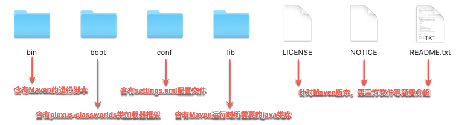
2.  环境变量

    **环境变量：** 配置maven\_home 和 path

    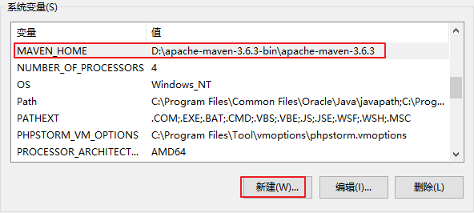

    
3.  命令测试
    ```bash
    mvn -v 
    # 输出版本信息即可，如果错误，请仔细检查环境变量即可！
    # 友好提示，如果此处错误，绝大部分原因都是java_home变量的事，请仔细检查！！
    ```
4.  配置文件
    > 我们需要需改**maven/conf/settings.xml**配置文件，来修改maven的一些默认配置。我们主要休要修改的有三个配置：1.依赖本地缓存位置（本地仓库位置）2.maven下载镜像3.maven选用编译项目的jdk版本！
    1.  配置本地仓库地址
        ```xml
        <!-- localRepository
         | The path to the local repository maven will use to store artifacts.
         |
         | Default: ${user.home}/.m2/repository
        <localRepository>/path/to/local/repo</localRepository>
        -->
        <!-- conf/settings.xml 55行 -->
        <localRepository>D:\repository</localRepository>
        ```
    2.  配置国内阿里镜像
        ```xml
        <!--在mirrors节点(标签)下添加中央仓库镜像 160行附近-->
        <mirror>
            <id>alimaven</id>
            <name>aliyun maven</name>
            <url>http://maven.aliyun.com/nexus/content/groups/public/</url>
            <mirrorOf>central</mirrorOf>
        </mirror>
        ```
    3.  配置jdk17版本项目构建
        ```xml
        <!--在profiles节点(标签)下添加jdk编译版本 268行附近-->
        <profile>
            <id>jdk-17</id>
            <activation>
              <activeByDefault>true</activeByDefault>
              <jdk>17</jdk>
            </activation>
            <properties>
              <maven.compiler.source>17</maven.compiler.source>
              <maven.compiler.target>17</maven.compiler.target>
              <maven.compiler.compilerVersion>17</maven.compiler.compilerVersion>
            </properties>
        </profile>
        ```
5.  idea配置本地maven
    > 我们需要将配置好的maven软件，配置到idea开发工具中即可！ 注意：idea工具默认自带maven配置软件，但是因为没有修改配置，建议替换成本地配置好的maven！
    1.  打开idea配置文件，构建工具配置

        依次点击

        file / settings / build / build tool / maven
    2.  选中本地maven软件

        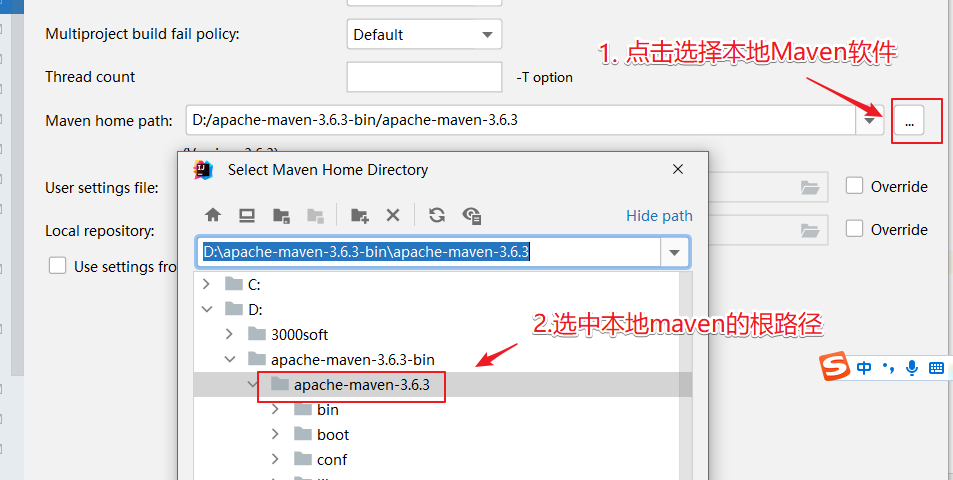
    3.  测试是否配置成功

        **注意**：如果本地仓库地址不变化，只有一个原因，就是maven/conf/settings.xml配置文件编写错误！仔细检查即可！

        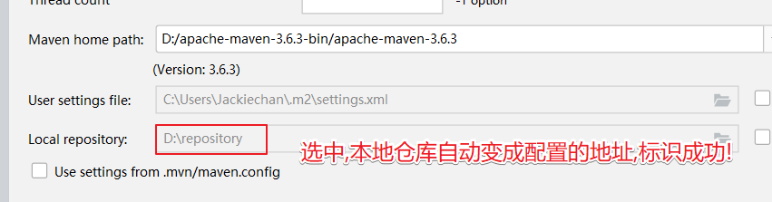

## 二、基于IDEA的Maven工程创建

### 2.1梳理Maven工程GAVP属性

> Maven工程相对之前的工程，多出一组gavp属性，gav需要我们在创建项目的时指定，p有默认值，后期通过配置文件修改。既然要填写的属性，我们先行了解下这组属性的含义!

Maven 中的 GAVP 是指 GroupId、ArtifactId、Version、Packaging 等四个属性的缩写，其中前三个是必要的，而 Packaging 属性为可选项。这四个属性主要为每个项目在maven仓库总做一个标识，类似人的《姓-名》。有了具体标识，方便maven软件对项目进行管理和互相引用！

**GAV遵循一下规则：**

1） **GroupID 格式**：com.{公司/BU }.业务线.\[子业务线]，最多 4 级。

说明：{公司/BU} 例如：alibaba/taobao/tmall/aliexpress 等 BU 一级；子业务线可选。

正例：com.taobao.tddl 或 com.alibaba.sourcing.multilang  com.atguigu.java

2） **ArtifactID 格式**：产品线名-模块名。语义不重复不遗漏，先到仓库中心去查证一下。

正例：tc-client / uic-api / tair-tool / bookstore

3） **Version版本号格式推荐**：主版本号.次版本号.修订号 1.0.0

1） 主版本号：当做了不兼容的 API 修改，或者增加了能改变产品方向的新功能。

2） 次版本号：当做了向下兼容的功能性新增（新增类、接口等）。

3） 修订号：修复 bug，没有修改方法签名的功能加强，保持 API 兼容性。

例如： 初始→1.0.0  修改bug → 1.0.1  功能调整 → 1.1.1等

**Packaging定义规则：**

指示将项目打包为什么类型的文件，idea根据packaging值，识别maven项目类型！

packaging 属性为 jar（默认值），代表普通的Java工程，打包以后是.jar结尾的文件。

packaging 属性为 war，代表Java的web工程，打包以后.war结尾的文件。

packaging 属性为 pom，代表不会打包，用来做继承的父工程。

### 2.2 Idea构建Maven JavaSE工程

注意：此处省略了version，直接给了一个默认值\<version>1.0-SNAPSHOT\</version>

自己后期可以在项目中随意修改！

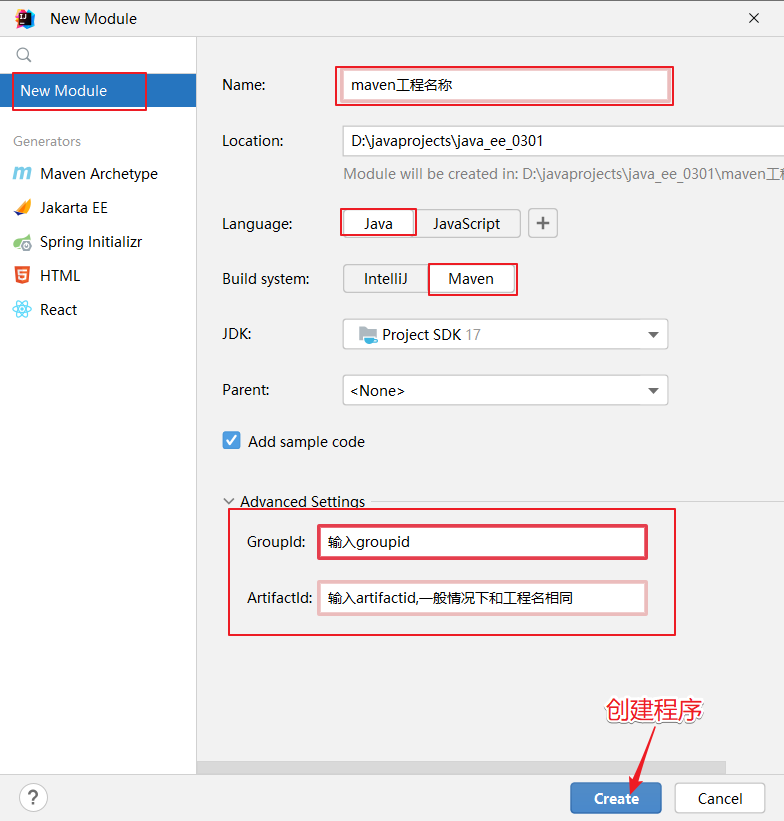

### 2.3 Idea构建Maven JavaEE工程

1.  手动创建
    1.  创建一个javasemaven工程
    2.  手动添加web项目结构文件

        注意：结构和命名固定

        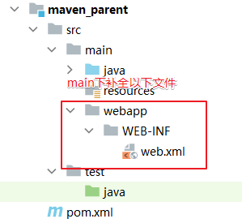
    3.  修改pom.xml文件打包方式

        修改位置：项目下/pom.xml
        ```xml
        <groupId>com.atguigu</groupId>
        <artifactId>maven_parent</artifactId>
        <version>1.0-SNAPSHOT</version>
        <!-- 新增一列打包方式packaging -->
        <packaging>war</packaging>
        ```
    4.  刷新和校验

        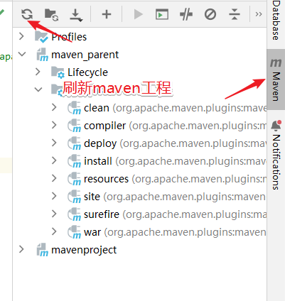

        

        项目的webapp文件夹出现小蓝点，代表成功！！
2.  插件方式创建
    1.  安装插件JBLJavaToWeb

        file / settings / plugins / marketplace

        
    2.  创建一个javasemaven工程
    3.  右键、使用插件快速补全web项目

        

### 2.4 Maven工程项目结构说明

Maven 是一个强大的构建工具，它提供一种标准化的项目结构，可以帮助开发者更容易地管理项目的依赖、构建、测试和发布等任务。以下是 Maven Web 程序的文件结构及每个文件的作用：

```xml
|-- pom.xml                               # Maven 项目管理文件 
|-- src
    |-- main                              # 项目主要代码
    |   |-- java                          # Java 源代码目录
    |   |   `-- com/example/myapp         # 开发者代码主目录
    |   |       |-- controller            # 存放 Controller 层代码的目录
    |   |       |-- service               # 存放 Service 层代码的目录
    |   |       |-- dao                   # 存放 DAO 层代码的目录
    |   |       `-- model                 # 存放数据模型的目录
    |   |-- resources                     # 资源目录，存放配置文件、静态资源等
    |   |   |-- log4j.properties          # 日志配置文件
    |   |   |-- spring-mybatis.xml        # Spring Mybatis 配置文件
    |   |   `-- static                    # 存放静态资源的目录
    |   |       |-- css                   # 存放 CSS 文件的目录
    |   |       |-- js                    # 存放 JavaScript 文件的目录
    |   |       `-- images                # 存放图片资源的目录
    |   `-- webapp                        # 存放 WEB 相关配置和资源
    |       |-- WEB-INF                   # 存放 WEB 应用配置文件
    |       |   |-- web.xml               # Web 应用的部署描述文件
    |       |   `-- classes               # 存放编译后的 class 文件
    |       `-- index.html                # Web 应用入口页面
    `-- test                              # 项目测试代码
        |-- java                          # 单元测试目录
        `-- resources                     # 测试资源目录
```

-   pom.xml：Maven 项目管理文件，用于描述项目的依赖和构建配置等信息。
-   src/main/java：存放项目的 Java 源代码。
-   src/main/resources：存放项目的资源文件，如配置文件、静态资源等。
-   src/main/webapp/WEB-INF：存放 Web 应用的配置文件。
-   src/main/webapp/index.html：Web 应用的入口页面。
-   src/test/java：存放项目的测试代码。
-   src/test/resources：存放测试相关的资源文件，如测试配置文件等。

## 三、Maven核心功能依赖和构建管理

### 3.1 依赖管理和配置

Maven 依赖管理是 Maven 软件中最重要的功能之一。Maven 的依赖管理能够帮助开发人员自动解决软件包依赖问题，使得开发人员能够轻松地将其他开发人员开发的模块或第三方框架集成到自己的应用程序或模块中，避免出现版本冲突和依赖缺失等问题。

我们通过定义 POM 文件，Maven 能够自动解析项目的依赖关系，并通过 Maven **仓库自动**下载和管理依赖，从而避免了手动下载和管理依赖的繁琐工作和可能引发的版本冲突问题。

重点: 编写pom.xml文件!

maven项目信息属性配置和读取：

```xml
<!-- 模型版本 -->
<modelVersion>4.0.0</modelVersion>
<!-- 公司或者组织的唯一标志，并且配置时生成的路径也是由此生成， 如com.companyname.project-group，maven会将该项目打成的jar包放本地路径：/com/companyname/project-group -->
<groupId>com.companyname.project-group</groupId>
<!-- 项目的唯一ID，一个groupId下面可能多个项目，就是靠artifactId来区分的 -->
<artifactId>project</artifactId>
<!-- 版本号 -->
<version>1.0.0</version>

<!--打包方式
    默认：jar
    jar指的是普通的java项目打包方式！ 项目打成jar包！
    war指的是web项目打包方式！项目打成war包！
    pom不会讲项目打包！这个项目作为父工程，被其他工程聚合或者继承！后面会讲解两个概念
-->
<packaging>jar/pom/war</packaging>
```

依赖管理和添加：

```xml
<!-- 
   通过编写依赖jar包的gav必要属性，引入第三方依赖！
   scope属性是可选的，可以指定依赖生效范围！
   依赖信息查询方式：
      1. maven仓库信息官网 https://mvnrepository.com/
      2. mavensearch插件搜索
 -->
<dependencies>
    <!-- 引入具体的依赖包 -->
    <dependency>
        <groupId>log4j</groupId>
        <artifactId>log4j</artifactId>
        <version>1.2.17</version>
        <!--
            生效范围
            - compile ：main目录 test目录  打包打包 [默认]
            - provided：main目录 test目录  Servlet
            - runtime： 打包运行           MySQL
            - test:    test目录           junit
         -->
        <scope>runtime</scope>
    </dependency>

</dependencies>
```

依赖版本提取和维护:

```xml
<!--声明版本-->
<properties>
  <!--命名随便,内部制定版本号即可！-->
  <junit.version>4.11</junit.version>
  <!-- 也可以通过 maven规定的固定的key，配置maven的参数！如下配置编码格式！-->
  <project.build.sourceEncoding>UTF-8</project.build.sourceEncoding>
  <project.reporting.outputEncoding>UTF-8</project.reporting.outputEncoding>
</properties>

<dependencies>
  <dependency>
    <groupId>junit</groupId>
    <artifactId>junit</artifactId>
    <!--引用properties声明版本 -->
    <version>${junit.version}</version>
  </dependency>
</dependencies>
```

### 3.2依赖传递和冲突

**依赖传递**指的是当一个模块或库 A 依赖于另一个模块或库 B，而 B 又依赖于模块或库 C，那么 A 会间接依赖于 C。这种依赖传递结构可以形成一个依赖树。当我们引入一个库或框架时，构建工具（如 Maven、Gradle）会自动解析和加载其所有的直接和间接依赖，确保这些依赖都可用。

依赖传递的作用是：

1.  减少重复依赖：当多个项目依赖同一个库时，Maven 可以自动下载并且只下载一次该库。这样可以减少项目的构建时间和磁盘空间。
2.  自动管理依赖: Maven 可以自动管理依赖项，使用依赖传递，简化了依赖项的管理，使项目构建更加可靠和一致。
3.  确保依赖版本正确性：通过依赖传递的依赖，之间都不会存在版本兼容性问题，确实依赖的版本正确性！

依赖传递演示：

项目中，需要导入jackson相关的依赖，通过之前导入经验，jackson需要导入三个依赖，分别为：


通过查看网站介绍的依赖传递特性：data-bind中，依赖其他两个依赖


最佳导入：直接可以导入data-bind，自动依赖传递需要的依赖

```xml
<!-- https://mvnrepository.com/artifact/com.fasterxml.jackson.core/jackson-databind -->
<dependency>
    <groupId>com.fasterxml.jackson.core</groupId>
    <artifactId>jackson-databind</artifactId>
    <version>2.15.0</version>
</dependency>
```

依赖冲突演示：

当直接引用或者间接引用出现了相同的jar包! 这时呢，一个项目就会出现相同的重复jar包，这就算作冲突！依赖冲突避免出现重复依赖，并且终止依赖传递！


maven自动解决依赖冲突问题能力，会按照自己的原则，进行重复依赖选择。同时也提供了手动解决的冲突的方式，不过不推荐！

解决依赖冲突（如何选择重复依赖）方式：

1.  自动选择原则
    -   短路优先原则（第一原则）

        A—>B—>C—>D—>E—>X(version 0.0.1)

        A—>F—>X(version 0.0.2)

        则A依赖于X(version 0.0.2)。
    -   依赖路径长度相同情况下，则“先声明优先”（第二原则）

        A—>E—>X(version 0.0.1)

        A—>F—>X(version 0.0.2)

        在\<depencies>\</depencies>中，先声明的，路径相同，会优先选择！

小思考:

```xml
前提：
   A 1.1 -> B 1.1 -> C 1.1 
   F 2.2 -> B 2.2 
   
pom声明：
   F 2.2
   A 1.1 
   
   B 2.2 
```

### 3.3 依赖导入失败场景和解决方案

在使用 Maven 构建项目时，可能会发生依赖项下载错误的情况，主要原因有以下几种：

1.  下载依赖时出现网络故障或仓库服务器宕机等原因，导致无法连接至 Maven 仓库，从而无法下载依赖。
2.  依赖项的版本号或配置文件中的版本号错误，或者依赖项没有正确定义，导致 Maven 下载的依赖项与实际需要的不一致，从而引发错误。
3.  本地 Maven 仓库或缓存被污染或损坏，导致 Maven 无法正确地使用现有的依赖项，并且也无法重新下载！

解决方案：

1.  检查网络连接和 Maven 仓库服务器状态。
2.  确保依赖项的版本号与项目对应的版本号匹配，并检查 POM 文件中的依赖项是否正确。
3.  清除本地 Maven 仓库缓存（lastUpdated 文件），因为只要存在lastupdated缓存文件，刷新也不会重新下载。本地仓库中，根据依赖的gav属性依次向下查找文件夹，最终删除内部的文件，刷新重新下载即可！

    例如： pom.xml依赖
    ```xml
    <dependency>
      <groupId>com.alibaba</groupId>
      <artifactId>druid</artifactId>
      <version>1.2.8</version>
    </dependency>
    ```
    文件：

    

    脚本使用：

    [清理maven错误缓存.bat](file/清理maven错误缓存_7g0qEFY8sn.bat "清理maven错误缓存.bat")
    ```xml
    使用记事本打开
    set REPOSITORY_PATH=D:\repository  改成你本地仓库地址即可！
    点击运行脚本，即可自动清理本地错误缓存文件！！
    ```

### 3.4 扩展构建管理和插件配置

**构建概念:**

项目构建是指将源代码、依赖库和资源文件等转换成可执行或可部署的应用程序的过程，在这个过程中包括编译源代码、链接依赖库、打包和部署等多个步骤。


**主动触发场景：**

-   重新编译 : 编译不充分, 部分文件没有被编译!
-   打包 : 独立部署到外部服务器软件,打包部署
-   部署本地或者私服仓库 : maven工程加入到本地或者私服仓库,供其他工程使用

**命令方式构建:**

语法: mvn 构建命令  构建命令....

| 命令          | 描述                        |
| ----------- | ------------------------- |
| mvn clean   | 清理编译或打包后的项目结构,删除target文件夹 |
| mvn compile | 编译项目，生成target文件           |
| mvn test    | 执行测试源码 (测试)               |
| mvn site    | 生成一个项目依赖信息的展示页面           |
| mvn package | 打包项目，生成war / jar 文件       |
| mvn install | 打包后上传到maven本地仓库(本地部署)     |
| mvn deploy  | 只打包，上传到maven私服仓库(私服部署)    |

**可视化方式构建:**

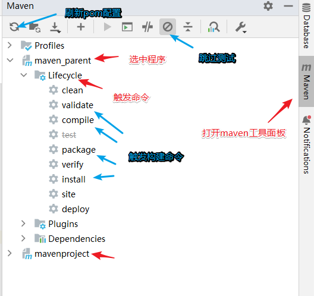

**构建命令周期:**

构建生命周期可以理解成是一组固定构建命令的有序集合，触发周期后的命令，会自动触发周期前的命令！也是一种简化构建的思路!

-   清理周期：主要是对项目编译生成文件进行清理

    包含命令：clean
-   默认周期：定义了真正构件时所需要执行的所有步骤，它是生命周期中最核心的部分

    包含命令：compile - test - package - install / deploy
-   报告周期

    包含命令：site

    打包: mvn clean package 本地仓库: mvn clean install

**最佳使用方案:**

```纯文本
打包: mvn clean package
重新编译: mvn clean compile
本地部署: mvn clean install 
```

**周期，命令和插件:**

周期→包含若干命令→包含若干插件!

使用周期命令构建，简化构建过程！

最终进行构建的是插件！

插件配置:

```xml
<build>
   <!-- jdk17 和 war包版本插件不匹配 -->
    <plugins>
        <plugin>
            <groupId>org.apache.maven.plugins</groupId>
            <artifactId>maven-war-plugin</artifactId>
            <version>3.2.2</version>
        </plugin>
    </plugins>
</build>
```

## 四、Maven继承和聚合特性

### 4.1 Maven工程继承关系

1.  继承概念

    Maven 继承是指在 Maven 的项目中，让一个项目从另一个项目中继承配置信息的机制。继承可以让我们在多个项目中共享同一配置信息，简化项目的管理和维护工作。

    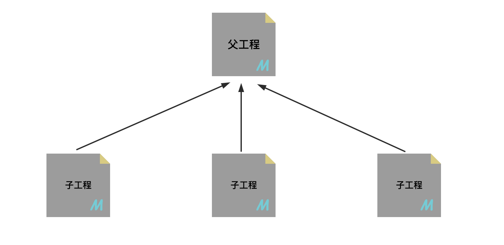
2.  继承作用

    作用：在父工程中统一管理项目中的依赖信息,进行统一版本管理!

    它的背景是：
    -   对一个比较大型的项目进行了模块拆分。
    -   一个 project 下面，创建了很多个 module。
    -   每一个 module 都需要配置自己的依赖信息。
        它背后的需求是：
    -   多个模块要使用同一个框架，它们应该是同一个版本，所以整个项目中使用的框架版本需要统一管理。
    -   使用框架时所需要的 jar 包组合（或者说依赖信息组合）需要经过长期摸索和反复调试，最终确定一个可用组合。这个耗费很大精力总结出来的方案不应该在新的项目中重新摸索。
        通过在父工程中为整个项目维护依赖信息的组合既保证了整个项目使用规范、准确的 jar 包；又能够将以往的经验沉淀下来，节约时间和精力。
3.  继承语法
    -   父工程
    ```xml
    <groupId>com.atguigu.maven</groupId>
    <artifactId>pro03-maven-parent</artifactId>
    <version>1.0-SNAPSHOT</version>
    <!-- 当前工程作为父工程，它要去管理子工程，所以打包方式必须是 pom -->
    <packaging>pom</packaging>

    ```
    -   子工程
    ```xml
    <!-- 使用parent标签指定当前工程的父工程 -->
    <parent>
      <!-- 父工程的坐标 -->
      <groupId>com.atguigu.maven</groupId>
      <artifactId>pro03-maven-parent</artifactId>
      <version>1.0-SNAPSHOT</version>
    </parent>

    <!-- 子工程的坐标 -->
    <!-- 如果子工程坐标中的groupId和version与父工程一致，那么可以省略 -->
    <!-- <groupId>com.atguigu.maven</groupId> -->
    <artifactId>pro04-maven-module</artifactId>
    <!-- <version>1.0-SNAPSHOT</version> -->
    ```
4.  父工程依赖统一管理
    -   父工程声明版本
        ```xml
        <!-- 使用dependencyManagement标签配置对依赖的管理 -->
        <!-- 被管理的依赖并没有真正被引入到工程 -->
        <dependencyManagement>
          <dependencies>
            <dependency>
              <groupId>org.springframework</groupId>
              <artifactId>spring-core</artifactId>
              <version>4.0.0.RELEASE</version>
            </dependency>
            <dependency>
              <groupId>org.springframework</groupId>
              <artifactId>spring-beans</artifactId>
              <version>4.0.0.RELEASE</version>
            </dependency>
            <dependency>
              <groupId>org.springframework</groupId>
              <artifactId>spring-context</artifactId>
              <version>4.0.0.RELEASE</version>
            </dependency>
            <dependency>
              <groupId>org.springframework</groupId>
              <artifactId>spring-expression</artifactId>
              <version>4.0.0.RELEASE</version>
            </dependency>
            <dependency>
              <groupId>org.springframework</groupId>
              <artifactId>spring-aop</artifactId>
              <version>4.0.0.RELEASE</version>
            </dependency>
          </dependencies>
        </dependencyManagement>
        ```
    -   子工程引用版本
        ```xml
        <!-- 子工程引用父工程中的依赖信息时，可以把版本号去掉。  -->
        <!-- 把版本号去掉就表示子工程中这个依赖的版本由父工程决定。 -->
        <!-- 具体来说是由父工程的dependencyManagement来决定。 -->
        <dependencies>
          <dependency>
            <groupId>org.springframework</groupId>
            <artifactId>spring-core</artifactId>
          </dependency>
          <dependency>
            <groupId>org.springframework</groupId>
            <artifactId>spring-beans</artifactId>
          </dependency>
          <dependency>
            <groupId>org.springframework</groupId>
            <artifactId>spring-context</artifactId>
          </dependency>
          <dependency>
            <groupId>org.springframework</groupId>
            <artifactId>spring-expression</artifactId>
          </dependency>
          <dependency>
            <groupId>org.springframework</groupId>
            <artifactId>spring-aop</artifactId>
          </dependency>
        </dependencies>
        ```

### 4.2 Maven工程聚合关系

1.  聚合概念

    Maven 聚合是指将多个项目组织到一个父级项目中，通过触发父工程的构建,统一按顺序触发子工程构建的过程!!
2.  聚合作用
    1.  统一管理子项目构建：通过聚合，可以将多个子项目组织在一起，方便管理和维护。
    2.  优化构建顺序：通过聚合，可以对多个项目进行顺序控制，避免出现构建依赖混乱导致构建失败的情况。
3.  聚合语法

    父项目中包含的子项目列表。
    ```xml
    <project>
      <groupId>com.example</groupId>
      <artifactId>parent-project</artifactId>
      <packaging>pom</packaging>
      <version>1.0.0</version>
      <modules>
        <module>child-project1</module>
        <module>child-project2</module>
      </modules>
    </project>
    ```
4.  聚合演示

    通过触发父工程构建命令、引发所有子模块构建！产生反应堆！

    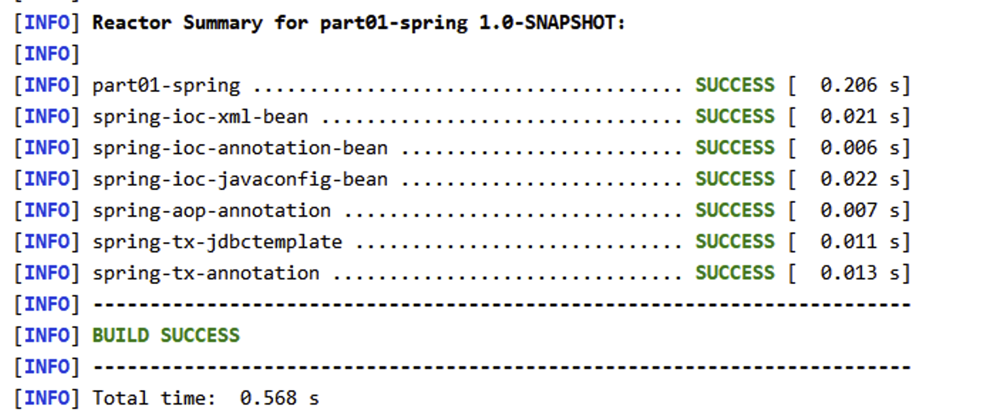

## 五、Maven实战案例：搭建微服务Maven工程架构

### 5.1 项目需求和结构分析

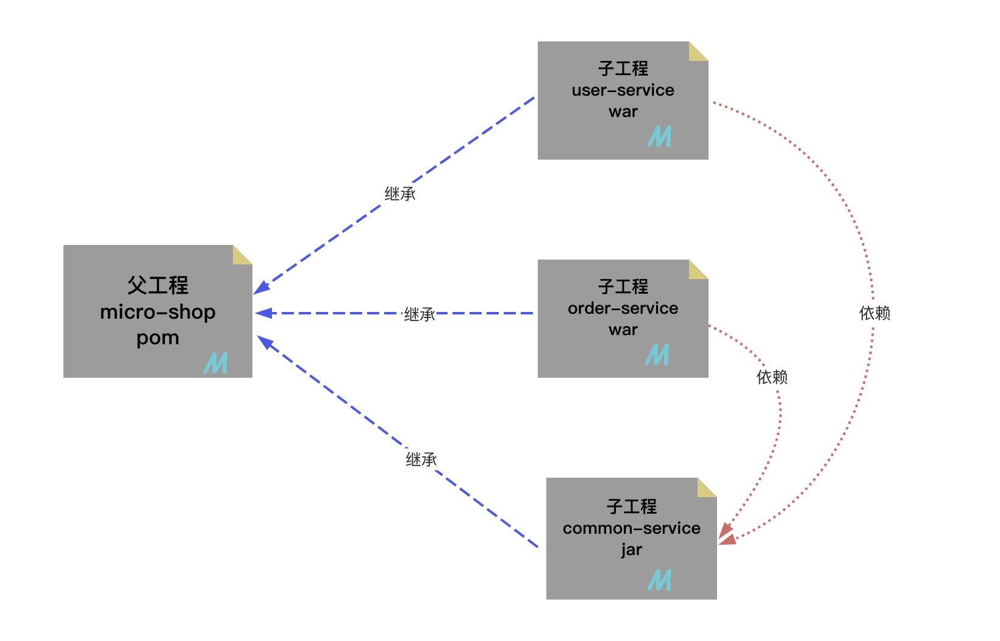

需求案例：搭建一个电商平台项目，该平台包括用户服务、订单服务、通用工具模块等。

项目架构：

1.  用户服务：负责处理用户相关的逻辑，例如用户信息的管理、用户注册、登录等。
2.  订单服务：负责处理订单相关的逻辑，例如订单的创建、订单支付、退货、订单查看等。
3.  通用模块：负责存储其他服务需要通用工具类，其他服务依赖此模块。

服务依赖：

1.  用户服务 (1.0.1)
    -   spring-context 6.0.6&#x20;
    -   spring-core 6.0.6
    -   spring-beans 6.0.6
    -   jackson-databind /  jackson-core / jackson-annotations 2.15.0&#x20;
2.  订单服务 (1.0.1)
    1.  shiro-core 1.10.1&#x20;
    2.  spring-context 6.0.6&#x20;
    3.  spring-core 6.0.6
    4.  spring-beans 6.0.6
3.  通用模块 (1.0.1)
    1.  commons-io 2.11.0

### 5.2项目搭建和统一构建

1.  父模块搭建 (micro-shop)
    1.  创建父工程

        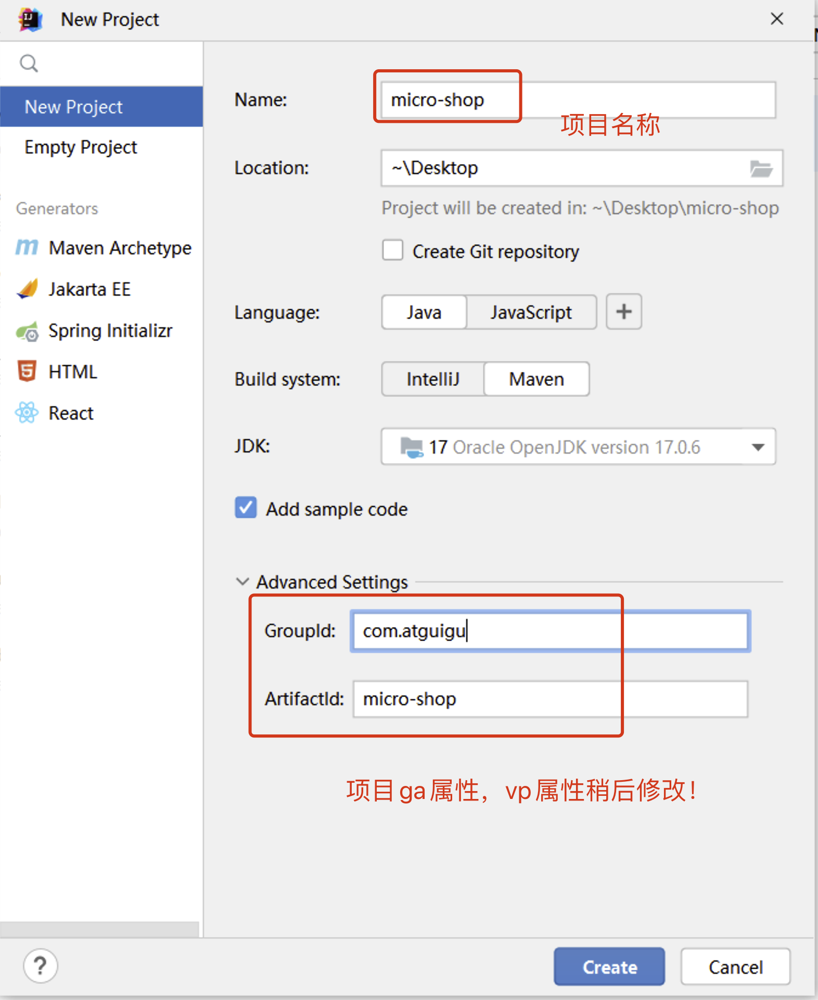
    2.  pom.xml配置
        ```xml
        <?xml version="1.0" encoding="UTF-8"?>
        <project xmlns="http://maven.apache.org/POM/4.0.0"
                 xmlns:xsi="http://www.w3.org/2001/XMLSchema-instance"
                 xsi:schemaLocation="http://maven.apache.org/POM/4.0.0 http://maven.apache.org/xsd/maven-4.0.0.xsd">
            <modelVersion>4.0.0</modelVersion>

            <groupId>com.atguigu</groupId>
            <artifactId>micro-shop</artifactId>
            <version>1.0.1</version>
            <!-- 父工程不打包，所以选择pom值-->
            <packaging>pom</packaging>

            <properties>
                <spring.version>6.0.6</spring.version>
                <jackson.version>2.15.0</jackson.version>
                <shiro.version>1.10.1</shiro.version>
                <commons.version>2.11.0</commons.version>
                <maven.compiler.source>17</maven.compiler.source>
                <maven.compiler.target>17</maven.compiler.target>
                <project.build.sourceEncoding>UTF-8</project.build.sourceEncoding>
            </properties>

            <!-- 依赖管理 -->
            <dependencyManagement>
                <dependencies>
                    <!-- spring-context会依赖传递core/beans -->
                    <dependency>
                        <groupId>org.springframework</groupId>
                        <artifactId>spring-context</artifactId>
                        <version>${spring.version}</version>
                    </dependency>

                    <!-- jackson-databind会依赖传递core/annotations -->
                    <dependency>
                        <groupId>com.fasterxml.jackson.core</groupId>
                        <artifactId>jackson-databind</artifactId>
                        <version>${jackson.version}</version>
                    </dependency>

                    <!-- shiro-core -->
                    <dependency>
                        <groupId>org.apache.shiro</groupId>
                        <artifactId>shiro-core</artifactId>
                        <version>${shiro.version}</version>
                    </dependency>
                    <!-- commons-io -->
                    <dependency>
                        <groupId>commons-io</groupId>
                        <artifactId>commons-io</artifactId>
                        <version>${commons.version}</version>
                    </dependency>

                </dependencies>

            </dependencyManagement>

            <dependencies>
                <!-- 父工程添加依赖，会自动传递给所有子工程，不推荐！ -->
            </dependencies>

            <!-- 统一更新子工程打包插件-->
            <build>
                <!-- jdk17 和 war包版本插件不匹配 -->
                <plugins>
                    <plugin>
                        <groupId>org.apache.maven.plugins</groupId>
                        <artifactId>maven-war-plugin</artifactId>
                        <version>3.2.2</version>
                    </plugin>
                </plugins>
            </build>

        </project>
        ```
2.  通用模块 (common-service)
    1.  创建模块

        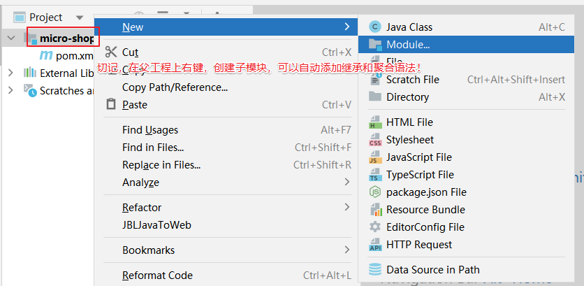

        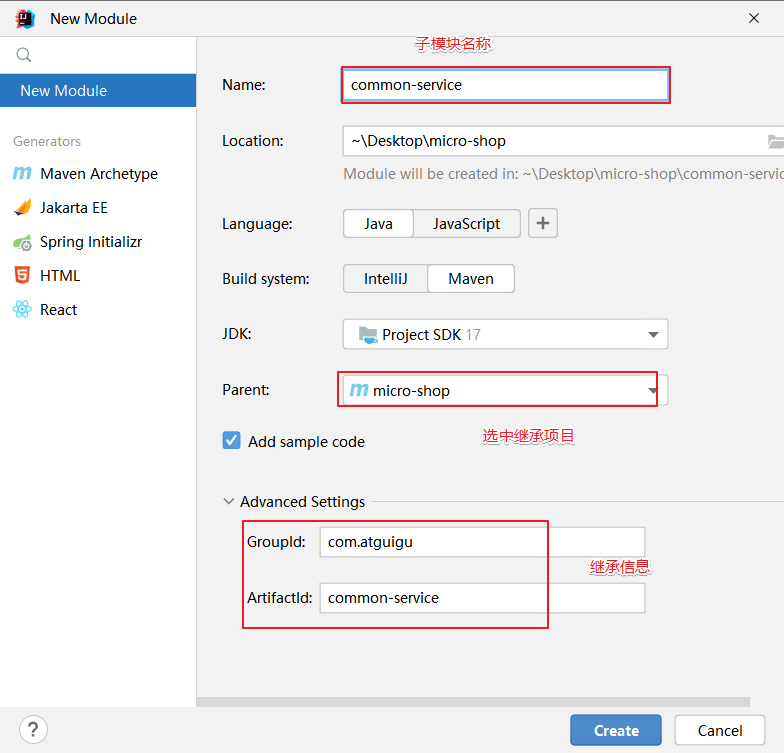
    2.  pom.xml配置
        ```xml
        <?xml version="1.0" encoding="UTF-8"?>
        <project xmlns="http://maven.apache.org/POM/4.0.0"
                 xmlns:xsi="http://www.w3.org/2001/XMLSchema-instance"
                 xsi:schemaLocation="http://maven.apache.org/POM/4.0.0 http://maven.apache.org/xsd/maven-4.0.0.xsd">
            <modelVersion>4.0.0</modelVersion>
            <parent>
                <groupId>com.atguigu</groupId>
                <artifactId>micro-shop</artifactId>
                <version>1.0.1</version>
            </parent>
            <artifactId>common-service</artifactId>
            <!-- 打包方式默认就是jar！ -->
            <packaging>jar</packaging>

            <properties>
                <maven.compiler.source>17</maven.compiler.source>
                <maven.compiler.target>17</maven.compiler.target>
                <project.build.sourceEncoding>UTF-8</project.build.sourceEncoding>
            </properties>

            <dependencies>
                <!-- 声明commons-io，继承父工程版本 -->
                <dependency>
                    <groupId>commons-io</groupId>
                    <artifactId>commons-io</artifactId>
                </dependency>
            </dependencies>

        </project>
        ```
3.  用户模块 (user-service)
    1.  创建模块

        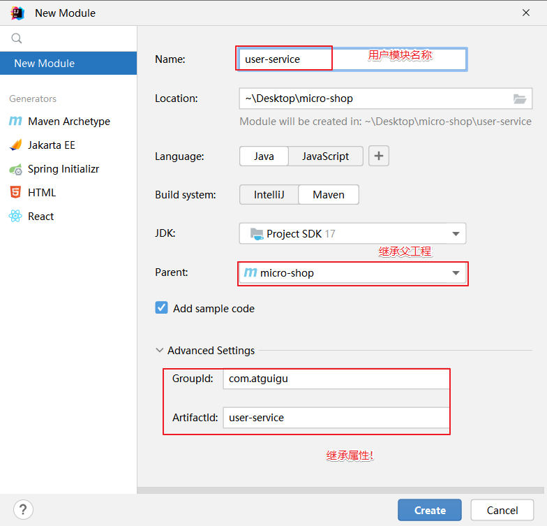

        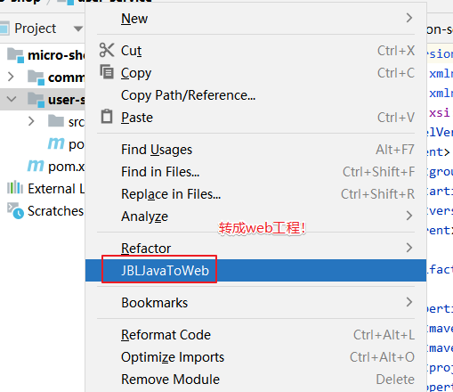
    2.  pom.xml配置
        ```xml
        <?xml version="1.0" encoding="UTF-8"?>

        <project xmlns="http://maven.apache.org/POM/4.0.0" xmlns:xsi="http://www.w3.org/2001/XMLSchema-instance" xsi:schemaLocation="http://maven.apache.org/POM/4.0.0 http://maven.apache.org/xsd/maven-4.0.0.xsd">  
          <modelVersion>4.0.0</modelVersion>  
          <parent> 
            <groupId>com.atguigu</groupId>  
            <artifactId>micro-shop</artifactId>  
            <version>1.0.1</version> 
          </parent>  
          <artifactId>user-service</artifactId>  
          <packaging>war</packaging>

          <properties> 
            <maven.compiler.source>17</maven.compiler.source>  
            <maven.compiler.target>17</maven.compiler.target>  
            <project.build.sourceEncoding>UTF-8</project.build.sourceEncoding> 
          </properties>

          <dependencies>
            <!-- 添加spring-context 自动传递 core / beans -->
            <dependency>
              <groupId>org.springframework</groupId>
              <artifactId>spring-context</artifactId>
            </dependency>

            <!-- 添加jackson-databind 自动传递 core / annotations -->
            <dependency>
              <groupId>com.fasterxml.jackson.core</groupId>
              <artifactId>jackson-databind</artifactId>
            </dependency>
          </dependencies>
        </project>

        ```
4.  订单模块 (order-service)
    1.  创建模块

        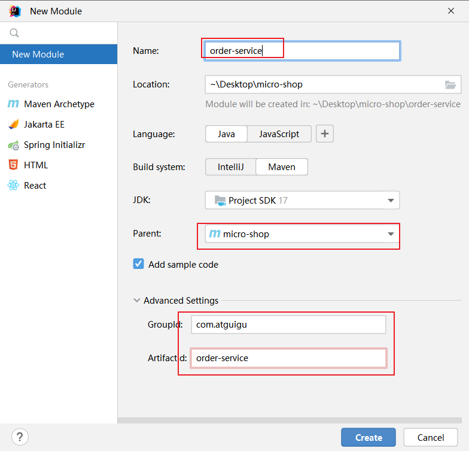

        
    2.  pom.xml
        ```xml
        <?xml version="1.0" encoding="UTF-8"?>
        <project xmlns="http://maven.apache.org/POM/4.0.0"
                 xmlns:xsi="http://www.w3.org/2001/XMLSchema-instance"
                 xsi:schemaLocation="http://maven.apache.org/POM/4.0.0 http://maven.apache.org/xsd/maven-4.0.0.xsd">
            <modelVersion>4.0.0</modelVersion>
            <parent>
                <groupId>com.atguigu</groupId>
                <artifactId>micro-shop</artifactId>
                <version>1.0.1</version>
            </parent>

            <artifactId>order-service</artifactId>
            <packaging>war</packaging>

            <properties>
                <maven.compiler.source>17</maven.compiler.source>
                <maven.compiler.target>17</maven.compiler.target>
                <project.build.sourceEncoding>UTF-8</project.build.sourceEncoding>
            </properties>

            <dependencies>
                <!-- 继承父工程依赖版本 -->
                <dependency>
                    <groupId>org.springframework</groupId>
                    <artifactId>spring-context</artifactId>
                </dependency>

                <!-- 继承父工程依赖版本 -->
                <dependency>
                    <groupId>org.apache.shiro</groupId>
                    <artifactId>shiro-core</artifactId>
                </dependency>
            </dependencies>

        </project>
        ```

## 六、Maven核心掌握总结

| 核心点   | 掌握目标                        |
| ----- | --------------------------- |
| 安装    | maven安装、环境变量、maven配置文件修改    |
| 工程创建  | gavp属性理解、JavaSE/EE工程创建、项目结构 |
| 依赖管理  | 依赖添加、依赖传递、版本提取、导入依赖错误解决     |
| 构建管理  | 构建过程、构建场景、构建周期等             |
| 继承和聚合 | 理解继承和聚合作用、继承语法和实践、聚合语法和实践   |
