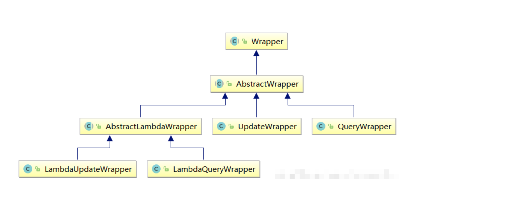
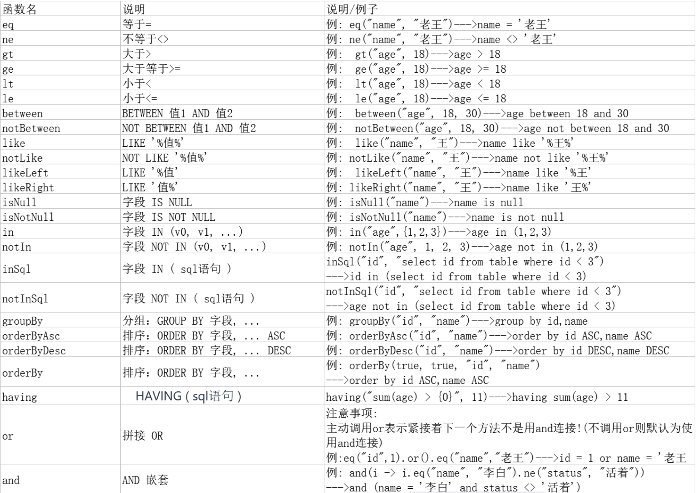
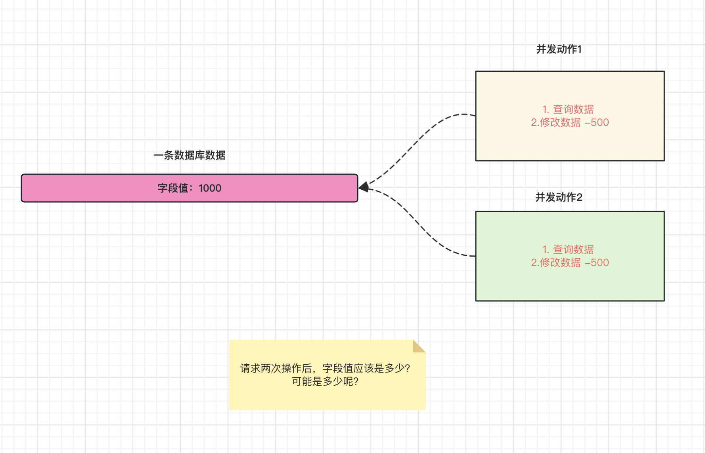
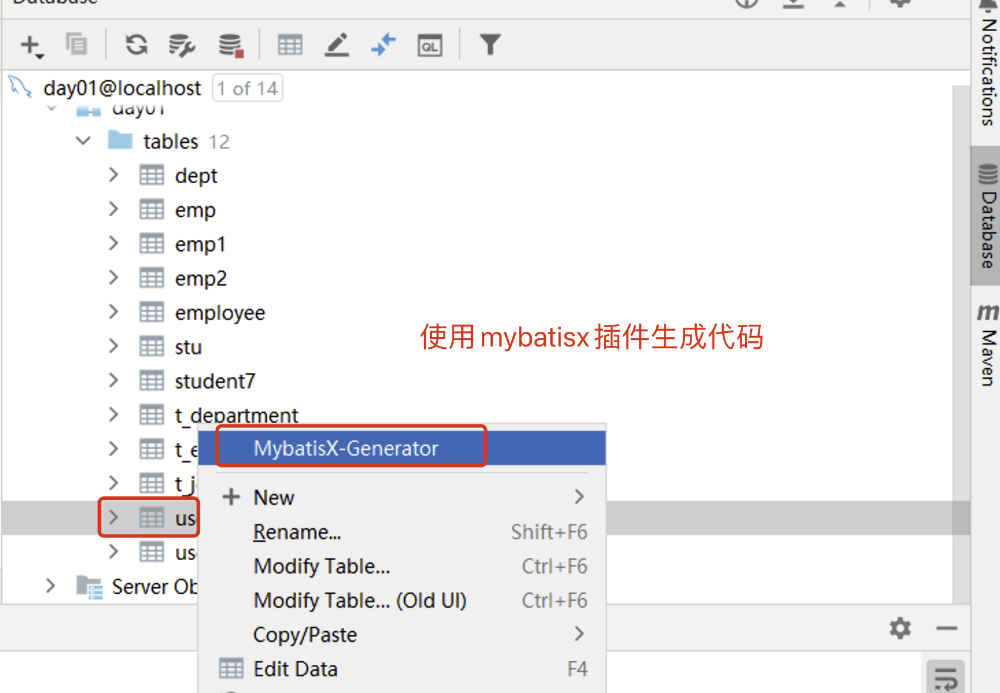
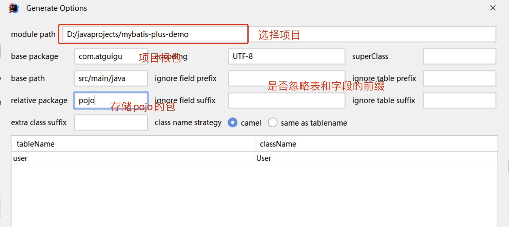
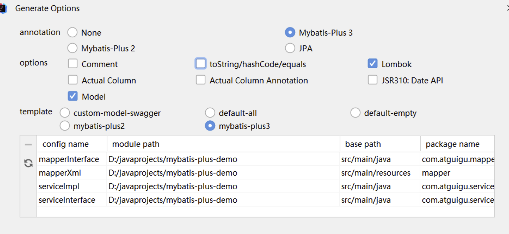

# 七、MyBatis-Plus高级用法：最优化持久层开发

## 目录

-   [一、MyBatis-Plus快速入门](#一MyBatis-Plus快速入门)
    -   [1.1 简介](#11-简介)
    -   [1.2 快速入门](#12-快速入门)
-   [二、MyBatis-Plus核心功能](#二MyBatis-Plus核心功能)
    -   [2.1 基于Mapper接口CRUD](#21-基于Mapper接口CRUD)
        -   [Insert方法](#Insert方法)
        -   [Delete方法](#Delete方法)
        -   [Update方法](#Update方法)
        -   [Select方法](#Select方法)
        -   [自定义和多表映射](#自定义和多表映射)
    -   [2.2 基于Service接口CRUD](#22-基于Service接口CRUD)
        -   [对比Mapper接口CRUD区别：](#对比Mapper接口CRUD区别)
        -   [使用Iservice接口方式](#使用Iservice接口方式)
        -   [CRUD方法介绍](#CRUD方法介绍)
    -   [2.3 分页查询实现](#23-分页查询实现)
    -   [2.4 条件构造器使用](#24-条件构造器使用)
        -   [2.4.1 条件构造器作用](#241-条件构造器作用)
        -   [2.4.2 条件构造器继承结构](#242-条件构造器继承结构)
        -   [2.4.3 基于QueryWrapper 组装条件](#243-基于QueryWrapper-组装条件)
        -   [2.3.4 基于 UpdateWrapper组装条件](#234-基于-UpdateWrapper组装条件)
        -   [2.3.5 基于LambdaQueryWrapper组装条件](#235-基于LambdaQueryWrapper组装条件)
        -   [2.3.6 基于LambdaUpdateWrapper组装条件](#236-基于LambdaUpdateWrapper组装条件)
    -   [2.5 核心注解使用](#25-核心注解使用)
-   [三、MyBatis-Plus高级扩展](#三MyBatis-Plus高级扩展)
    -   [3.1 逻辑删除实现](#31-逻辑删除实现)
    -   [3.2 乐观锁实现](#32-乐观锁实现)
        -   [3.2.1 悲观锁和乐观锁场景和介绍](#321-悲观锁和乐观锁场景和介绍)
        -   [3.2.2 使用mybatis-plus数据使用乐观锁](#322-使用mybatis-plus数据使用乐观锁)
    -   [3.3 防全表更新和删除实现](#33-防全表更新和删除实现)
-   [四、MyBatis-Plus代码生成器(MyBatisX插件)](#四MyBatis-Plus代码生成器MyBatisX插件)
    -   [4.1 Mybatisx插件逆向工程](#41-Mybatisx插件逆向工程)
    -   [4.2 MyBatisX快速代码生成](#42-MyBatisX快速代码生成)

# 一、MyBatis-Plus快速入门

### 1.1 简介

> 课程版本：3.5.3.1

<https://baomidou.com/>

[MyBatis-Plus](https://github.com/baomidou/mybatis-plus "MyBatis-Plus") [ (opens new window)](https://github.com/baomidou/mybatis-plus " (opens new window)")（简称 MP）是一个 [MyBatis](https://www.mybatis.org/mybatis-3/ "MyBatis") [ (opens new window)](https://www.mybatis.org/mybatis-3/ " (opens new window)") 的增强工具，在 MyBatis 的基础上只做增强不做改变，为简化开发、提高效率而生。


特性：

-   **无侵入**：只做增强不做改变，引入它不会对现有工程产生影响，如丝般顺滑
-   **损耗小**：启动即会自动注入基本 CURD，性能基本无损耗，直接面向对象操作
-   **强大的 CRUD 操作**：内置通用 Mapper、通用 Service，仅仅通过少量配置即可实现单表大部分 CRUD 操作，更有强大的条件构造器，满足各类使用需求
-   **支持 Lambda 形式调用**：通过 Lambda 表达式，方便的编写各类查询条件，无需再担心字段写错
-   **支持主键自动生成**：支持多达 4 种主键策略（内含分布式唯一 ID 生成器 - Sequence），可自由配置，完美解决主键问题
-   **支持 ActiveRecord 模式**：支持 ActiveRecord 形式调用，实体类只需继承 Model 类即可进行强大的 CRUD 操作
-   **支持自定义全局通用操作**：支持全局通用方法注入（ Write once, use anywhere ）
-   **内置代码生成器**：采用代码或者 Maven 插件可快速生成 Mapper 、 Model 、 Service 、 Controller 层代码，支持模板引擎，更有超多自定义配置等您来使用
-   **内置分页插件**：基于 MyBatis 物理分页，开发者无需关心具体操作，配置好插件之后，写分页等同于普通 List 查询
-   **分页插件支持多种数据库**：支持 MySQL、MariaDB、Oracle、DB2、H2、HSQL、SQLite、Postgre、SQLServer 等多种数据库
-   **内置性能分析插件**：可输出 SQL 语句以及其执行时间，建议开发测试时启用该功能，能快速揪出慢查询
-   **内置全局拦截插件**：提供全表 delete 、 update 操作智能分析阻断，也可自定义拦截规则，预防误操作

支持数据库：

-   MySQL，Oracle，DB2，H2，HSQL，SQLite，PostgreSQL，SQLServer，Phoenix，Gauss ，ClickHouse，Sybase，OceanBase，Firebird，Cubrid，Goldilocks，csiidb，informix，TDengine，redshift
-   达梦数据库，虚谷数据库，人大金仓数据库，南大通用(华库)数据库，南大通用数据库，神通数据库，瀚高数据库，优炫数据库

mybatis-plus总结：

自动生成单表的CRUD功能

提供丰富的条件拼接方式

全自动ORM类型持久层框架

### 1.2 快速入门

1.  准备数据库脚本

    现有一张 `User` 表，其表结构如下：
    | id | name   | age | email                                                                |
    | -- | ------ | --- | -------------------------------------------------------------------- |
    | 1  | Jone   | 18  | [test1@baomidou.com](mailto:test1@baomidou.com "test1@baomidou.com") |
    | 2  | Jack   | 20  | [test2@baomidou.com](mailto:test2@baomidou.com "test2@baomidou.com") |
    | 3  | Tom    | 28  | [test3@baomidou.com](mailto:test3@baomidou.com "test3@baomidou.com") |
    | 4  | Sandy  | 21  | [test4@baomidou.com](mailto:test4@baomidou.com "test4@baomidou.com") |
    | 5  | Billie | 24  | [test5@baomidou.com](mailto:test5@baomidou.com "test5@baomidou.com") |
    ```sql
    DROP TABLE IF EXISTS user;

    CREATE TABLE user
    (
        id BIGINT(20) NOT NULL COMMENT '主键ID',
        name VARCHAR(30) NULL DEFAULT NULL COMMENT '姓名',
        age INT(11) NULL DEFAULT NULL COMMENT '年龄',
        email VARCHAR(50) NULL DEFAULT NULL COMMENT '邮箱',
        PRIMARY KEY (id)
    );


    INSERT INTO user (id, name, age, email) VALUES
    (1, 'Jone', 18, 'test1@baomidou.com'),
    (2, 'Jack', 20, 'test2@baomidou.com'),
    (3, 'Tom', 28, 'test3@baomidou.com'),
    (4, 'Sandy', 21, 'test4@baomidou.com'),
    (5, 'Billie', 24, 'test5@baomidou.com');

    ```
2.  准备boot工程
3.  导入依赖
    ```xml
    <?xml version="1.0" encoding="UTF-8"?>
    <project xmlns="http://maven.apache.org/POM/4.0.0"
             xmlns:xsi="http://www.w3.org/2001/XMLSchema-instance"
             xsi:schemaLocation="http://maven.apache.org/POM/4.0.0 http://maven.apache.org/xsd/maven-4.0.0.xsd">
        <modelVersion>4.0.0</modelVersion>

        <parent>
            <groupId>org.springframework.boot</groupId>
            <artifactId>spring-boot-starter-parent</artifactId>
            <version>3.0.5</version>
        </parent>
        <groupId>com.atguigu</groupId>
        <artifactId>springboot-starter-mybatis-plus-06</artifactId>
        <version>1.0-SNAPSHOT</version>

        <properties>
            <maven.compiler.source>17</maven.compiler.source>
            <maven.compiler.target>17</maven.compiler.target>
            <project.build.sourceEncoding>UTF-8</project.build.sourceEncoding>
        </properties>


        <dependencies>
            <dependency>
                <groupId>org.springframework.boot</groupId>
                <artifactId>spring-boot-starter</artifactId>
            </dependency>
            
            <!-- 测试环境 -->
            <dependency>
                <groupId>org.springframework.boot</groupId>
                <artifactId>spring-boot-starter-test</artifactId>
            </dependency>
            
            <!-- mybatis-plus  -->
            <dependency>
                <groupId>com.baomidou</groupId>
                <artifactId>mybatis-plus-boot-starter</artifactId>
                <version>3.5.3.1</version>
            </dependency>

            <!-- 数据库相关配置启动器 -->
            <dependency>
                <groupId>org.springframework.boot</groupId>
                <artifactId>spring-boot-starter-jdbc</artifactId>
            </dependency>

            <!-- druid启动器的依赖  -->
            <dependency>
                <groupId>com.alibaba</groupId>
                <artifactId>druid-spring-boot-3-starter</artifactId>
                <version>1.2.18</version>
            </dependency>

            <!-- 驱动类-->
            <dependency>
                <groupId>mysql</groupId>
                <artifactId>mysql-connector-java</artifactId>
                <version>8.0.28</version>
            </dependency>

            <dependency>
                <groupId>org.projectlombok</groupId>
                <artifactId>lombok</artifactId>
                <version>1.18.28</version>
            </dependency>

        </dependencies>


        <!--    SpringBoot应用打包插件-->
        <build>
            <plugins>
                <plugin>
                    <groupId>org.springframework.boot</groupId>
                    <artifactId>spring-boot-maven-plugin</artifactId>
                </plugin>
            </plugins>
        </build>
    </project>
    ```
4.  配置文件和启动类

    完善连接池配置：

    文件夹：META-INF.spring

    文件名：

    org.springframework.boot.autoconfigure.AutoConfiguration.imports

    内容：com.alibaba.druid.spring.boot3.autoconfigure.DruidDataSourceAutoConfigure

    application.yaml
    ```yaml
    # 连接池配置
    spring:
      datasource:
        type: com.alibaba.druid.pool.DruidDataSource
        druid:
          url: jdbc:mysql:///day01
          username: root
          password: root
          driver-class-name: com.mysql.cj.jdbc.Driver

    ```
    启动类
    ```java
    @MapperScan("com.atguigu.mapper")
    @SpringBootApplication
    public class MainApplication {

        public static void main(String[] args) {
            SpringApplication.run(MainApplication.class,args);
        }
        
    }

    ```
5.  功能编码

    编写实体类 `User.java`（此处使用了 [Lombok](https://www.projectlombok.org/ "Lombok") [ ](https://www.projectlombok.org/ " ")简化代码）
    ```java
    @Data
    public class User {
        private Long id;
        private String name;
        private Integer age;
        private String email;
    }

    ```
    编写 Mapper 包下的 `UserMapper`接口
    ```java
    public interface UserMapper extends BaseMapper<User> {

    }

    ```
    继承mybatis-plus提供的基础Mapper接口，自带crud方法！
6.  测试和使用

    添加测试类，进行功能测试：
    ```java
    @SpringBootTest //springboot下测试环境注解
    public class SampleTest {

        @Autowired
        private UserMapper userMapper;

        @Test
        public void testSelect() {
            System.out.println(("----- selectAll method test ------"));
            List<User> userList = userMapper.selectList(null);
            userList.forEach(System.out::println);
        }
    }

    ```
7.  小结

    通过以上几个简单的步骤，我们就实现了 User 表的 CRUD 功能，甚至连 XML 文件都不用编写！

    从以上步骤中，我们可以看到集成`MyBatis-Plus`非常的简单，只需要引入 starter 工程，并配置 mapper 扫描路径即可。

# 二、MyBatis-Plus核心功能

### 2.1 基于Mapper接口CRUD

> 通用 CRUD 封装[BaseMapper (opens new window)](https://gitee.com/baomidou/mybatis-plus/blob/3.0/mybatis-plus-core/src/main/java/com/baomidou/mybatisplus/core/mapper/BaseMapper.java "BaseMapper (opens new window)")接口， `Mybatis-Plus` 启动时自动解析实体表关系映射转换为 `Mybatis` 内部对象注入容器! 内部包含常见的单表操作！

#### Insert方法

```java
// 插入一条记录
// T 就是要插入的实体对象
// 默认主键生成策略为雪花算法（后面讲解）
int insert(T entity);
```

| 类型 | 参数名    | 描述   |
| -- | ------ | ---- |
| T  | entity | 实体对象 |

#### Delete方法

```java
// 根据 entity 条件，删除记录
int delete(@Param(Constants.WRAPPER) Wrapper<T> wrapper);

// 删除（根据ID 批量删除）
int deleteBatchIds(@Param(Constants.COLLECTION) Collection<? extends Serializable> idList);

// 根据 ID 删除
int deleteById(Serializable id);

// 根据 columnMap 条件，删除记录
int deleteByMap(@Param(Constants.COLUMN_MAP) Map<String, Object> columnMap);
```

| 类型                                  | 参数名       | 描述                          |
| ----------------------------------- | --------- | --------------------------- |
| Wrapper\<T>                         | wrapper   | 实体对象封装操作类（可以为 null）         |
| Collection\<? extends Serializable> | idList    | 主键 ID 列表(不能为 null 以及 empty) |
| Serializable                        | id        | 主键 ID                       |
| Map\<String, Object>                | columnMap | 表字段 map 对象                  |

#### Update方法

```java
// 根据 whereWrapper 条件，更新记录
int update(@Param(Constants.ENTITY) T updateEntity, 
            @Param(Constants.WRAPPER) Wrapper<T> whereWrapper);

// 根据 ID 修改  主键属性必须值
int updateById(@Param(Constants.ENTITY) T entity);
```

| 类型          | 参数名           | 描述                                           |
| ----------- | ------------- | -------------------------------------------- |
| T           | entity        | 实体对象 (set 条件值,可为 null)                       |
| Wrapper\<T> | updateWrapper | 实体对象封装操作类（可以为 null,里面的 entity 用于生成 where 语句） |

#### Select方法

```java
// 根据 ID 查询
T selectById(Serializable id);

// 根据 entity 条件，查询一条记录
T selectOne(@Param(Constants.WRAPPER) Wrapper<T> queryWrapper);

// 查询（根据ID 批量查询）
List<T> selectBatchIds(@Param(Constants.COLLECTION) Collection<? extends Serializable> idList);

// 根据 entity 条件，查询全部记录
List<T> selectList(@Param(Constants.WRAPPER) Wrapper<T> queryWrapper);

// 查询（根据 columnMap 条件）
List<T> selectByMap(@Param(Constants.COLUMN_MAP) Map<String, Object> columnMap);

// 根据 Wrapper 条件，查询全部记录
List<Map<String, Object>> selectMaps(@Param(Constants.WRAPPER) Wrapper<T> queryWrapper);

// 根据 Wrapper 条件，查询全部记录。注意： 只返回第一个字段的值
List<Object> selectObjs(@Param(Constants.WRAPPER) Wrapper<T> queryWrapper);

// 根据 entity 条件，查询全部记录（并翻页）
IPage<T> selectPage(IPage<T> page, @Param(Constants.WRAPPER) Wrapper<T> queryWrapper);

// 根据 Wrapper 条件，查询全部记录（并翻页）
IPage<Map<String, Object>> selectMapsPage(IPage<T> page, @Param(Constants.WRAPPER) Wrapper<T> queryWrapper);

// 根据 Wrapper 条件，查询总记录数
Integer selectCount(@Param(Constants.WRAPPER) Wrapper<T> queryWrapper);
```

参数说明

| 类型                                  | 参数名          | 描述                            |
| ----------------------------------- | ------------ | ----------------------------- |
| Serializable                        | id           | 主键 ID                         |
| Wrapper\<T>                         | queryWrapper | 实体对象封装操作类（可以为 null）           |
| Collection\<? extends Serializable> | idList       | 主键 ID 列表(不能为 null 以及 empty)   |
| Map\<String, Object>                | columnMap    | 表字段 map 对象                    |
| IPage\<T>                           | page         | 分页查询条件（可以为 RowBounds.DEFAULT） |

#### 自定义和多表映射

mybatis-plus的默认mapperxml位置

```yaml
mybatis-plus: # mybatis-plus的配置
  # 默认位置 private String[] mapperLocations = new String[]{"classpath*:/mapper/**/*.xml"};    
  mapper-locations: classpath:/mapper/*.xml
```

自定义mapper方法：

```java
public interface UserMapper extends BaseMapper<User> {

    //正常自定义方法！
    //可以使用注解@Select或者mapper.xml实现
    List<User> queryAll();
}

```

基于mapper.xml实现：

```xml
<?xml version="1.0" encoding="UTF-8" ?>
<!DOCTYPE mapper
        PUBLIC "-//mybatis.org//DTD Mapper 3.0//EN"
        "https://mybatis.org/dtd/mybatis-3-mapper.dtd">
<!-- namespace = 接口的全限定符 -->
<mapper namespace="com.atguigu.mapper.UserMapper">

   <select id="queryAll" resultType="user" >
       select * from user
   </select>
</mapper>
```

### 2.2 基于Service接口CRUD

通用 Service CRUD 封装[IService (opens new window)](https://gitee.com/baomidou/mybatis-plus/blob/3.0/mybatis-plus-extension/src/main/java/com/baomidou/mybatisplus/extension/service/IService.java "IService (opens new window)")接口，进一步封装 CRUD 采用 `get 查询单行` `remove 删除` `list 查询集合` `page 分页` 前缀命名方式区分 `Mapper` 层避免混淆，

#### 对比Mapper接口CRUD区别：

-   service添加了批量方法
-   service层的方法自动添加事务

#### 使用Iservice接口方式

接口继承IService接口

```java
public interface UserService extends IService<User> {
}

```

类继承ServiceImpl实现类

```java
@Service
public class UserServiceImpl extends ServiceImpl<UserMapper,User> implements UserService{

}

```

#### CRUD方法介绍

```java
保存：
// 插入一条记录（选择字段，策略插入）
boolean save(T entity);
// 插入（批量）
boolean saveBatch(Collection<T> entityList);
// 插入（批量）
boolean saveBatch(Collection<T> entityList, int batchSize);

修改或者保存：
// TableId 注解存在更新记录，否插入一条记录
boolean saveOrUpdate(T entity);
// 根据updateWrapper尝试更新，否继续执行saveOrUpdate(T)方法
boolean saveOrUpdate(T entity, Wrapper<T> updateWrapper);
// 批量修改插入
boolean saveOrUpdateBatch(Collection<T> entityList);
// 批量修改插入
boolean saveOrUpdateBatch(Collection<T> entityList, int batchSize);

移除：
// 根据 queryWrapper 设置的条件，删除记录
boolean remove(Wrapper<T> queryWrapper);
// 根据 ID 删除
boolean removeById(Serializable id);
// 根据 columnMap 条件，删除记录
boolean removeByMap(Map<String, Object> columnMap);
// 删除（根据ID 批量删除）
boolean removeByIds(Collection<? extends Serializable> idList);

更新：
// 根据 UpdateWrapper 条件，更新记录 需要设置sqlset
boolean update(Wrapper<T> updateWrapper);
// 根据 whereWrapper 条件，更新记录
boolean update(T updateEntity, Wrapper<T> whereWrapper);
// 根据 ID 选择修改
boolean updateById(T entity);
// 根据ID 批量更新
boolean updateBatchById(Collection<T> entityList);
// 根据ID 批量更新
boolean updateBatchById(Collection<T> entityList, int batchSize);

数量： 
// 查询总记录数
int count();
// 根据 Wrapper 条件，查询总记录数
int count(Wrapper<T> queryWrapper);

查询：
// 根据 ID 查询
T getById(Serializable id);
// 根据 Wrapper，查询一条记录。结果集，如果是多个会抛出异常，随机取一条加上限制条件 wrapper.last("LIMIT 1")
T getOne(Wrapper<T> queryWrapper);
// 根据 Wrapper，查询一条记录
T getOne(Wrapper<T> queryWrapper, boolean throwEx);
// 根据 Wrapper，查询一条记录
Map<String, Object> getMap(Wrapper<T> queryWrapper);
// 根据 Wrapper，查询一条记录
<V> V getObj(Wrapper<T> queryWrapper, Function<? super Object, V> mapper);

集合：
// 查询所有
List<T> list();
// 查询列表
List<T> list(Wrapper<T> queryWrapper);
// 查询（根据ID 批量查询）
Collection<T> listByIds(Collection<? extends Serializable> idList);
// 查询（根据 columnMap 条件）
Collection<T> listByMap(Map<String, Object> columnMap);
// 查询所有列表
List<Map<String, Object>> listMaps();
// 查询列表
List<Map<String, Object>> listMaps(Wrapper<T> queryWrapper);
// 查询全部记录
List<Object> listObjs();
// 查询全部记录
<V> List<V> listObjs(Function<? super Object, V> mapper);
// 根据 Wrapper 条件，查询全部记录
List<Object> listObjs(Wrapper<T> queryWrapper);
// 根据 Wrapper 条件，查询全部记录
<V> List<V> listObjs(Wrapper<T> queryWrapper, Function<? super Object, V> mapper);

```

### 2.3 分页查询实现

1.  导入分页插件
    ```java
    @Bean
    public MybatisPlusInterceptor mybatisPlusInterceptor() {
        MybatisPlusInterceptor interceptor = new MybatisPlusInterceptor();
        interceptor.addInnerInterceptor(new PaginationInnerInterceptor(DbType.MYSQL));
        return interceptor;
    }
    ```
2.  使用分页查询
    ```java
    @Test
    public void testPageQuery(){
        //设置分页参数
        Page<User> page = new Page<>(1, 5);
        userMapper.selectPage(page, null);
        //获取分页数据
        List<User> list = page.getRecords();
        list.forEach(System.out::println);
        System.out.println("当前页："+page.getCurrent());
        System.out.println("每页显示的条数："+page.getSize());
        System.out.println("总记录数："+page.getTotal());
        System.out.println("总页数："+page.getPages());
        System.out.println("是否有上一页："+page.hasPrevious());
        System.out.println("是否有下一页："+page.hasNext());
    }
    ```
3.  自定义的mapper方法使用分页

    方法
    ```java
    //传入参数携带Ipage接口
    //返回结果为IPage
    IPage<User> selectPageVo(IPage<?> page, Integer id);

    ```
    接口实现
    ```java
    <select id="selectPageVo" resultType="xxx.xxx.xxx.User">
        SELECT * FROM user WHERE id > #{id}
    </select>
    ```
    测试
    ```java
    @Test
    public void testQuick(){

        IPage page = new Page(1,2);

        userMapper.selectPageVo(page,2);

        long current = page.getCurrent();
        System.out.println("current = " + current);
        long pages = page.getPages();
        System.out.println("pages = " + pages);
        long total = page.getTotal();
        System.out.println("total = " + total);
        List records = page.getRecords();
        System.out.println("records = " + records);

    }
    ```

### 2.4 条件构造器使用

#### 2.4.1 条件构造器作用

实例代码：

```java
QueryWrapper<User> queryWrapper = new QueryWrapper<>();
queryWrapper.eq("name", "John"); // 添加等于条件
queryWrapper.ne("age", 30); // 添加不等于条件
queryWrapper.like("email", "@gmail.com"); // 添加模糊匹配条件
等同于： 
delete from user where name = "John" and age != 30
                                  and email like "%@gmail.com%"
// 根据 entity 条件，删除记录
int delete(@Param(Constants.WRAPPER) Wrapper<T> wrapper);
```

使用MyBatis-Plus的条件构造器，你可以构建灵活、高效的查询条件，而不需要手动编写复杂的 SQL 语句。它提供了许多方法来支持各种条件操作符，并且可以通过链式调用来组合多个条件。这样可以简化查询的编写过程，并提高开发效率。

#### 2.4.2 条件构造器继承结构

条件构造器类结构：



Wrapper ： 条件构造抽象类，最顶端父类

-   AbstractWrapper ： 用于查询条件封装，生成 sql 的 where 条件
    -   QueryWrapper ： 查询/删除条件封装
    -   UpdateWrapper ： 修改条件封装
    -   AbstractLambdaWrapper ： 使用Lambda 语法
        -   LambdaQueryWrapper ：用于Lambda语法使用的查询Wrapper
        -   LambdaUpdateWrapper ： Lambda 更新封装Wrapper

#### 2.4.3 基于QueryWrapper 组装条件



组装查询条件：

```java
@Test
public void test01(){
    //查询用户名包含a，年龄在20到30之间，并且邮箱不为null的用户信息
    //SELECT id,username AS name,age,email,is_deleted FROM t_user WHERE is_deleted=0 AND (username LIKE ? AND age BETWEEN ? AND ? AND email IS NOT NULL)
    QueryWrapper<User> queryWrapper = new QueryWrapper<>();
    queryWrapper.like("username", "a")
            .between("age", 20, 30)
            .isNotNull("email");
    List<User> list = userMapper.selectList(queryWrapper);
    list.forEach(System.out::println);

```

组装排序条件:

```java
@Test
public void test02(){
    //按年龄降序查询用户，如果年龄相同则按id升序排列
    //SELECT id,username AS name,age,email,is_deleted FROM t_user WHERE is_deleted=0 ORDER BY age DESC,id ASC
    QueryWrapper<User> queryWrapper = new QueryWrapper<>();
    queryWrapper
            .orderByDesc("age")
            .orderByAsc("id");
    List<User> users = userMapper.selectList(queryWrapper);
    users.forEach(System.out::println);
}
```

组装删除条件:

```java
@Test
public void test03(){
    //删除email为空的用户
    //DELETE FROM t_user WHERE (email IS NULL)
    QueryWrapper<User> queryWrapper = new QueryWrapper<>();
    queryWrapper.isNull("email");
    //条件构造器也可以构建删除语句的条件
    int result = userMapper.delete(queryWrapper);
    System.out.println("受影响的行数：" + result);
}
```

and和or关键字使用(修改)：

```java
@Test
public void test04() {
    QueryWrapper<User> queryWrapper = new QueryWrapper<>();
    //将年龄大于20并且用户名中包含有a或邮箱为null的用户信息修改
    //UPDATE t_user SET age=?, email=? WHERE username LIKE ? AND age > ? OR email IS NULL)
    queryWrapper
            .like("username", "a")
            .gt("age", 20)
            .or()
            .isNull("email");
    User user = new User();
    user.setAge(18);
    user.setEmail("user@atguigu.com");
    int result = userMapper.update(user, queryWrapper);
    System.out.println("受影响的行数：" + result);
}
```

指定列映射查询：

```java
@Test
public void test05() {
    //查询用户信息的username和age字段
    //SELECT username,age FROM t_user
    QueryWrapper<User> queryWrapper = new QueryWrapper<>();
    queryWrapper.select("username", "age");
    //selectMaps()返回Map集合列表，通常配合select()使用，避免User对象中没有被查询到的列值为null
    List<Map<String, Object>> maps = userMapper.selectMaps(queryWrapper);
    maps.forEach(System.out::println);
}
```

condition判断组织条件:

```java
 @Test
public void testQuick3(){
    
    String name = "root";
    int    age = 18;

    QueryWrapper<User> queryWrapper = new QueryWrapper<>();
    //判断条件拼接
    //当name不为null拼接等于, age > 1 拼接等于判断
    //方案1: 手动判断
    if (!StringUtils.isEmpty(name)){
        queryWrapper.eq("name",name);
    }
    if (age > 1){
        queryWrapper.eq("age",age);
    }
    
    //方案2: 拼接condition判断
    //每个条件拼接方法都condition参数,这是一个比较运算,为true追加当前条件!
    //eq(condition,列名,值)
    queryWrapper.eq(!StringUtils.isEmpty(name),"name",name)
            .eq(age>1,"age",age);   
}
```

#### 2.3.4 基于 UpdateWrapper组装条件

使用queryWrapper:

```java
@Test
public void test04() {
    QueryWrapper<User> queryWrapper = new QueryWrapper<>();
    //将年龄大于20并且用户名中包含有a或邮箱为null的用户信息修改
    //UPDATE t_user SET age=?, email=? WHERE username LIKE ? AND age > ? OR email IS NULL)
    queryWrapper
            .like("username", "a")
            .gt("age", 20)
            .or()
            .isNull("email");
    User user = new User();
    user.setAge(18);
    user.setEmail("user@atguigu.com");
    int result = userMapper.update(user, queryWrapper);
    System.out.println("受影响的行数：" + result);
}
```

注意：使用queryWrapper + 实体类形式可以实现修改，但是无法将列值修改为null值！

使用updateWrapper:

```java
@Test
public void testQuick2(){

    UpdateWrapper<User> updateWrapper = new UpdateWrapper<>();
    //将id = 3 的email设置为null, age = 18
    updateWrapper.eq("id",3)
            .set("email",null)  // set 指定列和结果
            .set("age",18);
    //如果使用updateWrapper 实体对象写null即可!
    int result = userMapper.update(null, updateWrapper);
    System.out.println("result = " + result);

}
```

使用updateWrapper可以随意设置列的值！！

#### 2.3.5 基于LambdaQueryWrapper组装条件

1\. **LambdaQueryWrapper对比QueryWrapper优势**

QueryWrapper 示例代码：

```java
QueryWrapper<User> queryWrapper = new QueryWrapper<>();
queryWrapper.eq("name", "John")
  .ge("age", 18)
  .orderByDesc("create_time")
  .last("limit 10");
List<User> userList = userMapper.selectList(queryWrapper);
```

LambdaQueryWrapper 示例代码：

```java
LambdaQueryWrapper<User> lambdaQueryWrapper = new LambdaQueryWrapper<>();

lambdaQueryWrapper.eq(User::getName, "John")
  .ge(User::getAge, 18)
  .orderByDesc(User::getCreateTime)
  .last("limit 10");
List<User> userList = userMapper.selectList(lambdaQueryWrapper);
```

从上面的代码对比可以看出，相比于 QueryWrapper，LambdaQueryWrapper 使用了实体类的属性引用（例如 `User::getName`、`User::getAge`），而不是字符串来表示字段名，这提高了代码的可读性和可维护性。

2\. **lambda表达式回顾**

Lambda 表达式是 Java 8 引入的一种函数式编程特性，它提供了一种更简洁、更直观的方式来表示匿名函数或函数式接口的实现。Lambda 表达式可以用于简化代码，提高代码的可读性和可维护性。

Lambda 表达式的语法可以分为以下几个部分：

1.  **参数列表：** 参数列表用小括号 `()` 括起来，可以指定零个或多个参数。如果没有参数，可以省略小括号；如果只有一个参数，可以省略小括号。

    示例：`(a, b)`, `x ->`, `() ->`
2.  **箭头符号：** 箭头符号 `->` 分割参数列表和 Lambda 表达式的主体部分。

    示例：`->`
3.  **Lambda 表达式的主体：** Lambda 表达式的主体部分可以是一个表达式或一个代码块。如果是一个表达式，可以省略 return 关键字；如果是多条语句的代码块，需要使用大括号 `{}` 括起来，并且需要明确指定 return 关键字。

    示例：
    -   单个表达式：`x -> x * x`
    -   代码块：`(x, y) -> { int sum = x + y; return sum; }`

Lambda 表达式的语法可以更具体地描述如下：

```java
// 使用 Lambda 表达式实现一个接口的方法
interface Greeting {
    void sayHello();
}

public class LambdaExample {
    public static void main(String[] args) {
    
        //原始匿名内部类方式
        Greeting greeting = new Greeting() {
            @Override
            public void sayHello(int a) {
                System.out.println("Hello, world!");
            }
        };
        
        a->System.out.println("Hello, world!")
        
        // 使用 Lambda 表达式实现接口的方法
        greeting = () -> System.out.println("Hello, world!");

          System.out::println;
           () ->  类.XXX(); -> 类：：方法名
        // 调用接口的方法
        greeting.sayHello();
    }
}
```

**3. 方法引用回顾:**

方法引用是 Java 8 中引入的一种语法特性，它提供了一种简洁的方式来直接引用已有的方法或构造函数。方法引用可以替代 Lambda 表达式，使代码更简洁、更易读。

Java 8 支持以下几种方法引用的形式：

1.  **静态方法引用：** 引用静态方法，语法为 `类名::静态方法名`。
2.  **实例方法引用：** 引用实例方法，语法为 `实例对象::实例方法名`。
3.  **对象方法引用：** 引用特定对象的实例方法，语法为 `类名::实例方法名`。
4.  **构造函数引用：** 引用构造函数，语法为 `类名::new`。

演示代码:

```java
import java.util.Arrays;
import java.util.List;
import java.util.function.Consumer;

public class MethodReferenceExample {
    public static void main(String[] args) {
        List<String> names = Arrays.asList("John", "Tom", "Alice");
        // 使用 Lambda 表达式
        names.forEach(name -> System.out.println(name));
        // 使用方法引用
        names.forEach(System.out::println);
    }
}
```

**4. lambdaQueryWrapper使用案例:**

```java
@Test
public void testQuick4(){

    String name = "root";
    int    age = 18;

    QueryWrapper<User> queryWrapper = new QueryWrapper<>();
    //每个条件拼接方法都condition参数,这是一个比较运算,为true追加当前条件!
    //eq(condition,列名,值)
    queryWrapper.eq(!StringUtils.isEmpty(name),"name",name)
            .eq(age>1,"age",age);

    //TODO: 使用lambdaQueryWrapper
    LambdaQueryWrapper<User> lambdaQueryWrapper = new LambdaQueryWrapper<>();
    //注意: 需要使用方法引用
    //技巧: 类名::方法名
    lambdaQueryWrapper.eq(!StringUtils.isEmpty(name), User::getName,name);
    List<User> users= userMapper.selectList(lambdaQueryWrapper);
    System.out.println(users);
}
```

#### 2.3.6 基于LambdaUpdateWrapper组装条件

使用案例:

```java
@Test
public void testQuick2(){

    UpdateWrapper<User> updateWrapper = new UpdateWrapper<>();
    //将id = 3 的email设置为null, age = 18
    updateWrapper.eq("id",3)
            .set("email",null)  // set 指定列和结果
            .set("age",18);

    //使用lambdaUpdateWrapper
    LambdaUpdateWrapper<User> updateWrapper1 = new LambdaUpdateWrapper<>();
    updateWrapper1.eq(User::getId,3)
            .set(User::getEmail,null)
            .set(User::getAge,18);
    
    //如果使用updateWrapper 实体对象写null即可!
    int result = userMapper.update(null, updateWrapper);
    System.out.println("result = " + result);
}
```

### 2.5 核心注解使用

1.  理解和介绍

    MyBatis-Plus是一个基于MyBatis框架的增强工具，提供了一系列简化和增强的功能，用于加快开发人员在使用MyBatis进行数据库访问时的效率。

    MyBatis-Plus提供了一种基于注解的方式来定义和映射数据库操作，其中的注解起到了重要作用。

    理解：
    ```java
    public interface UserMapper extends BaseMapper<User> {

    }
    ```
    此接口对应的方法为什么会自动触发 user表的crud呢？

    默认情况下， 根据指定的<实体类>的名称对应数据库表名，属性名对应数据库的列名！

    但是不是所有数据库的信息和实体类都完全映射！

    例如： 表名 t\_user  → 实体类 User 这时候就不对应了！

    自定义映射关系就可以使用mybatis-plus提供的注解即可！
2.  @TableName注解
    -   描述：表名注解，标识实体类对应的表
    -   使用位置：实体类
    ```java
    @TableName("sys_user") //对应数据库表名
    public class User {
        private Long id;
        private String name;
        private Integer age;
        private String email;
    }

    ```
    特殊情况：如果表名和实体类名相同（忽略大小写）可以省略该注解！

    其他解决方案：全局设置前缀 ([https://www.baomidou.com/pages/56bac0/#基本配置](https://www.baomidou.com/pages/56bac0/#基本配置 "https://www.baomidou.com/pages/56bac0/#基本配置"))
    ```yaml
    mybatis-plus: # mybatis-plus的配置
      global-config:
        db-config:
          table-prefix: sys_ # 表名前缀字符串
    ```
3.  @TableId 注解
    -   描述：主键注解
    -   使用位置：实体类主键字段
    ```java
    @TableName("sys_user")
    public class User {
        @TableId(value="主键列名",type=主键策略)
        private Long id;
        private String name;
        private Integer age;
        private String email;
    }

    ```
    | 属性                                                                                                                                                               | 类型     | 必须指定 | 默认值         | 描述     |
    | ---------------------------------------------------------------------------------------------------------------------------------------------------------------- | ------ | ---- | ----------- | ------ |
    | value                                                                                                                                                            | String | 否    | ""          | 主键字段名  |
    | type                                                                                                                                                             | Enum   | 否    | IdType.NONE | 指定主键类型 |
    | [IdType](https://github.com/baomidou/mybatis-plus/blob/3.0/mybatis-plus-annotation/src/main/java/com/baomidou/mybatisplus/annotation/IdType.java "IdType")属性可选值： |        |      |             |        |
    | 值              | 描述                                                                                                                           |
    | -------------- | ---------------------------------------------------------------------------------------------------------------------------- |
    | AUTO           | 数据库 ID 自增 (mysql配置主键自增长)                                                                                                     |
    | ASSIGN\_ID（默认） | 分配 ID(主键类型为 Number(Long )或 String)(since 3.3.0),使用接口`IdentifierGenerator`的方法`nextId`(默认实现类为`DefaultIdentifierGenerator`雪花算法) |
    | 全局配置修改主键策略:    |                                                                                                                              |
    ```java
    mybatis-plus:
      configuration:
        # 配置MyBatis日志
        log-impl: org.apache.ibatis.logging.stdout.StdOutImpl
      global-config:
        db-config:
          # 配置MyBatis-Plus操作表的默认前缀
          table-prefix: t_
          # 配置MyBatis-Plus的主键策略
          id-type: auto
    ```
    在以下场景下，添加`@TableId`注解是必要的：
    1.  实体类的字段与数据库表的主键字段不同名：如果实体类中的字段与数据库表的主键字段不一致，需要使用`@TableId`注解来指定实体类中表示主键的字段。
    2.  主键生成策略不是默认策略：如果需要使用除了默认主键生成策略以外的策略，也需要添加`@TableId`注解，并通过`value`属性指定生成策略。
4.  雪花算法使用场景

    雪花算法（Snowflake Algorithm）是一种用于生成唯一ID的算法。它由Twitter公司提出，用于解决分布式系统中生成全局唯一ID的需求。

    在传统的自增ID生成方式中，使用单点数据库生成ID会成为系统的瓶颈，而雪花算法通过在分布式系统中生成唯一ID，避免了单点故障和性能瓶颈的问题。

    雪花算法生成的ID是一个64位的整数，由以下几个部分组成：
    1.  时间戳：41位，精确到毫秒级，可以使用69年。
    2.  节点ID：10位，用于标识分布式系统中的不同节点。
    3.  序列号：12位，表示在同一毫秒内生成的不同ID的序号。
        通过将这三个部分组合在一起，雪花算法可以在分布式系统中生成全局唯一的ID，并保证ID的生成顺序性。
    雪花算法的工作方式如下：
    1.  当前时间戳从某一固定的起始时间开始计算，可以用于计算ID的时间部分。
    2.  节点ID是分布式系统中每个节点的唯一标识，可以通过配置或自动分配的方式获得。
    3.  序列号用于记录在同一毫秒内生成的不同ID的序号，从0开始自增，最多支持4096个ID生成。
        需要注意的是，雪花算法依赖于系统的时钟，需要确保系统时钟的准确性和单调性，否则可能会导致生成的ID不唯一或不符合预期的顺序。
    雪花算法是一种简单但有效的生成唯一ID的算法，广泛应用于分布式系统中，如微服务架构、分布式数据库、分布式锁等场景，以满足全局唯一标识的需求。

    **你需要记住的: 雪花算法生成的数字,需要使用Long 或者 String类型主键!!**
5.  @TableField

    描述：字段注解（非主键）
    ```java
    @TableName("sys_user")
    public class User {
        @TableId
        private Long id;
        @TableField("nickname")
        private String name;
        private Integer age;
        private String email;
    }
    ```
    属性	        类型	    必须指定	默认值	描述
    value	String	否	          ""	        数据库字段名
    exist	        boolean	否	         true	        是否为数据库表字段

    **MyBatis-Plus会自动开启驼峰命名风格映射!!!**

# 三、MyBatis-Plus高级扩展

### 3.1 逻辑删除实现

**概念:**

逻辑删除，可以方便地实现对数据库记录的逻辑删除而不是物理删除。逻辑删除是指通过更改记录的状态或添加标记字段来模拟删除操作，从而保留了删除前的数据，便于后续的数据分析和恢复。

-   物理删除：真实删除，将对应数据从数据库中删除，之后查询不到此条被删除的数据
-   逻辑删除：假删除，将对应数据中代表是否被删除字段的状态修改为“被删除状态”，之后在数据库中仍旧能看到此条数据记录

**逻辑删除实现:**

1.  数据库和实体类添加逻辑删除字段
    1.  表添加逻辑删除字段

        可以是一个布尔类型、整数类型或枚举类型。
        ```sql
        ALTER TABLE USER ADD deleted INT DEFAULT 0 ;  # int 类型 1 逻辑删除 0 未逻辑删除
        ```
    2.  实体类添加逻辑删除属性
        ```sql
        @Data
        public class User {

           // @TableId
            private Integer id;
            private String name;
            private Integer age;
            private String email;
            
            @TableLogic
            //逻辑删除字段 int mybatis-plus下,默认 逻辑删除值为1 未逻辑删除 1 
            private Integer deleted;
        }

        ```
2.  指定逻辑删除字段和属性值
    1.  单一指定
        ```sql
        @Data
        public class User {

           // @TableId
            private Integer id;
            private String name;
            private Integer age;
            private String email;
             @TableLogic
            //逻辑删除字段 int mybatis-plus下,默认 逻辑删除值为1 未逻辑删除 1 
            private Integer deleted;
        }
        ```
    2.  全局指定
        ```yaml
        mybatis-plus:
          global-config:
            db-config:
              logic-delete-field: deleted # 全局逻辑删除的实体字段名(since 3.3.0,配置后可以忽略不配置步骤2)
              logic-delete-value: 1 # 逻辑已删除值(默认为 1)
              logic-not-delete-value: 0 # 逻辑未删除值(默认为 0)
        ```
3.  演示逻辑删除操作
    > 逻辑删除以后,没有真正的删除语句,删除改为修改语句!
    > 删除代码:
    ```java
    //逻辑删除
    @Test
    public void testQuick5(){
        //逻辑删除
        userMapper.deleteById(5);
    }
    ```
    执行效果:

    JDBC Connection \[com.alibaba.druid.proxy.jdbc.ConnectionProxyImpl\@5871a482] will not be managed by Spring
    \==> Preparing: UPDATE user SET deleted=1 WHERE id=? AND deleted=0
    \==> Parameters: 5(Integer)
    <==    Updates: 1
4.  测试查询数据
    ```java
    @Test
    public void testQuick6(){
        //正常查询.默认查询非逻辑删除数据
        userMapper.selectList(null);
    }

    //SELECT id,name,age,email,deleted FROM user WHERE deleted=0
    ```

### 3.2 乐观锁实现

#### 3.2.1 悲观锁和乐观锁场景和介绍

**并发问题场景演示:**



\*\*解决思路: \*\*

乐观锁和悲观锁是在并发编程中用于处理并发访问和资源竞争的两种不同的锁机制!!

悲观锁： &#x20;
悲观锁的基本思想是，在整个数据访问过程中，将共享资源锁定，以确保其他线程或进程不能同时访问和修改该资源。悲观锁的核心思想是"先保护，再修改"。在悲观锁的应用中，线程在访问共享资源之前会获取到锁，并在整个操作过程中保持锁的状态，阻塞其他线程的访问。只有当前线程完成操作后，才会释放锁，让其他线程继续操作资源。这种锁机制可以确保资源独占性和数据的一致性，但是在高并发环境下，悲观锁的效率相对较低。

乐观锁： &#x20;
乐观锁的基本思想是，认为并发冲突的概率较低，因此不需要提前加锁，而是在数据更新阶段进行冲突检测和处理。乐观锁的核心思想是"先修改，后校验"。在乐观锁的应用中，线程在读取共享资源时不会加锁，而是记录特定的版本信息。当线程准备更新资源时，会先检查该资源的版本信息是否与之前读取的版本信息一致，如果一致则执行更新操作，否则说明有其他线程修改了该资源，需要进行相应的冲突处理。乐观锁通过避免加锁操作，提高了系统的并发性能和吞吐量，但是在并发冲突较为频繁的情况下，乐观锁会导致较多的冲突处理和重试操作。

理解点: 悲观锁和乐观锁是两种解决并发数据问题的思路,不是具体技术!!!

**具体技术和方案:**

1.  乐观锁实现方案和技术：
    -   版本号/时间戳：为数据添加一个版本号或时间戳字段，每次更新数据时，比较当前版本号或时间戳与期望值是否一致，若一致则更新成功，否则表示数据已被修改，需要进行冲突处理。
    -   CAS（Compare-and-Swap）：使用原子操作比较当前值与旧值是否一致，若一致则进行更新操作，否则重新尝试。
    -   无锁数据结构：采用无锁数据结构，如无锁队列、无锁哈希表等，通过使用原子操作实现并发安全。
2.  悲观锁实现方案和技术：
    -   锁机制：使用传统的锁机制，如互斥锁（Mutex Lock）或读写锁（Read-Write Lock）来保证对共享资源的独占访问。
    -   数据库锁：在数据库层面使用行级锁或表级锁来控制并发访问。
    -   信号量（Semaphore）：使用信号量来限制对资源的并发访问。

**介绍版本号乐观锁技术的实现流程:**

-   每条数据添加一个版本号字段version
-   取出记录时，获取当前 version
-   更新时，检查获取版本号是不是数据库当前最新版本号
-   如果是\[证明没有人修改数据], 执行更新, set 数据更新 , version = version+ 1&#x20;
-   如果 version 不对\[证明有人已经修改了]，我们现在的其他记录就是失效数据!就更新失败

#### 3.2.2 使用mybatis-plus数据使用乐观锁

&#x20;1\.  添加版本号更新插件

```java
@Bean
public MybatisPlusInterceptor mybatisPlusInterceptor() {
    MybatisPlusInterceptor interceptor = new MybatisPlusInterceptor();
    interceptor.addInnerInterceptor(new OptimisticLockerInnerInterceptor());
    return interceptor;
}
```

1.  乐观锁字段添加@Version注解

    注意: 数据库也需要添加version字段
    ```java
    ALTER TABLE USER ADD VERSION INT DEFAULT 1 ;  # int 类型 乐观锁字段
    ```
    -   支持的数据类型只有:int,Integer,long,Long,Date,Timestamp,LocalDateTime
    -   仅支持 `updateById(id)` 与 `update(entity, wrapper)` 方法
    ```java
    @Version
    private Integer version;
    ```
2.  正常更新使用即可
    ```java
    //演示乐观锁生效场景
    @Test
    public void testQuick7(){
        //步骤1: 先查询,在更新 获取version数据
        //同时查询两条,但是version唯一,最后更新的失败
        User user  = userMapper.selectById(5);
        User user1  = userMapper.selectById(5);

        user.setAge(20);
        user1.setAge(30);

        userMapper.updateById(user);
        //乐观锁生效,失败!
        userMapper.updateById(user1);
    }
    ```

### 3.3 防全表更新和删除实现

针对 update 和 delete 语句 作用: 阻止恶意的全表更新删除

添加防止全表更新和删除拦截器

```java
@Bean
public MybatisPlusInterceptor mybatisPlusInterceptor() {
  MybatisPlusInterceptor interceptor = new MybatisPlusInterceptor();
  interceptor.addInnerInterceptor(new BlockAttackInnerInterceptor());
  return interceptor;
}
}
```

测试全部更新或者删除

```java
@Test
public void testQuick8(){
    User user = new User();
    user.setName("custom_name");
    user.setEmail("xxx@mail.com");
    //Caused by: com.baomidou.mybatisplus.core.exceptions.MybatisPlusException: Prohibition of table update operation
    //全局更新,报错
    userService.saveOrUpdate(user,null);
}
```

# 四、MyBatis-Plus代码生成器(MyBatisX插件)

### 4.1 Mybatisx插件逆向工程

MyBatis-Plus为我们提供了强大的mapper和service模板，能够大大的提高开发效率

但是在真正开发过程中，MyBatis-Plus并不能为我们解决所有问题，例如一些复杂的SQL，多表联查，我们就需要自己去编写代码和SQL语句，我们该如何快速的解决这个问题呢，这个时候可以使用MyBatisX插件

MyBatisX一款基于 IDEA 的快速开发插件，为效率而生。







### 4.2 MyBatisX快速代码生成

使用mybatisX插件,自动生成sql语句实现

<https://baomidou.com/pages/ba5b24/#功能>
