# 六、快速启动框架：SpringBoot3实战

## 目录

-   [一、SpringBoot3介绍](#一SpringBoot3介绍)
    -   [1.1 SpringBoot3简介](#11-SpringBoot3简介)
    -   [1.2 系统要求](#12-系统要求)
    -   [1.3 快速入门](#13-快速入门)
    -   [1.4 入门总结](#14-入门总结)
-   [二、SpringBoot3配置文件](#二SpringBoot3配置文件)
    -   [2.1 统一配置管理概述](#21-统一配置管理概述)
    -   [2.2 属性配置文件使用](#22-属性配置文件使用)
    -   [2.3 YAML配置文件使用](#23-YAML配置文件使用)
    -   [2.4 批量配置文件注入](#24-批量配置文件注入)
    -   [2.5 多环境配置和使用](#25-多环境配置和使用)
-   [三、SpringBoot3整合SpringMVC](#三SpringBoot3整合SpringMVC)
    -   [3.1 实现过程](#31-实现过程)
    -   [3.2 web相关配置](#32-web相关配置)
    -   [3.3 静态资源处理](#33-静态资源处理)
    -   [3.4 自定义拦截器(SpringMVC配置)](#34-自定义拦截器SpringMVC配置)
-   [四、SpringBoot3整合Druid数据源](#四SpringBoot3整合Druid数据源)
-   [五、SpringBoot3整合Mybatis](#五SpringBoot3整合Mybatis)
    -   [5.1 MyBatis整合步骤](#51-MyBatis整合步骤)
    -   [5.2 Mybatis整合实践](#52-Mybatis整合实践)
    -   [5.3 声明式事务整合配置](#53-声明式事务整合配置)
    -   [5.4 AOP整合配置](#54-AOP整合配置)
-   [六、SpringBoot3项目打包和运行](#六SpringBoot3项目打包和运行)
    -   [6.1 添加打包插件](#61-添加打包插件)
    -   [6.2 执行打包](#62-执行打包)
    -   [6.3 命令启动和参数说明](#63-命令启动和参数说明)

## 一、SpringBoot3介绍

### 1.1 SpringBoot3简介

> 课程使用SpringBoot版本：3.0.5

<https://docs.spring.io/spring-boot/docs/current/reference/html/getting-started.html#getting-started.introducing-spring-boot>

到目前为止，你已经学习了多种配置Spring程序的方式。但是无论使用XML、注解、Java配置类还是他们的混合用法，你都会觉得配置文件过于复杂和繁琐，让人头疼！


SpringBoot 帮我们简单、快速地创建一个独立的、生产级别的 **Spring 应用（说明：SpringBoot底层是Spring）**，大多数 SpringBoot 应用只需要编写少量配置即可快速整合 Spring 平台以及第三方技术！

SpringBoot的主要目标是：

-   为所有 Spring 开发提供更快速、可广泛访问的入门体验。
-   开箱即用，设置合理的默认值，但是也可以根据需求进行适当的调整。
-   提供一系列大型项目通用的非功能性程序（如嵌入式服务器、安全性、指标、运行检查等）。
-   约定大于配置，基本不需要主动编写配置类、也不需要 XML 配置文件。

**总结：简化开发，简化配置，简化整合，简化部署，简化监控，简化运维。**

### 1.2 系统要求

| 技术&工具   | 版本（or later）               |
| ------- | -------------------------- |
| maven   | 3.6.3 or later 3.6.3 或更高版本 |
| Tomcat  | 10.0+                      |
| Servlet | 9.0+                       |
| JDK     | 17+                        |

### 1.3 快速入门

> 场景：浏览器发送 **/hello**请求，返回"**Hello,Spring Boot 3!**"

1.  开发步骤
    1.  **创建Maven工程**
    2.  **添加依赖(springboot父工程依赖 , web启动器依赖)**
    3.  **编写启动引导类(springboot项目运行的入口)**
    4.  **编写处理器Controller**
    5.  **启动项目**
2.  创建项目

    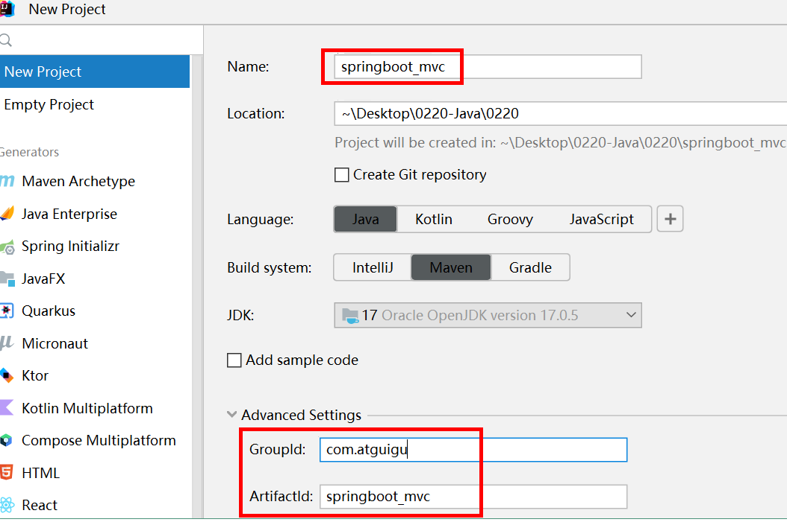
3.  添加依赖

    3.1 添加父工程坐标

    SpringBoot可以帮我们方便的管理项目依赖 , 在Spring Boot提供了一个名为**spring-boot-starter-parent**的工程，里面已经对各种常用依赖的版本进行了管理，我们的项目需要以这个项目为父工程，这样我们就不用操心依赖的版本问题了，需要什么依赖，直接引入坐标(不需要添加版本)即可！
    ```xml
    <!--所有springboot项目都必须继承自 spring-boot-starter-parent-->
    <parent>
        <groupId>org.springframework.boot</groupId>
        <artifactId>spring-boot-starter-parent</artifactId>
        <version>3.0.5</version>
    </parent>
    ```
    3.2 添加web启动器

    为了让Spring Boot帮我们完成各种自动配置，我们必须引入Spring Boot提供的**自动配置依赖**，我们称为**启动器**。因为我们是web项目，这里我们引入web启动器，在 pom.xml 文件中加入如下依赖：
    ```xml
    <dependencies>
    <!--web开发的场景启动器-->
        <dependency>
            <groupId>org.springframework.boot</groupId>
            <artifactId>spring-boot-starter-web</artifactId>
        </dependency>
    </dependencies>
    ```
4.  创建启动类

    创建package：com.atguigu

    创建启动类：MainApplication
    ```java
    package com.atguigu;

    import org.springframework.boot.SpringApplication;
    import org.springframework.boot.autoconfigure.SpringBootApplication;

    /**
     * @SpringBootApplication是一个特殊的注解，用于标识一个Spring Boot应用程序的入口类。它的主要作用是将三个常用注解组合在一起，简化了配置的过程。
     *
     * 具体而言，@SpringBootApplication注解包含以下三个注解的功能：
     *     @Configuration：将该类标识为应用程序的配置类。它允许使用Java代码定义和配置Bean。
     *     @EnableAutoConfiguration：启用Spring Boot的自动配置机制。它根据项目的依赖项自动配置Spring应用程序的行为。自动配置根据类路径、注解和配置属性等条件来决定要使用的功能和配置。
     *     @ComponentScan：自动扫描并加载应用程序中的组件，如控制器、服务、存储库等。它默认扫描@SpringBootApplication注解所在类的包及其子包中的组件。
     *
     * 使用@SpringBootApplication注解，可以将上述三个注解的功能集中在一个注解上，简化了配置文件的编写和组件的加载和扫描过程。它是Spring Boot应用程序的入口点，标识了应用程序的主类，
     * 并告诉Spring Boot在启动时应如何配置和加载应用程序。
     */
    @SpringBootApplication
    public class MainApplication {

        //SpringApplication.run() 方法是启动 Spring Boot 应用程序的关键步骤。它创建应用程序上下文、
        // 自动配置应用程序、启动应用程序，并处理命令行参数，使应用程序能够运行和提供所需的功能
        public static void main(String[] args) {
            SpringApplication.run(MainApplication.class,args);
        }
    }
    ```
5.  编写处理器Controller

    创建package：com.atguigu.controller

    创建类：HelloController

    注意： IoC和DI注解需要在启动类的同包或者子包下方可生效！无需指定，约束俗称。
    ```java
    package com.atguigu.controller;

    import org.springframework.web.bind.annotation.GetMapping;
    import org.springframework.web.bind.annotation.RestController;

    @RestController
    public class HelloController {

        @GetMapping("/hello")
        public String hello(){
            return "Hello,Spring Boot 3!";
        }

    }
    ```
6.  启动测试

    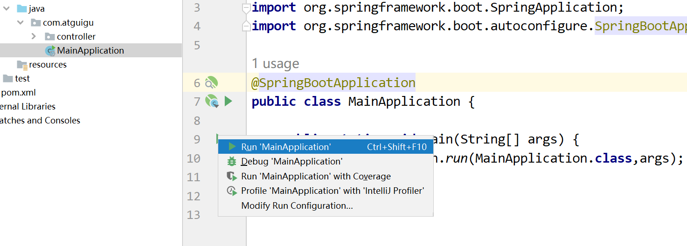

### 1.4 入门总结

1.  为什么依赖不需要写版本？
    -   每个boot项目都有一个父项目`spring-boot-starter-parent`
    -   parent的父项目是`spring-boot-dependencies`
    -   父项目 **版本仲裁中心**，把所有常见的jar的依赖版本都声明好了。
    -   比如：`mysql-connector-j`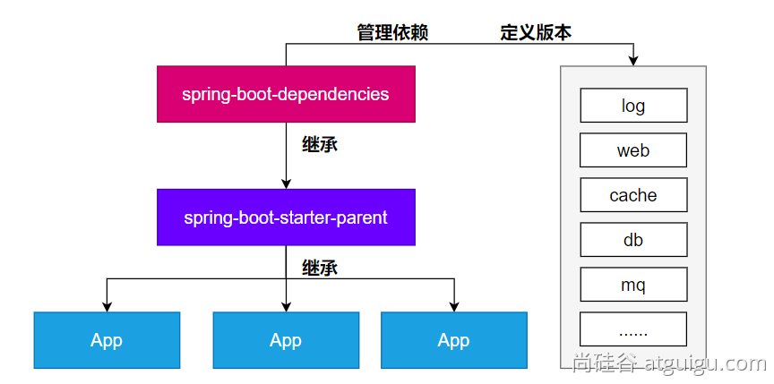
2.  启动器(Starter)是何方神圣？

    Spring Boot提供了一种叫做Starter的概念，它是一组预定义的依赖项集合，旨在简化Spring应用程序的配置和构建过程。Starter包含了一组相关的依赖项，以便在启动应用程序时自动引入所需的库、配置和功能。

    主要作用如下：
    1.  简化依赖管理：Spring Boot Starter通过捆绑和管理一组相关的依赖项，减少了手动解析和配置依赖项的工作。只需引入一个相关的Starter依赖，即可获取应用程序所需的全部依赖。
    2.  自动配置：Spring Boot Starter在应用程序启动时自动配置所需的组件和功能。通过根据类路径和其他设置的自动检测，Starter可以自动配置Spring Bean、数据源、消息传递等常见组件，从而使应用程序的配置变得简单和维护成本降低。
    3.  提供约定优于配置：Spring Boot Starter遵循“约定优于配置”的原则，通过提供一组默认设置和约定，减少了手动配置的需要。它定义了标准的配置文件命名约定、默认属性值、日志配置等，使得开发者可以更专注于业务逻辑而不是繁琐的配置细节。
    4.  快速启动和开发应用程序：Spring Boot Starter使得从零开始构建一个完整的Spring Boot应用程序变得容易。它提供了主要领域（如Web开发、数据访问、安全性、消息传递等）的Starter，帮助开发者快速搭建一个具备特定功能的应用程序原型。
    5.  模块化和可扩展性：Spring Boot Starter的组织结构使得应用程序的不同模块可以进行分离和解耦。每个模块可以有自己的Starter和依赖项，使得应用程序的不同部分可以按需进行开发和扩展。
        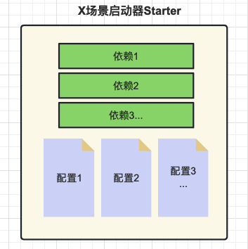
    Spring Boot提供了许多预定义的Starter，例如spring-boot-starter-web用于构建Web应用程序，spring-boot-starter-data-jpa用于使用JPA进行数据库访问，spring-boot-starter-security用于安全认证和授权等等。

    使用Starter非常简单，只需要在项目的构建文件（例如Maven的pom.xml）中添加所需的Starter依赖，Spring Boot会自动处理依赖管理和配置。

    通过使用Starter，开发人员可以方便地引入和配置应用程序所需的功能，避免了手动添加大量的依赖项和编写冗长的配置文件的繁琐过程。同时，Starter也提供了一致的依赖项版本管理，确保依赖项之间的兼容性和稳定性。

    spring boot提供的全部启动器地址：

    [https://docs.spring.io/spring-boot/docs/current/reference/html/using.html#using.build-systems.starters](https://docs.spring.io/spring-boot/docs/current/reference/html/using.html#using.build-systems.starters "https://docs.spring.io/spring-boot/docs/current/reference/html/using.html#using.build-systems.starters")

    命名规范：
    -   官方提供的场景：命名为：`spring-boot-starter-*`
    -   第三方提供场景：命名为：`*-spring-boot-starter`
3.  @SpringBootApplication注解的功效？

    @SpringBootApplication添加到启动类上，是一个组合注解，他的功效有具体的子注解实现！
    ```java
    @SpringBootConfiguration
    @EnableAutoConfiguration
    @ComponentScan
    public @interface SpringBootApplication {}

    ```
    @SpringBootApplication注解是Spring Boot框架中的核心注解，它的主要作用是简化和加速Spring Boot应用程序的配置和启动过程。

    具体而言，@SpringBootApplication注解起到以下几个主要作用：
    1.  自动配置：@SpringBootApplication注解包含了@EnableAutoConfiguration注解，用于启用Spring Boot的自动配置机制。自动配置会根据应用程序的依赖项和类路径，自动配置各种常见的Spring配置和功能，减少开发者的手动配置工作。它通过智能地分析类路径、加载配置和条件判断，为应用程序提供适当的默认配置。
    2.  组件扫描：@SpringBootApplication注解包含了@ComponentScan注解，用于自动扫描并加载应用程序中的组件，例如控制器（Controllers）、服务（Services）、存储库（Repositories）等。它默认会扫描@SpringBootApplication注解所在类的包及其子包中的组件，并将它们纳入Spring Boot应用程序的上下文中，使它们可被自动注入和使用。
    3.  声明配置类：@SpringBootApplication注解本身就是一个组合注解，它包含了@Configuration注解，将被标注的类声明为配置类。配置类可以包含Spring框架相关的配置、Bean定义，以及其他的自定义配置。通过@SpringBootApplication注解，开发者可以将配置类与启动类合并在一起，使得配置和启动可以同时发生。
        总的来说，@SpringBootApplication注解的主要作用是简化Spring Boot应用程序的配置和启动过程。它自动配置应用程序、扫描并加载组件，并将配置和启动类合二为一，简化了开发者的工作量，提高了开发效率。

## 二、SpringBoot3配置文件

### 2.1 统一配置管理概述

SpringBoot工程下，进行统一的配置管理，你想设置的任何参数（端口号、项目根路径、数据库连接信息等等)都集中到一个固定位置和命名的配置文件（`application.properties`或`application.yml`）中！

配置文件应该放置在Spring Boot工程的`src/main/resources`目录下。这是因为`src/main/resources`目录是Spring Boot默认的类路径（classpath），配置文件会被自动加载并可供应用程序访问。


功能配置参数说明：

[https://docs.spring.io/spring-boot/docs/current/reference/html/application-properties.html#appendix.application-properties](https://docs.spring.io/spring-boot/docs/current/reference/html/application-properties.html#appendix.application-properties "https://docs.spring.io/spring-boot/docs/current/reference/html/application-properties.html#appendix.application-properties")

细节总结：

-   集中式管理配置。统一在一个文件完成程序功能参数设置和自定义参数声明 。
-   位置：resources文件夹下，必须命名application  后缀 .properties / .yaml /  .yml 。
-   如果同时存在application.properties | application.yml(.yaml) , properties的优先级更高。
-   配置基本都有默认值。

    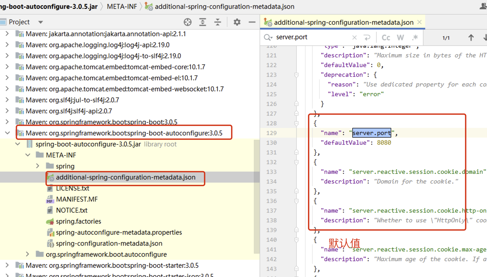

### 2.2 属性配置文件使用

1.  配置文件

    在 resource 文件夹下面新建 application.properties 配置文件
    ```.properties
    # application.properties 为统一配置文件
    # 内部包含: 固定功能的key,自定义的key
    # 此处的配置信息,我们都可以在程序中@Value等注解读取

    # 固定的key
    # 启动端口号
    server.port=80 

    # 自定义
    spring.jdbc.datasource.driverClassName=com.mysql.cj.jdbc.driver
    spring.jdbc.datasource.url=jdbc:mysql:///springboot_01
    spring.jdbc.datasource.username=root
    spring.jdbc.datasource.password=root
    ```
2.  读取配置文件
    ```java
    package com.atguigu.properties;

    import org.springframework.beans.factory.annotation.Value;
    import org.springframework.stereotype.Component;

    @Component
    public class DataSourceProperties {

        @Value("${spring.jdbc.datasource.driverClassName}")
        private String driverClassName;

        @Value("${spring.jdbc.datasource.url}")
        private String url;

        @Value("${spring.jdbc.datasource.username}")
        private String username;

        @Value("${spring.jdbc.datasource.password}")
        private String password;

        // 生成get set 和 toString方法
        public String getDriverClassName() {
            return driverClassName;
        }

        public void setDriverClassName(String driverClassName) {
            this.driverClassName = driverClassName;
        }

        public String getUrl() {
            return url;
        }

        public void setUrl(String url) {
            this.url = url;
        }

        public String getUsername() {
            return username;
        }

        public void setUsername(String username) {
            this.username = username;
        }

        public String getPassword() {
            return password;
        }

        public void setPassword(String password) {
            this.password = password;
        }

        @Override
        public String toString() {
            return "DataSourceProperties{" +
                    "driverClassName='" + driverClassName + '\'' +
                    ", url='" + url + '\'' +
                    ", username='" + username + '\'' +
                    ", password='" + password + '\'' +
                    '}';
        }
    }
    ```
3.  测试效果

    在controller注入，输出进行测试
    ```java
    @Autowired
    private DataSourceProperties dataSourceProperties ;

    @RequestMapping(path = "/hello")
    public String sayHello() {
      System.out.println(dataSourceProperties);
      return "Hello Spring Boot ! " ;
    }
    ```
    浏览器访问路径，控制台查看效果

    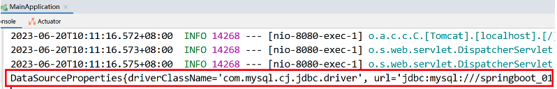

### 2.3 YAML配置文件使用

1.  yaml格式介绍

    YAML（YAML Ain’t Markup Language）是一种基于层次结构的数据序列化格式，旨在提供一种易读、人类友好的数据表示方式。

    与`.properties`文件相比，YAML格式有以下优势：
    1.  层次结构：YAML文件使用缩进和冒号来表示层次结构，使得数据之间的关系更加清晰和直观。这样可以更容易理解和维护复杂的配置，特别适用于深层次嵌套的配置情况。
    2.  自我描述性：YAML文件具有自我描述性，字段和值之间使用冒号分隔，并使用缩进表示层级关系。这使得配置文件更易于阅读和理解，并且可以减少冗余的标点符号和引号。
    3.  注释支持：YAML格式支持注释，可以在配置文件中添加说明性的注释，使配置更具可读性和可维护性。相比之下，`.properties`文件不支持注释，无法提供类似的解释和说明。
    4.  多行文本：YAML格式支持多行文本的表示，可以更方便地表示长文本或数据块。相比之下，`.properties`文件需要使用转义符或将长文本拆分为多行。
    5.  类型支持：YAML格式天然支持复杂的数据类型，如列表、映射等。这使得在配置文件中表示嵌套结构或数据集合更加容易，而不需要进行额外的解析或转换。
    6.  更好的可读性：由于YAML格式的特点，它更容易被人类读懂和解释。它减少了配置文件中需要的特殊字符和语法，让配置更加清晰明了，从而减少了错误和歧义。
        综上所述，YAML格式相对于`.properties`文件具有更好的层次结构表示、自我描述性、注释支持、多行文本表示、复杂数据类型支持和更好的可读性。这些特点使YAML成为一种有力的配置文件格式，尤其适用于复杂的配置需求和人类可读的场景。然而，选择使用YAML还是`.properties`取决于实际需求和团队的偏好，简单的配置可以使用`.properties`，而复杂的配置可以选择YAML以获得更多的灵活性和可读性
2.  yaml语法说明
    1.  数据结构用树形结构呈现，通过缩进来表示层级，
    2.  连续的项目（集合）通过减号 ” - ” 来表示
    3.  键值结构里面的key/value对用冒号 ” : ” 来分隔。
    4.  YAML配置文件的扩展名是yaml 或 yml
    5.  例如：
        ```yaml
        # YAML配置文件示例
        app_name: 我的应用程序
        version: 1.0.0
        author: 张三

        database:
          host: localhost
          port: 5432
          username: admin
          password: password123

        features:
          - 登录
          - 注册
          - 仪表盘

        settings:
          analytics: true
          theme: dark
        ```
3.  配置文件
    ```yaml
    spring:
      jdbc:
        datasource:
          driverClassName: com.mysql.jdbc.Driver
          url: jdbc:mysql:///springboot_02
          username: root
          password: root
          
    server:
      port: 80
    ```
4.  读取配置文件
    > 读取方式和properties一致
    ```java
    package com.atguigu.properties;

    import org.springframework.beans.factory.annotation.Value;
    import org.springframework.stereotype.Component;

    @Component
    public class DataSourceProperties {

        @Value("${spring.jdbc.datasource.driverClassName}")
        private String driverClassName;

        @Value("${spring.jdbc.datasource.url}")
        private String url;

        @Value("${spring.jdbc.datasource.username}")
        private String username;

        @Value("${spring.jdbc.datasource.password}")
        private String password;

        // 生成get set 和 toString方法
        public String getDriverClassName() {
            return driverClassName;
        }

        public void setDriverClassName(String driverClassName) {
            this.driverClassName = driverClassName;
        }

        public String getUrl() {
            return url;
        }

        public void setUrl(String url) {
            this.url = url;
        }

        public String getUsername() {
            return username;
        }

        public void setUsername(String username) {
            this.username = username;
        }

        public String getPassword() {
            return password;
        }

        public void setPassword(String password) {
            this.password = password;
        }

        @Override
        public String toString() {
            return "DataSourceProperties{" +
                    "driverClassName='" + driverClassName + '\'' +
                    ", url='" + url + '\'' +
                    ", username='" + username + '\'' +
                    ", password='" + password + '\'' +
                    '}';
        }
    }
    ```
5.  测试效果

    在controller注入，输出进行测试
    ```java
    @Autowired
    private DataSourceProperties dataSourceProperties ;

    @RequestMapping(path = "/hello")
    public String sayHello() {
      System.out.println(dataSourceProperties);
      return "Hello Spring Boot ! " ;
    }
    ```
    浏览器访问路径，控制台查看效果

    

### 2.4 批量配置文件注入

> &#x20;**@ConfigurationProperties**是SpringBoot提供的重要注解, 他可以将一些配置属性批量注入到bean对象。

1.  创建类，添加属性和注解

    在类上通过@ConfigurationProperties注解声明该类要读取属性配置

    prefix="spring.jdbc.datasource" 读取属性文件中前缀为spring.jdbc.datasource的值。前缀和属性名称和配置文件中的key必须要保持一致才可以注入成功
    ```java
    package com.atguigu.properties;

    import org.springframework.boot.context.properties.ConfigurationProperties;
    import org.springframework.stereotype.Component;

    @Component
    @ConfigurationProperties(prefix = "spring.jdbc.datasource")
    public class DataSourceConfigurationProperties {

        private String driverClassName;
        private String url;
        private String username;
        private String password;

        public String getDriverClassName() {
            return driverClassName;
        }

        public void setDriverClassName(String driverClassName) {
            this.driverClassName = driverClassName;
        }

        public String getUrl() {
            return url;
        }

        public void setUrl(String url) {
            this.url = url;
        }

        public String getUsername() {
            return username;
        }

        public void setUsername(String username) {
            this.username = username;
        }

        public String getPassword() {
            return password;
        }

        public void setPassword(String password) {
            this.password = password;
        }

        @Override
        public String toString() {
            return "DataSourceConfigurationProperties{" +
                    "driverClassName='" + driverClassName + '\'' +
                    ", url='" + url + '\'' +
                    ", username='" + username + '\'' +
                    ", password='" + password + '\'' +
                    '}';
        }
    }
    ```
2.  测试效果
    ```java
    @RestController
    public class HelloController {

        @Autowired
        private DataSourceProperties dataSourceProperties;

        @Autowired
        private DataSourceConfigurationProperties dataSourceConfigurationProperties;

        @GetMapping("/hello")
        public String hello(){
            System.out.println("dataSourceProperties = " + dataSourceProperties);
            System.out.println("dataSourceConfigurationProperties = " + dataSourceConfigurationProperties);
            return "Hello,Spring Boot 3!";
        }
    }
    ```
    浏览器访问路径，控制台查看效果

    

### 2.5 多环境配置和使用

1.  需求

    在Spring Boot中，可以使用多环境配置来根据不同的运行环境（如开发、测试、生产）加载不同的配置。SpringBoot支持多环境配置让应用程序在不同的环境中使用不同的配置参数，例如数据库连接信息、日志级别、缓存配置等。

    以下是实现Spring Boot多环境配置的常见方法：
    1.  属性文件分离：将应用程序的配置参数分离到不同的属性文件中，每个环境对应一个属性文件。例如，可以创建`application-dev.properties`、`application-prod.properties`和`application-test.properties`等文件。在这些文件中，可以定义各自环境的配置参数，如数据库连接信息、端口号等。然后，在`application.properties`中通过`spring.profiles.active`属性指定当前使用的环境。Spring Boot会根据该属性来加载对应环境的属性文件，覆盖默认的配置。
    2.  YAML配置文件：与属性文件类似，可以将配置参数分离到不同的YAML文件中，每个环境对应一个文件。例如，可以创建`application-dev.yml`、`application-prod.yml`和`application-test.yml`等文件。在这些文件中，可以使用YAML语法定义各自环境的配置参数。同样，通过`spring.profiles.active`属性指定当前的环境，Spring Boot会加载相应的YAML文件。
    3.  命令行参数(动态)：可以通过命令行参数来指定当前的环境。例如，可以使用`--spring.profiles.active=dev`来指定使用开发环境的配置。
        通过上述方法，Spring Boot会根据当前指定的环境来加载相应的配置文件或参数，从而实现多环境配置。这样可以简化在不同环境之间的配置切换，并且确保应用程序在不同环境中具有正确的配置。
2.  多环境配置（基于方式b实践）
    > 创建开发、测试、生产三个环境的配置文件
    > application-dev.yml（开发）
    ```yaml
    spring:
      jdbc:
        datasource:
          driverClassName: com.mysql.cj.jdbc.Driver
          url: jdbc:mysql:///dev
          username: root
          password: root
    ```
    application-test.yml（测试）
    ```yaml
    spring:
      jdbc:
        datasource:
          driverClassName: com.mysql.cj.jdbc.Driver
          url: jdbc:mysql:///test
          username: root
          password: root
    ```
    application-prod.yml（生产）
    ```yaml
    spring:
      jdbc:
        datasource:
          driverClassName: com.mysql.cj.jdbc.Driver
          url: jdbc:mysql:///prod
          username: root
          password: root
    ```
3.  环境激活
    ```yaml
    spring:
      profiles:
        active: dev
    ```
4.  测试效果

    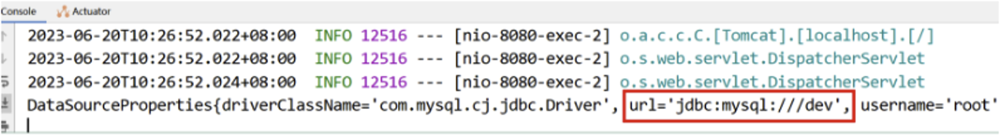

    **注意 :**

    如果设置了spring.profiles.active，并且和application有重叠属性，以active设置优先。

    如果设置了spring.profiles.active，和application无重叠属性，application设置依然生效！

## 三、SpringBoot3整合SpringMVC

### 3.1 实现过程

1.  创建程序
2.  引入依赖
    ```xml
    <?xml version="1.0" encoding="UTF-8"?>
    <project xmlns="http://maven.apache.org/POM/4.0.0"
             xmlns:xsi="http://www.w3.org/2001/XMLSchema-instance"
             xsi:schemaLocation="http://maven.apache.org/POM/4.0.0 http://maven.apache.org/xsd/maven-4.0.0.xsd">
        <modelVersion>4.0.0</modelVersion>

        <parent>
            <groupId>org.springframework.boot</groupId>
            <artifactId>spring-boot-starter-parent</artifactId>
            <version>3.0.5</version>
        </parent>

        <groupId>com.atguigu</groupId>
        <artifactId>springboot-starter-springmvc-03</artifactId>
        <version>1.0-SNAPSHOT</version>

        <properties>
            <maven.compiler.source>17</maven.compiler.source>
            <maven.compiler.target>17</maven.compiler.target>
            <project.build.sourceEncoding>UTF-8</project.build.sourceEncoding>
        </properties>

        <dependencies>
            <!--        web开发的场景启动器 -->
            <dependency>
                <groupId>org.springframework.boot</groupId>
                <artifactId>spring-boot-starter-web</artifactId>
            </dependency>
        </dependencies>

    </project>
    ```
3.  创建启动类
    ```java
    @SpringBootApplication
    public class MainApplication {

        public static void main(String[] args) {
            SpringApplication.run(MainApplication.class,args);
        }
    }

    ```
4.  创建实体类
    ```java
    package com.atguigu.pojo;

    public class User {
        private String username ;
        private String password ;
        private Integer age ;
        private String sex ;

        public String getUsername() {
            return username;
        }

        public void setUsername(String username) {
            this.username = username;
        }

        public String getPassword() {
            return password;
        }

        public void setPassword(String password) {
            this.password = password;
        }

        public Integer getAge() {
            return age;
        }

        public void setAge(Integer age) {
            this.age = age;
        }

        public String getSex() {
            return sex;
        }

        public void setSex(String sex) {
            this.sex = sex;
        }
    }
    ```
5.  编写Controller
    ```java
    package com.atguigu.controller;

    import com.atguigu.pojo.User;
    import org.springframework.stereotype.Controller;
    import org.springframework.web.bind.annotation.GetMapping;
    import org.springframework.web.bind.annotation.RequestMapping;
    import org.springframework.web.bind.annotation.ResponseBody;

    @Controller
    @RequestMapping("/user")
    public class UserController {

        @GetMapping("/getUser")
        @ResponseBody
        public User getUser(){
            
            User user = new User();
            user.setUsername("杨过");
            user.setPassword("123456");
            user.setAge(18);
            user.setSex("男");
            return user;
        }
    }
    ```
6.  访问测试

    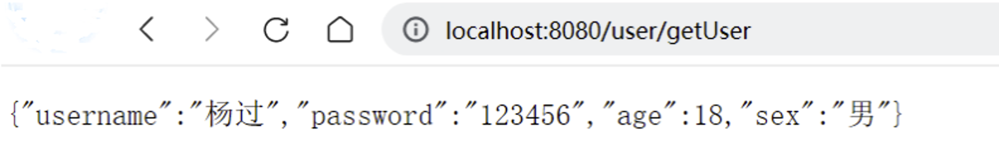

### 3.2 web相关配置

位置：application.yml

```yaml
# web相关的配置
# https://docs.spring.io/spring-boot/docs/current/reference/html/application-properties.html#appendix.application-properties.server
server:
  # 端口号设置
  port: 80
  # 项目根路径
  servlet:
    context-path: /boot
```

当涉及Spring Boot的Web应用程序配置时，以下是五个重要的配置参数：

1.  `server.port`: 指定应用程序的HTTP服务器端口号。默认情况下，Spring Boot使用8080作为默认端口。您可以通过在配置文件中设置`server.port`来更改端口号。
2.  `server.servlet.context-path`: 设置应用程序的上下文路径。这是应用程序在URL中的基本路径。默认情况下，上下文路径为空。您可以通过在配置文件中设置`server.servlet.context-path`属性来指定自定义的上下文路径。
3.  `spring.mvc.view.prefix`和`spring.mvc.view.suffix`: 这两个属性用于配置视图解析器的前缀和后缀。视图解析器用于解析控制器返回的视图名称，并将其映射到实际的视图页面。`spring.mvc.view.prefix`定义视图的前缀，`spring.mvc.view.suffix`定义视图的后缀。
4.  `spring.resources.static-locations`: 配置静态资源的位置。静态资源可以是CSS、JavaScript、图像等。默认情况下，Spring Boot会将静态资源放在`classpath:/static`目录下。您可以通过在配置文件中设置`spring.resources.static-locations`属性来自定义静态资源的位置。
5.  `spring.http.encoding.charset`和`spring.http.encoding.enabled`: 这两个属性用于配置HTTP请求和响应的字符编码。`spring.http.encoding.charset`定义字符编码的名称（例如UTF-8），`spring.http.encoding.enabled`用于启用或禁用字符编码的自动配置。

这些是在Spring Boot的配置文件中与Web应用程序相关的一些重要配置参数。根据您的需求，您可以在配置文件中设置这些参数来定制和配置您的Web应用程序

### 3.3 静态资源处理

> 在WEB开发中我们需要引入一些静态资源 , 例如 : HTML , CSS , JS , 图片等 , 如果是普通的项目静态资源可以放在项目的webapp目录下。现在使用Spring Boot做开发 , 项目中没有webapp目录 , 我们的项目是一个jar工程，那么就没有webapp，我们的静态资源该放哪里呢？

1.  默认路径

    在springboot中就定义了静态资源的默认查找路径：
    ```java
    package org.springframework.boot.autoconfigure.web;
    //..................
    public static class Resources {
            private static final String[] CLASSPATH_RESOURCE_LOCATIONS = new String[]{"classpath:/META-INF/resources/", "classpath:/resources/", "classpath:/static/", "classpath:/public/"};
            private String[] staticLocations;
            private boolean addMappings;
            private boolean customized;
            private final Chain chain;
            private final Cache cache;

            public Resources() {
                this.staticLocations = CLASSPATH_RESOURCE_LOCATIONS;
                this.addMappings = true;
                this.customized = false;
                this.chain = new Chain();
                this.cache = new Cache();
            }
    //...........        
    ```
    **默认的静态资源路径为：**

    **· classpath:/META-INF/resources/**

    **· classpath:/resources/**

    **· classpath:/static/**

    **· classpath:/public/**

    我们只要静态资源放在这些目录中任何一个，SpringMVC都会帮我们处理。 我们习惯会把静态资源放在classpath:/static/ 目录下。在resources目录下创建index.html文件

    

    打开浏览器输入 : [http://localhost:8080/index.html](http://localhost:8080/index.html "http://localhost:8080/index.html")
2.  覆盖路径
    ```yaml
    # web相关的配置
    # https://docs.spring.io/spring-boot/docs/current/reference/html/application-properties.html#appendix.application-properties.server
    server:
      # 端口号设置
      port: 80
      # 项目根路径
      servlet:
        context-path: /boot
    spring:
      web:
        resources:
          # 配置静态资源地址,如果设置,会覆盖默认值
          static-locations: classpath:/webapp
    ```
    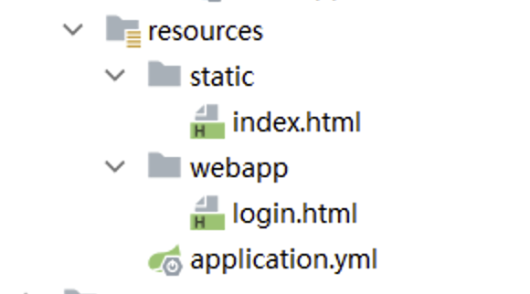

    访问地址：[http://localhost/boot/login.html](http://localhost/boot/login.html "http://localhost/boot/login.html")

### 3.4 自定义拦截器(SpringMVC配置)

1.  拦截器声明
    ```java
    package com.atguigu.interceptor;

    import jakarta.servlet.http.HttpServletRequest;
    import jakarta.servlet.http.HttpServletResponse;
    import org.springframework.stereotype.Component;
    import org.springframework.web.servlet.HandlerInterceptor;
    import org.springframework.web.servlet.ModelAndView;

    @Component
    public class MyInterceptor implements HandlerInterceptor {
        @Override
        public boolean preHandle(HttpServletRequest request, HttpServletResponse response, Object handler) throws Exception {
            System.out.println("MyInterceptor拦截器的preHandle方法执行....");
            return true;
        }

        @Override
        public void postHandle(HttpServletRequest request, HttpServletResponse response, Object handler, ModelAndView modelAndView) throws Exception {
            System.out.println("MyInterceptor拦截器的postHandle方法执行....");
        }

        @Override
        public void afterCompletion(HttpServletRequest request, HttpServletResponse response, Object handler, Exception ex) throws Exception {
            System.out.println("MyInterceptor拦截器的afterCompletion方法执行....");
        }
    }
    ```
2.  拦截器配置

    正常使用配置类，只要保证，**配置类要在启动类的同包或者子包方可生效！**
    ```java
    package com.atguigu.config;

    import com.atguigu.interceptor.MyInterceptor;
    import org.springframework.beans.factory.annotation.Autowired;
    import org.springframework.context.annotation.Configuration;
    import org.springframework.web.servlet.config.annotation.InterceptorRegistry;
    import org.springframework.web.servlet.config.annotation.WebMvcConfigurer;

    @Configuration
    public class MvcConfig implements WebMvcConfigurer {

        @Autowired
        private MyInterceptor myInterceptor ;

        /**
         * /**  拦截当前目录及子目录下的所有路径 /user/**   /user/findAll  /user/order/findAll
         * /*   拦截当前目录下的以及子路径   /user/*     /user/findAll
         * @param registry
         */
        @Override
        public void addInterceptors(InterceptorRegistry registry) {
            registry.addInterceptor(myInterceptor).addPathPatterns("/**");
        }
    }
    ```
3.  拦截器效果测试

    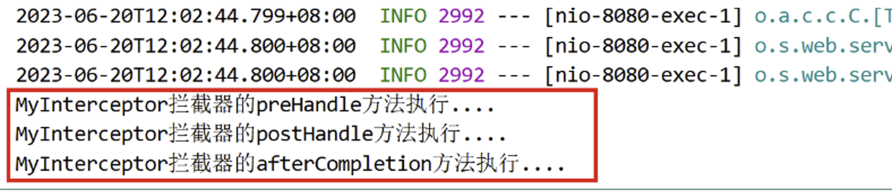

## 四、SpringBoot3整合Druid数据源

1.  创建程序
2.  引入依赖
    ```xml
    <?xml version="1.0" encoding="UTF-8"?>
    <project xmlns="http://maven.apache.org/POM/4.0.0"
             xmlns:xsi="http://www.w3.org/2001/XMLSchema-instance"
             xsi:schemaLocation="http://maven.apache.org/POM/4.0.0 http://maven.apache.org/xsd/maven-4.0.0.xsd">
        <modelVersion>4.0.0</modelVersion>

        <parent>
            <groupId>org.springframework.boot</groupId>
            <artifactId>spring-boot-starter-parent</artifactId>
            <version>3.0.5</version>
        </parent>
        <groupId>com.atguigu</groupId>
        <artifactId>springboot-starter-druid-04</artifactId>
        <version>1.0-SNAPSHOT</version>

        <properties>
            <maven.compiler.source>17</maven.compiler.source>
            <maven.compiler.target>17</maven.compiler.target>
            <project.build.sourceEncoding>UTF-8</project.build.sourceEncoding>
        </properties>


        <dependencies>
            <!--  web开发的场景启动器 -->
            <dependency>
                <groupId>org.springframework.boot</groupId>
                <artifactId>spring-boot-starter-web</artifactId>
            </dependency>

            <!-- 数据库相关配置启动器 jdbctemplate 事务相关-->
            <dependency>
                <groupId>org.springframework.boot</groupId>
                <artifactId>spring-boot-starter-jdbc</artifactId>
            </dependency>

            <!-- druid启动器的依赖  -->
            <dependency>
                <groupId>com.alibaba</groupId>
                <artifactId>druid-spring-boot-3-starter</artifactId>
                <version>1.2.18</version>
            </dependency>

            <!-- 驱动类-->
            <dependency>
                <groupId>mysql</groupId>
                <artifactId>mysql-connector-java</artifactId>
                <version>8.0.28</version>
            </dependency>

            <dependency>
                <groupId>org.projectlombok</groupId>
                <artifactId>lombok</artifactId>
                <version>1.18.28</version>
            </dependency>

        </dependencies>

        <!--    SpringBoot应用打包插件-->
        <build>
            <plugins>
                <plugin>
                    <groupId>org.springframework.boot</groupId>
                    <artifactId>spring-boot-maven-plugin</artifactId>
                </plugin>
            </plugins>
        </build>

    </project>
    ```
3.  启动类
    ```java
    @SpringBootApplication
    public class MainApplication {

        public static void main(String[] args) {
            SpringApplication.run(MainApplication.class,args);
        }
    }

    ```
4.  配置文件编写
    > 添加druid连接池的基本配置
    ```yaml
    spring:
      datasource:
        # 连接池类型 
        type: com.alibaba.druid.pool.DruidDataSource

        # Druid的其他属性配置 springboot3整合情况下,数据库连接信息必须在Druid属性下!
        druid:
          url: jdbc:mysql://localhost:3306/day01
          username: root
          password: root
          driver-class-name: com.mysql.cj.jdbc.Driver
          # 初始化时建立物理连接的个数
          initial-size: 5
          # 连接池的最小空闲数量
          min-idle: 5
          # 连接池最大连接数量
          max-active: 20
          # 获取连接时最大等待时间，单位毫秒
          max-wait: 60000
          # 申请连接的时候检测，如果空闲时间大于timeBetweenEvictionRunsMillis，执行validationQuery检测连接是否有效。
          test-while-idle: true
          # 既作为检测的间隔时间又作为testWhileIdel执行的依据
          time-between-eviction-runs-millis: 60000
          # 销毁线程时检测当前连接的最后活动时间和当前时间差大于该值时，关闭当前连接(配置连接在池中的最小生存时间)
          min-evictable-idle-time-millis: 30000
          # 用来检测数据库连接是否有效的sql 必须是一个查询语句(oracle中为 select 1 from dual)
          validation-query: select 1
          # 申请连接时会执行validationQuery检测连接是否有效,开启会降低性能,默认为true
          test-on-borrow: false
          # 归还连接时会执行validationQuery检测连接是否有效,开启会降低性能,默认为true
          test-on-return: false
          # 是否缓存preparedStatement, 也就是PSCache,PSCache对支持游标的数据库性能提升巨大，比如说oracle,在mysql下建议关闭。
          pool-prepared-statements: false
          # 要启用PSCache，必须配置大于0，当大于0时，poolPreparedStatements自动触发修改为true。在Druid中，不会存在Oracle下PSCache占用内存过多的问题，可以把这个数值配置大一些，比如说100
          max-pool-prepared-statement-per-connection-size: -1
          # 合并多个DruidDataSource的监控数据
          use-global-data-source-stat: true

    logging:
      level:
        root: debug
    ```
5.  编写Controller
    ```java
    @Slf4j
    @Controller
    @RequestMapping("/user")
    public class UserController {

        @Autowired
        private JdbcTemplate jdbcTemplate;

        @GetMapping("/getUser")
        @ResponseBody
        public User getUser(){
            String sql = "select * from users where id = ? ; ";
            User user = jdbcTemplate.queryForObject(sql, new BeanPropertyRowMapper<>(User.class), 1);
            log.info("查询的user数据为:{}",user.toString());
            return user;
        }
        
    }
    ```
6.  启动测试
7.  问题解决

    通过源码分析，druid-spring-boot-3-starter目前最新版本是1.2.18，虽然适配了SpringBoot3，但缺少自动装配的配置文件，需要手动在resources目录下创建META-INF/spring/org.springframework.boot.autoconfigure.AutoConfiguration.imports，文件内容如下!
    ```java
    com.alibaba.druid.spring.boot3.autoconfigure.DruidDataSourceAutoConfigure
    ```
    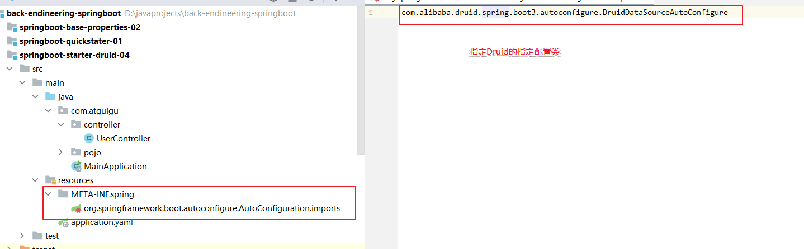

## 五、SpringBoot3整合Mybatis

### 5.1 MyBatis整合步骤

1.  导入依赖：在您的Spring Boot项目的构建文件（如pom.xml）中添加MyBatis和数据库驱动的相关依赖。例如，如果使用MySQL数据库，您需要添加MyBatis和MySQL驱动的依赖。
2.  配置数据源：在`application.properties`或`application.yml`中配置数据库连接信息，包括数据库URL、用户名、密码、mybatis的功能配置等。
3.  创建实体类：创建与数据库表对应的实体类。
4.  创建Mapper接口：创建与数据库表交互的Mapper接口。
5.  创建Mapper接口SQL实现： 可以使用mapperxml文件或者注解方式
6.  创建程序启动类
7.  注解扫描：在Spring Boot的主应用类上添加`@MapperScan`注解，用于扫描和注册Mapper接口。
8.  使用Mapper接口：在需要使用数据库操作的地方，通过依赖注入或直接实例化Mapper接口，并调用其中的方法进行数据库操作。

### 5.2 Mybatis整合实践

1.  创建项目
2.  导入依赖
    ```xml
    <parent>
        <groupId>org.springframework.boot</groupId>
        <artifactId>spring-boot-starter-parent</artifactId>
        <version>3.0.5</version>
    </parent>

    <dependencies>
        <dependency>
            <groupId>org.springframework.boot</groupId>
            <artifactId>spring-boot-starter-web</artifactId>
        </dependency>

        <dependency>
            <groupId>org.mybatis.spring.boot</groupId>
            <artifactId>mybatis-spring-boot-starter</artifactId>
            <version>3.0.1</version>
        </dependency>

        <!-- 数据库相关配置启动器 -->
        <dependency>
            <groupId>org.springframework.boot</groupId>
            <artifactId>spring-boot-starter-jdbc</artifactId>
        </dependency>

        <!-- druid启动器的依赖  -->
        <dependency>
            <groupId>com.alibaba</groupId>
            <artifactId>druid-spring-boot-3-starter</artifactId>
            <version>1.2.18</version>
        </dependency>

        <!-- 驱动类-->
        <dependency>
            <groupId>mysql</groupId>
            <artifactId>mysql-connector-java</artifactId>
            <version>8.0.28</version>
        </dependency>

        <dependency>
            <groupId>org.projectlombok</groupId>
            <artifactId>lombok</artifactId>
            <version>1.18.28</version>
        </dependency>

    </dependencies>
    ```
3.  配置文件
    ```yaml
    server:
      port: 80
      servlet:
        context-path: /
    spring:
      datasource:
        type: com.alibaba.druid.pool.DruidDataSource
        druid:
          url: jdbc:mysql:///day01
          username: root
          password: root
          driver-class-name: com.mysql.cj.jdbc.Driver
          
    mybatis:
      configuration:  # setting配置
        auto-mapping-behavior: full
        map-underscore-to-camel-case: true
        log-impl: org.apache.ibatis.logging.slf4j.Slf4jImpl
      type-aliases-package: com.atguigu.pojo # 配置别名
      mapper-locations: classpath:/mapper/*.xml # mapperxml位置
    ```
4.  实体类准备
    ```java
    package com.atguigu.pojo;

    public class User {
        private String account ;
        private String password ;
        private Integer id ;

        public String getAccount() {
            return account;
        }

        public void setAccount(String account) {
            this.account = account;
        }

        public String getPassword() {
            return password;
        }

        public void setPassword(String password) {
            this.password = password;
        }

        public Integer getId() {
            return id;
        }

        public void setId(Integer id) {
            this.id = id;
        }

        @Override
        public String toString() {
            return "User{" +
                    "account='" + account + '\'' +
                    ", password='" + password + '\'' +
                    ", id=" + id +
                    '}';
        }
    }
    ```
5.  Mapper接口准备
    ```java
    public interface UserMapper {

        List<User> queryAll();
    }
    ```
6.  Mapper接口实现（XML）

    位置：resources/mapper/UserMapper.xml
    ```java
    <?xml version="1.0" encoding="UTF-8" ?>
    <!DOCTYPE mapper
            PUBLIC "-//mybatis.org//DTD Mapper 3.0//EN"
            "https://mybatis.org/dtd/mybatis-3-mapper.dtd">
    <!-- namespace = 接口的全限定符 -->
    <mapper namespace="com.atguigu.mapper.UserMapper">

        <select id="queryAll" resultType="user">
            select * from users
        </select>

    </mapper>
    ```
7.  编写三层架构代码
    > 伪代码，不添加业务接口！
    1.  controller
        ```java
        @Slf4j
        @Controller
        @RequestMapping("/user")
        public class UserController {

            @Autowired
            private UserService userService;

            @GetMapping("/list")
            @ResponseBody
            public List<User> getUser(){
                List<User> userList = userService.findList();
                log.info("查询的user数据为:{}",userList);
                return userList;
            }

        }
        ```
    2.  service
        ```java
        @Slf4j
        @Service
        public class UserService {

            @Autowired
            private UserMapper userMapper;

            public List<User> findList(){
                List<User> users = userMapper.queryAll();
                log.info("查询全部数据:{}",users);
                return users;
            }
        }
        ```
8.  启动类和接口扫描
    ```java
    @MapperScan("com.atguigu.mapper") //mapper接口扫描配置
    @SpringBootApplication
    public class MainApplication {

        public static void main(String[] args) {
            SpringApplication.run(MainApplication.class,args);
        }
    }

    ```
9.  启动测试

### 5.3 声明式事务整合配置

依赖导入:

```xml
 <dependency>
    <groupId>org.springframework.boot</groupId>
    <artifactId>spring-boot-starter-jdbc</artifactId>
</dependency>
```

注：SpringBoot项目会自动配置一个 DataSourceTransactionManager，所以我们只需在方法（或者类）加上 @Transactional 注解，就自动纳入 Spring 的事务管理了

```java
@Transactional
public void update(){
    User user = new User();
    user.setId(1);
    user.setPassword("test2");
    user.setAccount("test2");
    userMapper.update(user);
}
```

### 5.4 AOP整合配置

依赖导入:

```xml
<dependency>
    <groupId>org.springframework.boot</groupId>
    <artifactId>spring-boot-starter-aop</artifactId>
</dependency>
```

直接使用aop注解即可:&#x20;

```java
@Component
@Aspect
public class LogAdvice {

    @Before("execution(* com..service.*.*(..))")
    public void before(JoinPoint joinPoint){
        System.out.println("LogAdvice.before");
        System.out.println("joinPoint = " + joinPoint);
    }

}
```

## 六、SpringBoot3项目打包和运行

### 6.1 添加打包插件

> 在Spring Boot项目中添加`spring-boot-maven-plugin`插件是为了支持将项目打包成可执行的可运行jar包。如果不添加`spring-boot-maven-plugin`插件配置，使用常规的`java -jar`命令来运行打包后的Spring Boot项目是无法找到应用程序的入口点，因此导致无法运行。

```xml
<!--    SpringBoot应用打包插件-->
<build>
    <plugins>
        <plugin>
            <groupId>org.springframework.boot</groupId>
            <artifactId>spring-boot-maven-plugin</artifactId>
        </plugin>
    </plugins>
</build>
```

### 6.2 执行打包

在idea点击package进行打包

可以在编译的target文件中查看jar包

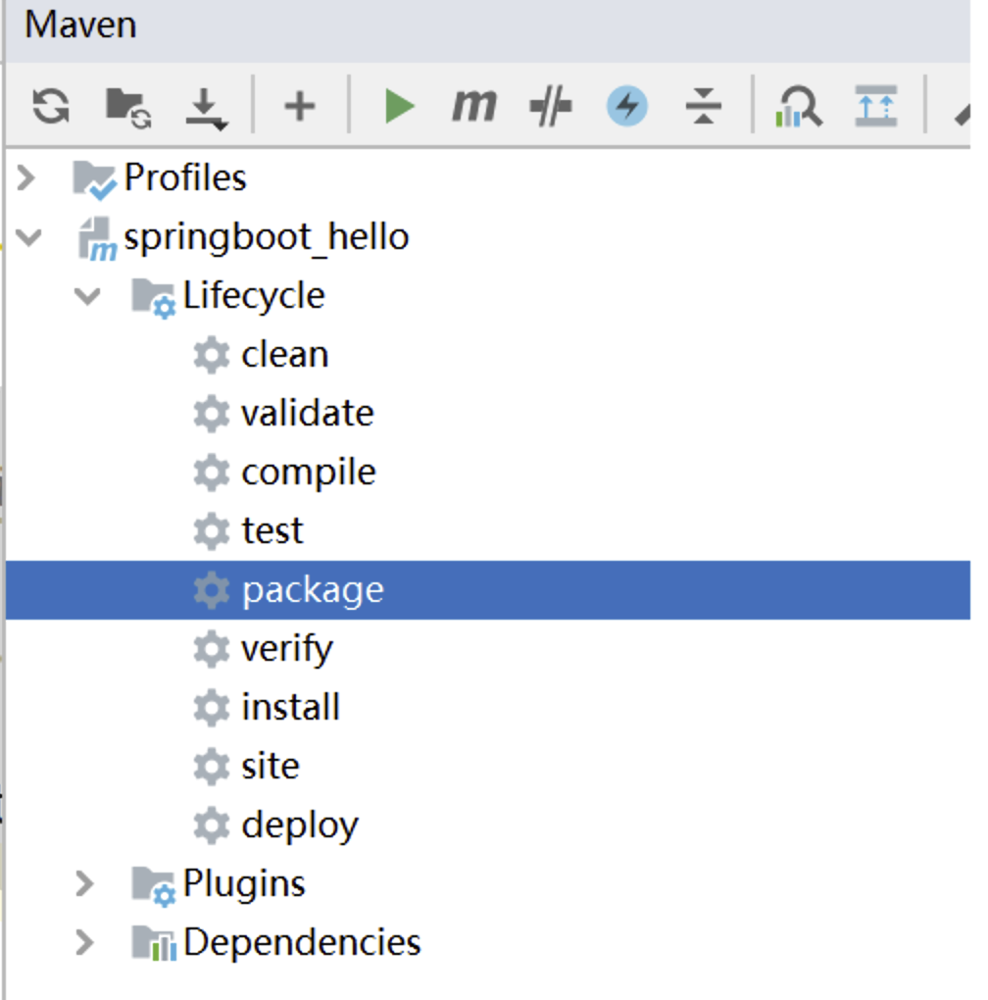

### 6.3 命令启动和参数说明

`java -jar`命令用于在Java环境中执行可执行的JAR文件。下面是关于`java -jar`命令的说明：

```xml
命令格式：java -jar  [选项] [参数] <jar文件名>
```

1.  `-D<name>=<value>`：设置系统属性，可以通过`System.getProperty()`方法在应用程序中获取该属性值。例如：`java -jar -Dserver.port=8080 myapp.jar`。
2.  `-X`：设置JVM参数，例如内存大小、垃圾回收策略等。常用的选项包括：
    -   `-Xmx<size>`：设置JVM的最大堆内存大小，例如 `-Xmx512m` 表示设置最大堆内存为512MB。
    -   `-Xms<size>`：设置JVM的初始堆内存大小，例如 `-Xms256m` 表示设置初始堆内存为256MB。
3.  `-Dspring.profiles.active=<profile>`：指定Spring Boot的激活配置文件，可以通过`application-<profile>.properties`或`application-<profile>.yml`文件来加载相应的配置。例如：`java -jar -Dspring.profiles.active=dev myapp.jar`。

启动和测试：

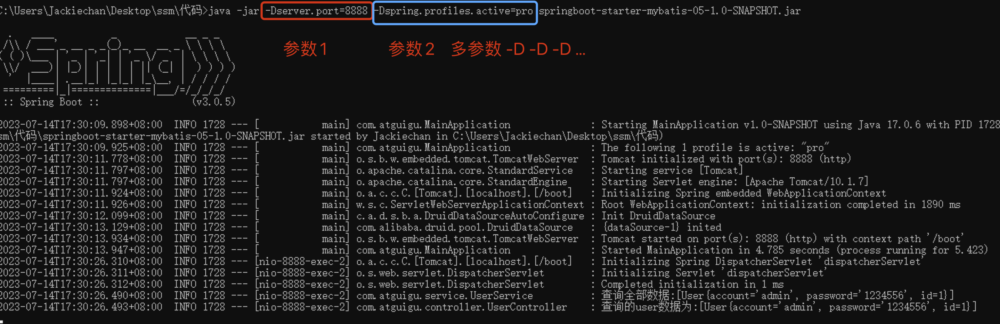

注意： -D 参数必须要在jar之前！否者不生效！
