# 四、SpringMVC实战：构建高效表述层框架

## 目录

-   [一、SpringMVC简介和体验](#一SpringMVC简介和体验)
    -   [1.1 介绍](#11-介绍)
    -   [1.2 主要作用](#12-主要作用)
    -   [1.3 核心组件和调用流程理解](#13-核心组件和调用流程理解)
    -   [1.4 快速体验](#14-快速体验)
-   [二、SpringMVC接收数据](#二SpringMVC接收数据)
    -   [2.1 访问路径设置](#21-访问路径设置)
    -   [2.2 接收参数（重点）](#22-接收参数重点)
        -   [2.2.1 param 和 json参数比较](#221-param-和-json参数比较)
        -   [2.2.2 param参数接收](#222-param参数接收)
        -   [2.2.3 路径 参数接收](#223-路径-参数接收)
        -   [2.2.4 json参数接收](#224-json参数接收)
    -   [2.3 接收Cookie数据](#23-接收Cookie数据)
    -   [2.4 接收请求头数据](#24-接收请求头数据)
    -   [2.5 原生Api对象操作](#25-原生Api对象操作)
    -   [2.6 共享域对象操作](#26-共享域对象操作)
        -   [2.6.1 属性（共享）域作用回顾](#261-属性共享域作用回顾)
        -   [2.6.2 Request级别属性（共享）域](#262-Request级别属性共享域)
        -   [2.6.3 Session级别属性（共享）域](#263-Session级别属性共享域)
        -   [2.6.4 Application级别属性（共享）域](#264-Application级别属性共享域)
-   [三、SpringMVC响应数据](#三SpringMVC响应数据)
    -   [3.1 handler方法分析](#31-handler方法分析)
    -   [3.2 页面跳转控制](#32-页面跳转控制)
        -   [3.2.1 快速返回模板视图](#321-快速返回模板视图)
        -   [3.2.2 转发和重定向](#322-转发和重定向)
    -   [3.3 返回JSON数据（重点）](#33-返回JSON数据重点)
        -   [3.3.1 前置准备](#331-前置准备)
        -   [3.3.2 @ResponseBody](#332-ResponseBody)
        -   [3.3.3 @RestController](#333-RestController)
    -   [3.4 返回静态资源处理](#34-返回静态资源处理)
-   [四、RESTFul风格设计和实战](#四RESTFul风格设计和实战)
    -   [4.1 RESTFul风格概述](#41-RESTFul风格概述)
        -   [4.1.1 RESTFul风格简介](#411-RESTFul风格简介)
        -   [4.1.2 RESTFul风格特点](#412-RESTFul风格特点)
        -   [4.1.3 RESTFul风格设计规范](#413-RESTFul风格设计规范)
        -   [4.1.4 RESTFul风格好处](#414-RESTFul风格好处)
    -   [4.2 RESTFul风格实战](#42-RESTFul风格实战)
        -   [4.2.1 需求分析](#421-需求分析)
        -   [4.2.2 RESTFul风格接口设计](#422-RESTFul风格接口设计)
        -   [4.2.3 后台接口实现](#423-后台接口实现)
-   [五、SpringMVC其他扩展](#五SpringMVC其他扩展)
    -   [5.1 全局异常处理机制](#51-全局异常处理机制)
        -   [5.1.1 异常处理两种方式](#511-异常处理两种方式)
        -   [5.1.2 基于注解异常声明异常处理](#512-基于注解异常声明异常处理)
    -   [5.2 拦截器使用](#52-拦截器使用)
        -   [5.2.1 拦截器概念](#521-拦截器概念)
        -   [5.2.2 拦截器使用](#522-拦截器使用)
    -   [5.3 参数校验](#53-参数校验)
-   [六、SpringMVC总结](#六SpringMVC总结)

## 一、SpringMVC简介和体验

### 1.1 介绍

<https://docs.spring.io/spring-framework/reference/web/webmvc.html>

Spring Web MVC是基于Servlet API构建的原始Web框架，从一开始就包含在Spring Framework中。正式名称“Spring Web MVC”来自其源模块的名称（ `spring-webmvc` ），但它通常被称为“Spring MVC”。

在控制层框架历经Strust、WebWork、Strust2等诸多产品的历代更迭之后，目前业界普遍选择了SpringMVC作为Java EE项目表述层开发的**首选方案**。之所以能做到这一点，是因为SpringMVC具备如下显著优势：

-   **Spring 家族原生产品**，与IOC容器等基础设施无缝对接
-   表述层各细分领域需要解决的问题**全方位覆盖**，提供**全面解决方案**
-   **代码清新简洁**，大幅度提升开发效率
-   内部组件化程度高，可插拔式组件**即插即用**，想要什么功能配置相应组件即可
-   **性能卓著**，尤其适合现代大型、超大型互联网项目要求

原生Servlet API开发代码片段

```java
protected void doGet(HttpServletRequest request, HttpServletResponse response) 
                                                        throws ServletException, IOException {  
    String userName = request.getParameter("userName");
    
    System.out.println("userName="+userName);
}
```

基于SpringMVC开发代码片段

```java
@RequestMapping("/user/login")
public String login(@RequestParam("userName") String userName,Sting password){
    
    log.debug("userName="+userName);
    //调用业务即可
    
    return "result";
}
```

### 1.2 主要作用

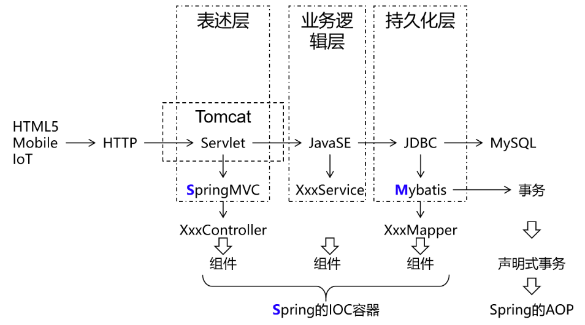

SSM框架构建起单体项目的技术栈需求！其中的SpringMVC负责表述层（控制层）实现简化！

SpringMVC的作用主要覆盖的是表述层，例如：

-   请求映射
-   数据输入
-   视图界面
-   请求分发
-   表单回显
-   会话控制
-   过滤拦截
-   异步交互
-   文件上传
-   文件下载
-   数据校验
-   类型转换
-   等等等

**最终总结：**

1.  简化前端参数接收( 形参列表 )
2.  简化后端数据响应(返回值)
3.  以及其他......

### 1.3 核心组件和调用流程理解

Spring MVC与许多其他Web框架一样，是围绕前端控制器模式设计的，其中中央 `Servlet`  `DispatcherServlet` 做整体请求处理调度！

除了`DispatcherServlet`SpringMVC还会提供其他特殊的组件协作完成请求处理和响应呈现。

**SpringMVC处理请求流程：**

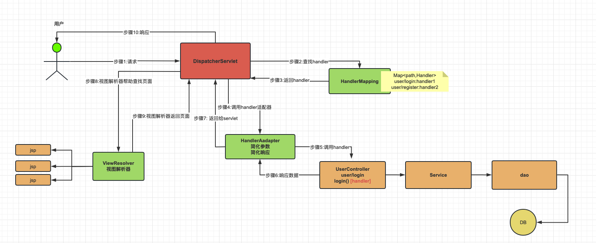

**SpringMVC涉及组件理解：**

1.  DispatcherServlet :  SpringMVC提供，我们需要使用web.xml配置使其生效，它是整个流程处理的核心，所有请求都经过它的处理和分发！\[ CEO ]
2.  HandlerMapping :  SpringMVC提供，我们需要进行IoC配置使其加入IoC容器方可生效，它内部缓存handler(controller方法)和handler访问路径数据，被DispatcherServlet调用，用于查找路径对应的handler！\[秘书]
3.  HandlerAdapter : SpringMVC提供，我们需要进行IoC配置使其加入IoC容器方可生效，它可以处理请求参数和处理响应数据数据，每次DispatcherServlet都是通过handlerAdapter间接调用handler，他是handler和DispatcherServlet之间的适配器！\[经理]
4.  Handler : handler又称处理器，他是Controller类内部的方法简称，是由我们自己定义，用来接收参数，向后调用业务，最终返回响应结果！\[打工人]
5.  ViewResovler : SpringMVC提供，我们需要进行IoC配置使其加入IoC容器方可生效！视图解析器主要作用简化模版视图页面查找的，但是需要注意，前后端分离项目，后端只返回JSON数据，不返回页面，那就不需要视图解析器！所以，视图解析器，相对其他的组件不是必须的！\[财务]

### 1.4 快速体验

1.  体验场景需求

    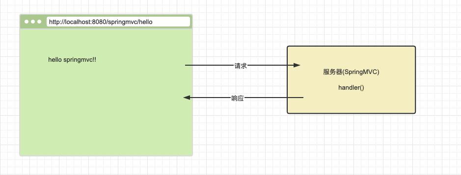
2.  配置分析
    1.  DispatcherServlet，设置处理所有请求！
    2.  HandlerMapping,HandlerAdapter,Handler需要加入到IoC容器，供DS调用！
    3.  Handler自己声明（Controller）需要配置到HandlerMapping中供DS查找！
3.  准备项目
    1.  创建项目

        springmvc-base-quick

        注意：需要转成maven/web程序！！
    2.  导入依赖
        ```xml
        <properties>
            <spring.version>6.0.6</spring.version>
            <servlet.api>9.1.0</servlet.api>
            <maven.compiler.source>17</maven.compiler.source>
            <maven.compiler.target>17</maven.compiler.target>
            <project.build.sourceEncoding>UTF-8</project.build.sourceEncoding>
        </properties>

        <dependencies>
            <!-- springioc相关依赖  -->
            <dependency>
                <groupId>org.springframework</groupId>
                <artifactId>spring-context</artifactId>
                <version>${spring.version}</version>
            </dependency>

            <!-- web相关依赖  -->
            <!-- 在 pom.xml 中引入 Jakarta EE Web API 的依赖 -->
            <!--
                在 Spring Web MVC 6 中，Servlet API 迁移到了 Jakarta EE API，因此在配置 DispatcherServlet 时需要使用
                 Jakarta EE 提供的相应类库和命名空间。错误信息 “‘org.springframework.web.servlet.DispatcherServlet’
                 is not assignable to ‘javax.servlet.Servlet,jakarta.servlet.Servlet’” 表明你使用了旧版本的
                 Servlet API，没有更新到 Jakarta EE 规范。
            -->
            <dependency>
                <groupId>jakarta.platform</groupId>
                <artifactId>jakarta.jakartaee-web-api</artifactId>
                <version>${servlet.api}</version>
                <scope>provided</scope>
            </dependency>

            <!-- springwebmvc相关依赖  -->
            <dependency>
                <groupId>org.springframework</groupId>
                <artifactId>spring-webmvc</artifactId>
                <version>${spring.version}</version>
            </dependency>

        </dependencies>
        ```
4.  Controller声明
    ```java
    @Controller
    public class HelloController {

        //handlers

        /**
         * handler就是controller内部的具体方法
         * @RequestMapping("/springmvc/hello") 就是用来向handlerMapping中注册的方法注解!
         * @ResponseBody 代表向浏览器直接返回数据!
         */
        @RequestMapping("/springmvc/hello")
        @ResponseBody
        public String hello(){
            System.out.println("HelloController.hello");
            return "hello springmvc!!";
        }
    }

    ```
5.  Spring MVC核心组件配置类
    > 声明springmvc涉及组件信息的配置类
    ```java
    //TODO: SpringMVC对应组件的配置类 [声明SpringMVC需要的组件信息]

    //TODO: 导入handlerMapping和handlerAdapter的三种方式
     //1.自动导入handlerMapping和handlerAdapter [推荐]
     //2.可以不添加,springmvc会检查是否配置handlerMapping和handlerAdapter,没有配置默认加载
     //3.使用@Bean方式配置handlerMapper和handlerAdapter
    @EnableWebMvc     
    @Configuration
    @ComponentScan(basePackages = "com.atguigu.controller") //TODO: 进行controller扫
    //WebMvcConfigurer springMvc进行组件配置的规范,配置组件,提供各种方法! 前期可以实现
    public class SpringMvcConfig implements WebMvcConfigurer {

        @Bean
        public HandlerMapping handlerMapping(){
            return new RequestMappingHandlerMapping();
        }

        @Bean
        public HandlerAdapter handlerAdapter(){
            return new RequestMappingHandlerAdapter();
        }
        
    }

    ```
6.  SpringMVC环境搭建
    > 对于使用基于 Java 的 Spring 配置的应用程序，建议这样做，如以下示例所示：
    ```java
    //TODO: SpringMVC提供的接口,是替代web.xml的方案,更方便实现完全注解方式ssm处理!
    //TODO: Springmvc框架会自动检查当前类的实现类,会自动加载 getRootConfigClasses / getServletConfigClasses 提供的配置类
    //TODO: getServletMappings 返回的地址 设置DispatherServlet对应处理的地址
    public class MyWebAppInitializer extends AbstractAnnotationConfigDispatcherServletInitializer {

      /**
       * 指定service / mapper层的配置类
       */
      @Override
      protected Class<?>[] getRootConfigClasses() {
        return null;
      }

      /**
       * 指定springmvc的配置类
       * @return
       */
      @Override
      protected Class<?>[] getServletConfigClasses() {
        return new Class<?>[] { SpringMvcConfig.class };
      }

      /**
       * 设置dispatcherServlet的处理路径!
       * 一般情况下为 / 代表处理所有请求!
       */
      @Override
      protected String[] getServletMappings() {
        return new String[] { "/" };
      }
    }
    ```
7.  启动测试

    注意： tomcat应该是10+版本！方可支持 Jakarta EE API!

    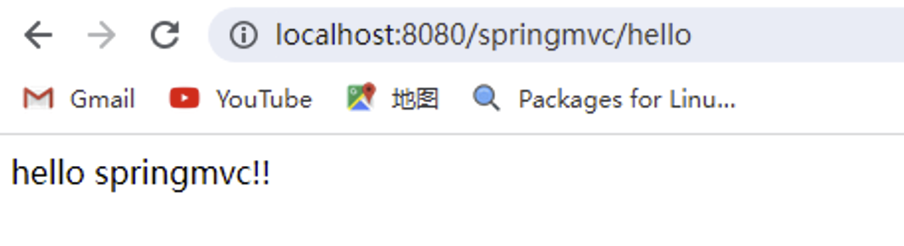

## 二、SpringMVC接收数据

### 2.1 访问路径设置

@RequestMapping注解的作用就是将请求的 URL 地址和处理请求的方式（handler方法）关联起来，建立映射关系。

SpringMVC 接收到指定的请求，就会来找到在映射关系中对应的方法来处理这个请求。

1.  **精准路径匹配**

    在@RequestMapping注解指定 URL 地址时，不使用任何通配符，按照请求地址进行精确匹配。
    ```java
    @Controller
    public class UserController {

        /**
         * 精准设置访问地址 /user/login
         */
        @RequestMapping(value = {"/user/login"})
        @ResponseBody
        public String login(){
            System.out.println("UserController.login");
            return "login success!!";
        }

        /**
         * 精准设置访问地址 /user/register
         */
        @RequestMapping(value = {"/user/register"})
        @ResponseBody
        public String register(){
            System.out.println("UserController.register");
            return "register success!!";
        }
        
    }

    ```
2.  **模糊路径匹配**

    在@RequestMapping注解指定 URL 地址时，通过使用通配符，匹配多个类似的地址。
    ```java
    @Controller
    public class ProductController {

        /**
         *  路径设置为 /product/*  
         *    /* 为单层任意字符串  /product/a  /product/aaa 可以访问此handler  
         *    /product/a/a 不可以
         *  路径设置为 /product/** 
         *   /** 为任意层任意字符串  /product/a  /product/aaa 可以访问此handler  
         *   /product/a/a 也可以访问
         */
        @RequestMapping("/product/*")
        @ResponseBody
        public String show(){
            System.out.println("ProductController.show");
            return "product show!";
        }
    }

    ```
    ```text
    单层匹配和多层匹配：
      /*：只能匹配URL地址中的一层，如果想准确匹配两层，那么就写“/*/*”以此类推。
      /**：可以匹配URL地址中的多层。
    其中所谓的一层或多层是指一个URL地址字符串被“/”划分出来的各个层次
    这个知识点虽然对于@RequestMapping注解来说实用性不大，但是将来配置拦截器的时候也遵循这个规则。
    ```
3.  **类和方法级别区别**

    `@RequestMapping` 注解可以用于类级别和方法级别，它们之间的区别如下：
    1.  设置到类级别：`@RequestMapping` 注解可以设置在控制器类上，用于映射整个控制器的通用请求路径。这样，如果控制器中的多个方法都需要映射同一请求路径，就不需要在每个方法上都添加映射路径。
    2.  设置到方法级别：`@RequestMapping` 注解也可以单独设置在控制器方法上，用于更细粒度地映射请求路径和处理方法。当多个方法处理同一个路径的不同操作时，可以使用方法级别的 `@RequestMapping` 注解进行更精细的映射。
    ```java
    //1.标记到handler方法
    @RequestMapping("/user/login")
    @RequestMapping("/user/register")
    @RequestMapping("/user/logout")

    //2.优化标记类+handler方法
    //类上
    @RequestMapping("/user")
    //handler方法上
    @RequestMapping("/login")
    @RequestMapping("/register")
    @RequestMapping("/logout")

    ```
4.  **附带请求方式限制**

    HTTP 协议定义了八种请求方式，在 SpringMVC 中封装到了下面这个枚举类：
    ```java
    public enum RequestMethod {
      GET, HEAD, POST, PUT, PATCH, DELETE, OPTIONS, TRACE
    }
    ```
    默认情况下：@RequestMapping("/logout") 任何请求方式都可以访问！

    如果需要特定指定：
    ```java
    @Controller
    public class UserController {

        /**
         * 精准设置访问地址 /user/login
         * method = RequestMethod.POST 可以指定单个或者多个请求方式!
         * 注意:违背请求方式会出现405异常!
         */
        @RequestMapping(value = {"/user/login"} , method = RequestMethod.POST)
        @ResponseBody
        public String login(){
            System.out.println("UserController.login");
            return "login success!!";
        }

        /**
         * 精准设置访问地址 /user/register
         */
        @RequestMapping(value = {"/user/register"},method = {RequestMethod.POST,RequestMethod.GET})
        @ResponseBody
        public String register(){
            System.out.println("UserController.register");
            return "register success!!";
        }

    }
    ```
    注意：违背请求方式，会出现405异常！！！
5.  **进阶注解**

    还有 `@RequestMapping` 的 HTTP 方法特定快捷方式变体：
    -   `@GetMapping`
    -   `@PostMapping`
    -   `@PutMapping`
    -   `@DeleteMapping`
    -   `@PatchMapping`
    ```java
    @RequestMapping(value="/login",method=RequestMethod.GET)
    ||
    @GetMapping(value="/login")
    ```
    注意：进阶注解只能添加到handler方法上，无法添加到类上！
6.  **常见配置问题**

    出现原因：多个 handler 方法映射了同一个地址，导致 SpringMVC 在接收到这个地址的请求时该找哪个 handler 方法处理。
    > There is already 'demo03MappingMethodHandler' bean method com.atguigu.mvc.handler.Demo03MappingMethodHandler#empGet() **mapped**.

### 2.2 接收参数（重点）

#### 2.2.1 param 和 json参数比较

在 HTTP 请求中，我们可以选择不同的参数类型，如 param 类型和 JSON 类型。下面对这两种参数类型进行区别和对比：

1.  参数编码： &#x20;

    param 类型的参数会被编码为 ASCII 码。例如，假设 `name=john doe`，则会被编码为 `name=john%20doe`。而 JSON 类型的参数会被编码为 UTF-8。
2.  参数顺序： &#x20;

    param 类型的参数没有顺序限制。但是，JSON 类型的参数是有序的。JSON 采用键值对的形式进行传递，其中键值对是有序排列的。
3.  数据类型： &#x20;

    param 类型的参数仅支持字符串类型、数值类型和布尔类型等简单数据类型。而 JSON 类型的参数则支持更复杂的数据类型，如数组、对象等。
4.  嵌套性： &#x20;

    param 类型的参数不支持嵌套。但是，JSON 类型的参数支持嵌套，可以传递更为复杂的数据结构。
5.  可读性： &#x20;

    param 类型的参数格式比 JSON 类型的参数更加简单、易读。但是，JSON 格式在传递嵌套数据结构时更加清晰易懂。

总的来说，param 类型的参数适用于单一的数据传递，而 JSON 类型的参数则更适用于更复杂的数据结构传递。根据具体的业务需求，需要选择合适的参数类型。在实际开发中，常见的做法是：在 GET 请求中采用 param 类型的参数，而在 POST 请求中采用 JSON 类型的参数传递。

#### 2.2.2 param参数接收

1.  **直接接值**

    客户端请求

    

    handler接收参数

    只要形参数名和类型与传递参数相同，即可自动接收!
    ```java
    @Controller
    @RequestMapping("param")
    public class ParamController {

        /**
         * 前端请求: http://localhost:8080/param/value?name=xx&age=18
         *
         * 可以利用形参列表,直接接收前端传递的param参数!
         *    要求: 参数名 = 形参名
         *          类型相同
         * 出现乱码正常，json接收具体解决！！
         * @return 返回前端数据
         */
        @GetMapping(value="/value")
        @ResponseBody
        public String setupForm(String name,int age){
            System.out.println("name = " + name + ", age = " + age);
            return name + age;
        }
    }
    ```
2.  **@RequestParam注解**

    可以使用 `@RequestParam` 注释将 Servlet 请求参数（即查询参数或表单数据）绑定到控制器中的方法参数。

    `@RequestParam`使用场景：
    -   指定绑定的请求参数名
    -   要求请求参数必须传递
    -   为请求参数提供默认值
        基本用法：
    ```java
     /**
     * 前端请求: http://localhost:8080/param/data?name=xx&stuAge=18
     * 
     *  使用@RequestParam注解标记handler方法的形参
     *  指定形参对应的请求参数@RequestParam(请求参数名称)
     */
    @GetMapping(value="/data")
    @ResponseBody
    public Object paramForm(@RequestParam("name") String name, 
                            @RequestParam("stuAge") int age){
        System.out.println("name = " + name + ", age = " + age);
        return name+age;
    }
    ```
    默认情况下，使用此批注的方法参数是必需的，但您可以通过将 `@RequestParam` 批注的 `required` 标志设置为 `false`！

    如果没有没有设置非必须，也没有传递参数会出现：

    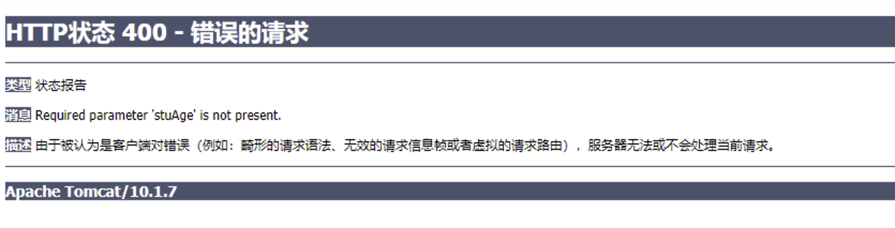

    将参数设置非必须，并且设置默认值：
    ```java
    @GetMapping(value="/data")
    @ResponseBody
    public Object paramForm(@RequestParam("name") String name, 
                            @RequestParam(value = "stuAge",required = false,defaultValue = "18") int age){
        System.out.println("name = " + name + ", age = " + age);
        return name+age;
    }

    ```
3.  **特殊场景接值**
    1.  一名多值

        多选框，提交的数据的时候一个key对应多个值，我们可以使用集合进行接收！
        ```java
          /**
           * 前端请求: http://localhost:8080/param/mul?hbs=吃&hbs=喝
           *
           *  一名多值,可以使用集合接收即可!但是需要使用@RequestParam注解指定
           */
          @GetMapping(value="/mul")
          @ResponseBody
          public Object mulForm(@RequestParam List<String> hbs){
              System.out.println("hbs = " + hbs);
              return hbs;
          }
        ```
    2.  实体接收

        Spring MVC 是 Spring 框架提供的 Web 框架，它允许开发者使用实体对象来接收 HTTP 请求中的参数。通过这种方式，可以在方法内部直接使用对象的属性来访问请求参数，而不需要每个参数都写一遍。下面是一个使用实体对象接收参数的示例：

        定义一个用于接收参数的实体类：
        ```java
        public class User {

          private String name;

          private int age = 18;

          // getter 和 setter 略
        }
        ```
        在控制器中，使用实体对象接收，示例代码如下：
        ```java
        @Controller
        @RequestMapping("param")
        public class ParamController {

            @RequestMapping(value = "/user", method = RequestMethod.POST)
            @ResponseBody
            public String addUser(User user) {
                // 在这里可以使用 user 对象的属性来接收请求参数
                System.out.println("user = " + user);
                return "success";
            }
        }
        ```
        在上述代码中，将请求参数name和age映射到实体类属性上！要求属性名必须等于参数名！否则无法映射！

        使用postman传递参数测试：

        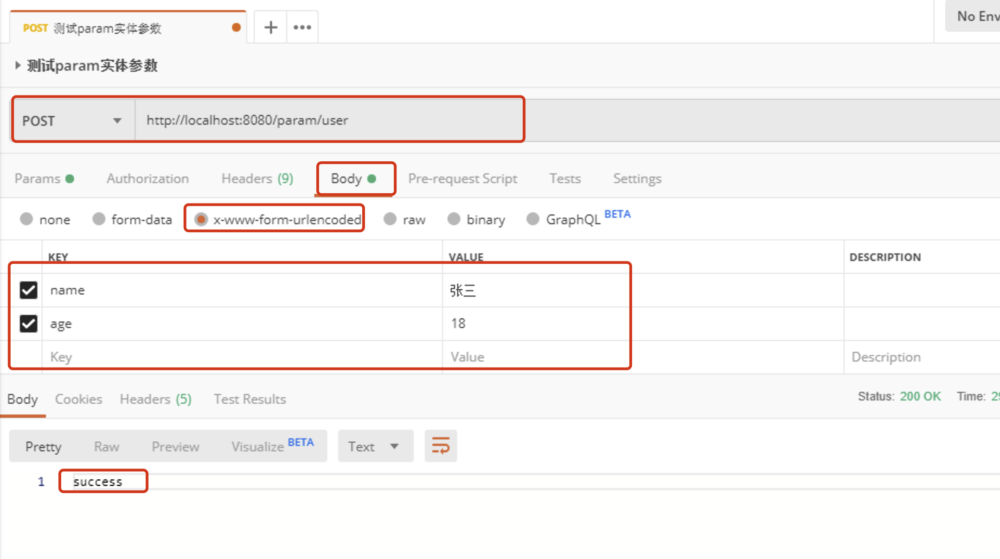

#### 2.2.3 路径 参数接收

路径传递参数是一种在 URL 路径中传递参数的方式。在 RESTful 的 Web 应用程序中，经常使用路径传递参数来表示资源的唯一标识符或更复杂的表示方式。而 Spring MVC 框架提供了 `@PathVariable` 注解来处理路径传递参数。

`@PathVariable` 注解允许将 URL 中的占位符映射到控制器方法中的参数。

例如，如果我们想将 `/user/{id}` 路径下的 `{id}` 映射到控制器方法的一个参数中，则可以使用 `@PathVariable` 注解来实现。

下面是一个使用 `@PathVariable` 注解处理路径传递参数的示例：

```java
 /**
 * 动态路径设计: /user/{动态部分}/{动态部分}   动态部分使用{}包含即可! {}内部动态标识!
 * 形参列表取值: @PathVariable Long id  如果形参名 = {动态标识} 自动赋值!
 *              @PathVariable("动态标识") Long id  如果形参名 != {动态标识} 可以通过指定动态标识赋值!
 *
 * 访问测试:  /param/user/1/root  -> id = 1  uname = root
 */
@GetMapping("/user/{id}/{name}")
@ResponseBody
public String getUser(@PathVariable Long id, 
                      @PathVariable("name") String uname) {
    System.out.println("id = " + id + ", uname = " + uname);
    return "user_detail";
}
```

#### 2.2.4 json参数接收

前端传递 JSON 数据时，Spring MVC 框架可以使用 `@RequestBody` 注解来将 JSON 数据转换为 Java 对象。`@RequestBody` 注解表示当前方法参数的值应该从请求体中获取，并且需要指定 value 属性来指示请求体应该映射到哪个参数上。其使用方式和示例代码如下：

1.  前端发送 JSON 数据的示例：（使用postman测试）
    ```json
    {
      "name": "张三",
      "age": 18,
      "gender": "男"
    }
    ```
2.  定义一个用于接收 JSON 数据的 Java 类，例如：
    ```java
    public class Person {
      private String name;
      private int age;
      private String gender;
      // getter 和 setter 略
    }
    ```
3.  在控制器中，使用 `@RequestBody` 注解来接收 JSON 数据，并将其转换为 Java 对象，例如：
    ```java
    @PostMapping("/person")
    @ResponseBody
    public String addPerson(@RequestBody Person person) {

      // 在这里可以使用 person 对象来操作 JSON 数据中包含的属性
      return "success";
    }
    ```
    在上述代码中，`@RequestBody` 注解将请求体中的 JSON 数据映射到 `Person` 类型的 `person` 参数上，并将其作为一个对象来传递给 `addPerson()` 方法进行处理。
4.  完善配置

    测试：

    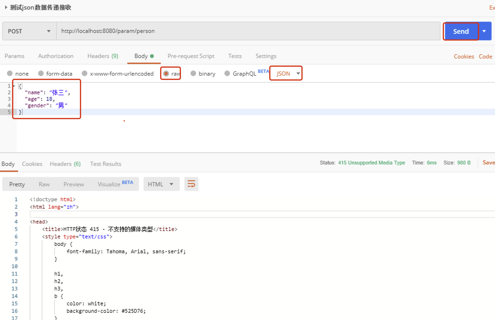

    问题：

    org.springframework.web.HttpMediaTypeNotSupportedException: Content-Type 'application/json;charset=UTF-8' is not supported]

    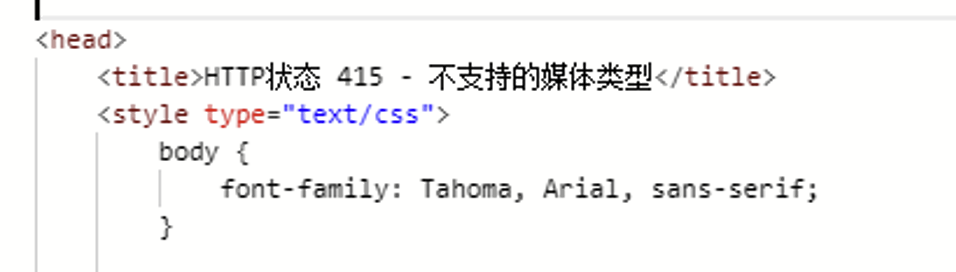

    原因：
    -   不支持json数据类型处理
    -   没有json类型处理的工具（jackson）
        解决：
    springmvc handlerAdpater配置json转化器,配置类需要明确：
    ```java
    //TODO: SpringMVC对应组件的配置类 [声明SpringMVC需要的组件信息]

    //TODO: 导入handlerMapping和handlerAdapter的三种方式
     //1.自动导入handlerMapping和handlerAdapter [推荐]
     //2.可以不添加,springmvc会检查是否配置handlerMapping和handlerAdapter,没有配置默认加载
     //3.使用@Bean方式配置handlerMapper和handlerAdapter
    @EnableWebMvc  //json数据处理,必须使用此注解,因为他会加入json处理器
    @Configuration
    @ComponentScan(basePackages = "com.atguigu.controller") //TODO: 进行controller扫描

    //WebMvcConfigurer springMvc进行组件配置的规范,配置组件,提供各种方法! 前期可以实现
    public class SpringMvcConfig implements WebMvcConfigurer {


    }
    ```
    pom.xml 加入jackson依赖
    ```xml
    <dependency>
        <groupId>com.fasterxml.jackson.core</groupId>
        <artifactId>jackson-databind</artifactId>
        <version>2.15.0</version>
    </dependency>
    ```
5.  @EnableWebMvc注解说明

    @EnableWebMvc注解效果等同于在 XML 配置中，可以使用 `<mvc:annotation-driven>` 元素！我们来解析`<mvc:annotation-driven>`对应的解析工作！

    让我们来查看下`<mvc:annotation-driven>`具体的动作！
    -   先查看`<mvc:annotation-driven>`标签最终对应解析的Java类

        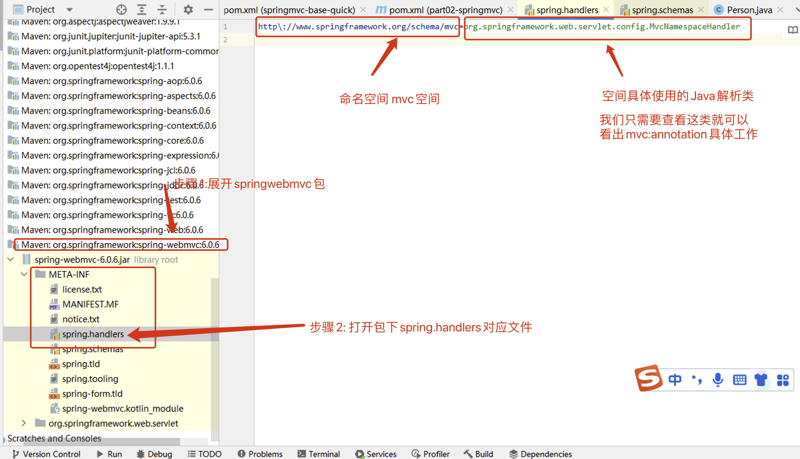
    -   查看解析类中具体的动作即可

        打开源码：org.springframework.web.servlet.config.MvcNamespaceHandler

        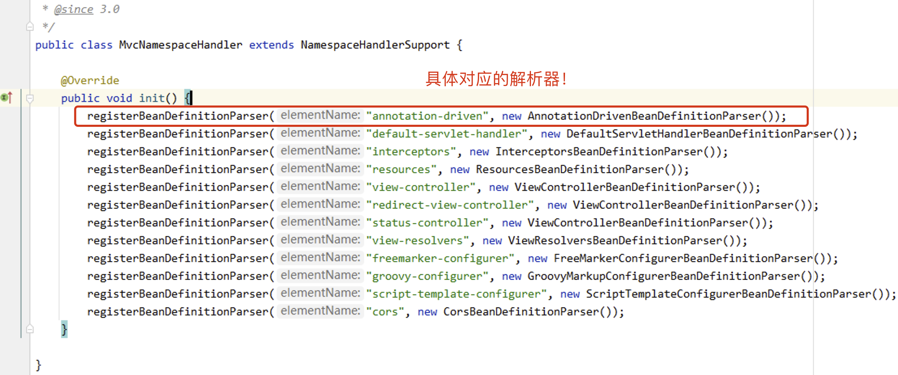

        打开源码：org.springframework.web.servlet.config.AnnotationDrivenBeanDefinitionParser
        ```java
        class AnnotationDrivenBeanDefinitionParser implements BeanDefinitionParser {

          public static final String HANDLER_MAPPING_BEAN_NAME = RequestMappingHandlerMapping.class.getName();

          public static final String HANDLER_ADAPTER_BEAN_NAME = RequestMappingHandlerAdapter.class.getName();

          static {
            ClassLoader classLoader = AnnotationDrivenBeanDefinitionParser.class.getClassLoader();
            javaxValidationPresent = ClassUtils.isPresent("jakarta.validation.Validator", classLoader);
            romePresent = ClassUtils.isPresent("com.rometools.rome.feed.WireFeed", classLoader);
            jaxb2Present = ClassUtils.isPresent("jakarta.xml.bind.Binder", classLoader);
            jackson2Present = ClassUtils.isPresent("com.fasterxml.jackson.databind.ObjectMapper", classLoader) &&
                    ClassUtils.isPresent("com.fasterxml.jackson.core.JsonGenerator", classLoader);
            jackson2XmlPresent = ClassUtils.isPresent("com.fasterxml.jackson.dataformat.xml.XmlMapper", classLoader);
            jackson2SmilePresent = ClassUtils.isPresent("com.fasterxml.jackson.dataformat.smile.SmileFactory", classLoader);
            jackson2CborPresent = ClassUtils.isPresent("com.fasterxml.jackson.dataformat.cbor.CBORFactory", classLoader);
            gsonPresent = ClassUtils.isPresent("com.google.gson.Gson", classLoader);
          }


          @Override
          @Nullable
          public BeanDefinition parse(Element element, ParserContext context) {
            //handlerMapping加入到ioc容器
            readerContext.getRegistry().registerBeanDefinition(HANDLER_MAPPING_BEAN_NAME, handlerMappingDef);

            //添加jackson转化器
            addRequestBodyAdvice(handlerAdapterDef);
            addResponseBodyAdvice(handlerAdapterDef);

            //handlerAdapter加入到ioc容器
            readerContext.getRegistry().registerBeanDefinition(HANDLER_ADAPTER_BEAN_NAME, handlerAdapterDef);
            return null;
          }

          //具体添加jackson转化对象方法
          protected void addRequestBodyAdvice(RootBeanDefinition beanDef) {
            if (jackson2Present) {
              beanDef.getPropertyValues().add("requestBodyAdvice",
                  new RootBeanDefinition(JsonViewRequestBodyAdvice.class));
            }
          }

          protected void addResponseBodyAdvice(RootBeanDefinition beanDef) {
            if (jackson2Present) {
              beanDef.getPropertyValues().add("responseBodyAdvice",
                  new RootBeanDefinition(JsonViewResponseBodyAdvice.class));
            }
          }

        ```

### 2.3 接收Cookie数据

可以使用 `@CookieValue` 注释将 HTTP Cookie 的值绑定到控制器中的方法参数。

考虑使用以下 cookie 的请求：

```java
JSESSIONID=415A4AC178C59DACE0B2C9CA727CDD84
```

下面的示例演示如何获取 cookie 值：

```java
@GetMapping("/demo")
public void handle(@CookieValue("JSESSIONID") String cookie) { 
  //...
}
```

### 2.4 接收请求头数据

可以使用 `@RequestHeader` 批注将请求标头绑定到控制器中的方法参数。

请考虑以下带有标头的请求：

```java
Host                    localhost:8080
Accept                  text/html,application/xhtml+xml,application/xml;q=0.9
Accept-Language         fr,en-gb;q=0.7,en;q=0.3
Accept-Encoding         gzip,deflate
Accept-Charset          ISO-8859-1,utf-8;q=0.7,*;q=0.7
Keep-Alive              300
```

下面的示例获取 `Accept-Encoding` 和 `Keep-Alive` 标头的值：

```java
@GetMapping("/demo")
public void handle(
    @RequestHeader("Accept-Encoding") String encoding, 
    @RequestHeader("Keep-Alive") long keepAlive) { 
  //...
}
```

### 2.5 原生Api对象操作

<https://docs.spring.io/spring-framework/reference/web/webmvc/mvc-controller/ann-methods/arguments.html>

下表描述了支持的控制器方法参数

| Controller method argument 控制器方法参数                                                 | Description                                                    |
| ---------------------------------------------------------------------------------- | -------------------------------------------------------------- |
| `jakarta.servlet.ServletRequest`, `jakarta.servlet.ServletResponse`                | 请求/响应对象                                                        |
| `jakarta.servlet.http.HttpSession`                                                 | 强制存在会话。因此，这样的参数永远不会为 `null` 。                                  |
| `java.io.InputStream`, `java.io.Reader`                                            | 用于访问由 Servlet API 公开的原始请求正文。                                   |
| `java.io.OutputStream`, `java.io.Writer`                                           | 用于访问由 Servlet API 公开的原始响应正文。                                   |
| `@PathVariable`                                                                    | 接收路径参数注解                                                       |
| `@RequestParam`                                                                    | 用于访问 Servlet 请求参数，包括多部分文件。参数值将转换为声明的方法参数类型。                    |
| `@RequestHeader`                                                                   | 用于访问请求标头。标头值将转换为声明的方法参数类型。                                     |
| `@CookieValue`                                                                     | 用于访问Cookie。Cookie 值将转换为声明的方法参数类型。                              |
| `@RequestBody`                                                                     | 用于访问 HTTP 请求正文。正文内容通过使用 `HttpMessageConverter` 实现转换为声明的方法参数类型。 |
| `java.util.Map`, `org.springframework.ui.Model`, `org.springframework.ui.ModelMap` | 共享域对象，并在视图呈现过程中向模板公开。                                          |
| `Errors`, `BindingResult`                                                          | 验证和数据绑定中的错误信息获取对象！                                             |

获取原生对象示例：

```java
/**
 * 如果想要获取请求或者响应对象,或者会话等,可以直接在形参列表传入,并且不分先后顺序!
 * 注意: 接收原生对象,并不影响参数接收!
 */
@GetMapping("api")
@ResponseBody
public String api(HttpSession session , HttpServletRequest request,
                  HttpServletResponse response){
    String method = request.getMethod();
    System.out.println("method = " + method);
    return "api";
}
```

### 2.6 共享域对象操作

#### 2.6.1 属性（共享）域作用回顾

在 JavaWeb 中，共享域指的是在 Servlet 中存储数据，以便在同一 Web 应用程序的多个组件中进行共享和访问。常见的共享域有四种：`ServletContext`、`HttpSession`、`HttpServletRequest`、`PageContext`。

1.  `ServletContext` 共享域：`ServletContext` 对象可以在整个 Web 应用程序中共享数据，是最大的共享域。一般可以用于保存整个 Web 应用程序的全局配置信息，以及所有用户都共享的数据。在 `ServletContext` 中保存的数据是线程安全的。
2.  `HttpSession` 共享域：`HttpSession` 对象可以在同一用户发出的多个请求之间共享数据，但只能在同一个会话中使用。比如，可以将用户登录状态保存在 `HttpSession` 中，让用户在多个页面间保持登录状态。
3.  `HttpServletRequest` 共享域：`HttpServletRequest` 对象可以在同一个请求的多个处理器方法之间共享数据。比如，可以将请求的参数和属性存储在 `HttpServletRequest` 中，让处理器方法之间可以访问这些数据。
4.  `PageContext` 共享域：`PageContext` 对象是在 JSP 页面Servlet 创建时自动创建的。它可以在 JSP 的各个作用域中共享数据，包括`pageScope`、`requestScope`、`sessionScope`、`applicationScope` 等作用域。

共享域的作用是提供了方便实用的方式在同一 Web 应用程序的多个组件之间传递数据，并且可以将数据保存在不同的共享域中，根据需要进行选择和使用。

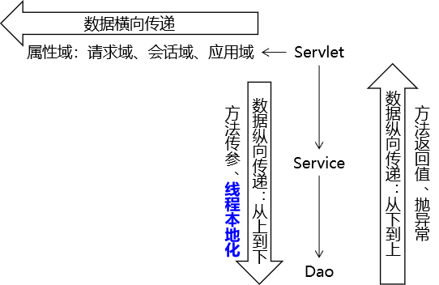

#### 2.6.2 Request级别属性（共享）域

1.  使用 Model 类型的形参
    ```java
    @RequestMapping("/attr/request/model")
    @ResponseBody
    public String testAttrRequestModel(
        
            // 在形参位置声明Model类型变量，用于存储模型数据
            Model model) {
        
        // 我们将数据存入模型，SpringMVC 会帮我们把模型数据存入请求域
        // 存入请求域这个动作也被称为暴露到请求域
        model.addAttribute("requestScopeMessageModel","i am very happy[model]");
        
        return "target";
    }
    ```
2.  使用 ModelMap 类型的形参
    ```java
    @RequestMapping("/attr/request/model/map")
    @ResponseBody
    public String testAttrRequestModelMap(
        
            // 在形参位置声明ModelMap类型变量，用于存储模型数据
            ModelMap modelMap) {
        
        // 我们将数据存入模型，SpringMVC 会帮我们把模型数据存入请求域
        // 存入请求域这个动作也被称为暴露到请求域
        modelMap.addAttribute("requestScopeMessageModelMap","i am very happy[model map]");
        
        return "target";
    }
    ```
3.  使用 Map 类型的形参
    ```java
    @RequestMapping("/attr/request/map")
    @ResponseBody
    public String testAttrRequestMap(
        
            // 在形参位置声明Map类型变量，用于存储模型数据
            Map<String, Object> map) {
        
        // 我们将数据存入模型，SpringMVC 会帮我们把模型数据存入请求域
        // 存入请求域这个动作也被称为暴露到请求域
        map.put("requestScopeMessageMap", "i am very happy[map]");
        
        return "target";
    }
    ```
4.  使用原生 request 对象
    ```java
    @RequestMapping("/attr/request/original")
    @ResponseBody
    public String testAttrOriginalRequest(
        
            // 拿到原生对象，就可以调用原生方法执行各种操作
            HttpServletRequest request) {
        
        request.setAttribute("requestScopeMessageOriginal", "i am very happy[original]");
        
        return "target";
    }
    ```
5.  使用 ModelAndView 对象
    ```java
    @RequestMapping("/attr/request/mav")
    public ModelAndView testAttrByModelAndView() {
        
        // 1.创建ModelAndView对象
        ModelAndView modelAndView = new ModelAndView();
        // 2.存入模型数据
        modelAndView.addObject("requestScopeMessageMAV", "i am very happy[mav]");
        // 3.设置视图名称
        modelAndView.setViewName("target");
        
        return modelAndView;
    }
    ```

#### 2.6.3 Session级别属性（共享）域

```java
@RequestMapping("/attr/session")
@ResponseBody
public String testAttrSession(HttpSession session) {
    //直接对session对象操作,即对会话范围操作!
    return "target";
}
```

#### 2.6.4 Application级别属性（共享）域

解释：springmvc会在初始化容器的时候，讲servletContext对象存储到ioc容器中！

```java
@Autowired
private ServletContext servletContext;

@RequestMapping("/attr/application")
@ResponseBody
public String attrApplication() {
    
    servletContext.setAttribute("appScopeMsg", "i am hungry...");
    
    return "target";
}
```

## 三、SpringMVC响应数据

### 3.1 handler方法分析

理解handler方法的作用和组成：

```java
/**
 * TODO: 一个controller的方法是控制层的一个处理器,我们称为handler
 * TODO: handler需要使用@RequestMapping/@GetMapping系列,声明路径,在HandlerMapping中注册,供DS查找!
 * TODO: handler作用总结:
 *       1.接收请求参数(param,json,pathVariable,共享域等) 
 *       2.调用业务逻辑 
 *       3.响应前端数据(页面（不讲解模版页面跳转）,json,转发和重定向等)
 * TODO: handler如何处理呢
 *       1.接收参数: handler(形参列表: 主要的作用就是用来接收参数)
 *       2.调用业务: { 方法体  可以向后调用业务方法 service.xx() }
 *       3.响应数据: return 返回结果,可以快速响应前端数据
 */
@GetMapping
public Object handler(简化请求参数接收){
    调用业务方法
    返回的结果 （页面跳转，返回数据（json））
    return 简化响应前端数据;
}
```

总结： 请求数据接收，我们都是通过handler的形参列表

&#x20;            前端数据响应，我们都是通过handler的return关键字快速处理！

&#x20;       springmvc简化了参数接收和响应！

### 3.2 页面跳转控制

#### 3.2.1 快速返回模板视图

1.  开发模式回顾

    在 Web 开发中，有两种主要的开发模式：前后端分离和混合开发。

    前后端分离模式：\[重点]

    指将前端的界面和后端的业务逻辑通过接口分离开发的一种方式。开发人员使用不同的技术栈和框架，前端开发人员主要负责页面的呈现和用户交互，后端开发人员主要负责业务逻辑和数据存储。前后端通信通过 API 接口完成，数据格式一般使用 JSON 或 XML。前后端分离模式可以提高开发效率，同时也有助于代码重用和维护。

    混合开发模式：

    指将前端和后端的代码集成在同一个项目中，共享相同的技术栈和框架。这种模式在小型项目中比较常见，可以减少学习成本和部署难度。但是，在大型项目中，这种模式会导致代码耦合性很高，维护和升级难度较大。

    对于混合开发，我们就需要使用动态页面技术，动态展示Java的共享域数据！！
2.  jsp技术了解

    JSP（JavaServer Pages）是一种动态网页开发技术，它是由 Sun 公司提出的一种基于 Java 技术的 Web 页面制作技术，可以在 HTML 文件中嵌入 Java 代码，使得生成动态内容的编写更加简单。

    JSP 最主要的作用是生成动态页面。它允许将 Java 代码嵌入到 HTML 页面中，以便使用 Java 进行数据库查询、处理表单数据和生成 HTML 等动态内容。另外，JSP 还可以与 Servlet 结合使用，实现更加复杂的 Web 应用程序开发。

    JSP 的主要特点包括：
    1.  简单：JSP 通过将 Java 代码嵌入到 HTML 页面中，使得生成动态内容的编写更加简单。
    2.  高效：JSP 首次运行时会被转换为 Servlet，然后编译为字节码，从而可以启用 Just-in-Time（JIT）编译器，实现更高效的运行。
    3.  多样化：JSP 支持多种标准标签库，包括 JSTL（JavaServer Pages 标准标签库）、EL（表达式语言）等，可以帮助开发人员更加方便的处理常见的 Web 开发需求。
        总之，JSP 是一种简单高效、多样化的动态网页开发技术，它可以方便地生成动态页面和与 Servlet 结合使用，是 Java Web 开发中常用的技术之一。
3.  准备jsp页面和依赖

    pom.xml依赖
    ```xml
    <!-- jsp需要依赖! jstl-->
    <dependency>
        <groupId>jakarta.servlet.jsp.jstl</groupId>
        <artifactId>jakarta.servlet.jsp.jstl-api</artifactId>
        <version>3.0.0</version>
    </dependency>
    ```
    jsp页面创建

    建议位置：/WEB-INF/下，避免外部直接访问！

    位置：/WEB-INF/views/home.jsp
    ```java
    <%@ page contentType="text/html;charset=UTF-8" language="java" %>
    <html>
      <head>
        <title>Title</title>
      </head>
      <body>
            <!-- 可以获取共享域的数据,动态展示! jsp== 后台vue -->
            ${msg}
      </body>
    </html>

    ```
4.  快速响应模版页面
    1.  配置jsp视图解析器
        ```java
        @EnableWebMvc  //json数据处理,必须使用此注解,因为他会加入json处理器
        @Configuration
        @ComponentScan(basePackages = "com.atguigu.controller") //TODO: 进行controller扫描

        //WebMvcConfigurer springMvc进行组件配置的规范,配置组件,提供各种方法! 前期可以实现
        public class SpringMvcConfig implements WebMvcConfigurer {

            //配置jsp对应的视图解析器
            @Override
            public void configureViewResolvers(ViewResolverRegistry registry) {
                //快速配置jsp模板语言对应的
                registry.jsp("/WEB-INF/views/",".jsp");
            }
        }
        ```
    2.  handler返回视图
        ```java
        /**
         *  跳转到提交文件页面  /save/jump
         *  
         *  如果要返回jsp页面!
         *     1.方法返回值改成字符串类型
         *     2.返回逻辑视图名即可    
         *         <property name="prefix" value="/WEB-INF/views/"/>
         *            + 逻辑视图名 +
         *         <property name="suffix" value=".jsp"/>
         */
        @GetMapping("jump")
        public String jumpJsp(Model model){
            System.out.println("FileController.jumpJsp");
            model.addAttribute("msg","request data!!");
            return "home";
        }
        ```

#### 3.2.2 转发和重定向

在 Spring MVC 中，Handler 方法返回值来实现快速转发，可以使用 `redirect` 或者 `forward` 关键字来实现重定向。

```java
@RequestMapping("/redirect-demo")
public String redirectDemo() {
    // 重定向到 /demo 路径 
    return "redirect:/demo";
}

@RequestMapping("/forward-demo")
public String forwardDemo() {
    // 转发到 /demo 路径
    return "forward:/demo";
}

//注意： 转发和重定向到项目下资源路径都是相同，都不需要添加项目根路径！填写项目下路径即可！
```

总结：

-   将方法的返回值，设置String类型
-   转发使用forward关键字，重定向使用redirect关键字
-   关键字: /路径
-   注意：如果是项目下的资源，转发和重定向都一样都是项目下路径！都不需要添加项目根路径！

### 3.3 返回JSON数据（重点）

#### 3.3.1 前置准备

导入jackson依赖

```xml
<dependency>
    <groupId>com.fasterxml.jackson.core</groupId>
    <artifactId>jackson-databind</artifactId>
    <version>2.15.0</version>
</dependency>
```

添加json数据转化器

@EnableWebMvc&#x20;

```java
//TODO: SpringMVC对应组件的配置类 [声明SpringMVC需要的组件信息]

//TODO: 导入handlerMapping和handlerAdapter的三种方式
 //1.自动导入handlerMapping和handlerAdapter [推荐]
 //2.可以不添加,springmvc会检查是否配置handlerMapping和handlerAdapter,没有配置默认加载
 //3.使用@Bean方式配置handlerMapper和handlerAdapter
@EnableWebMvc  //json数据处理,必须使用此注解,因为他会加入json处理器
@Configuration
@ComponentScan(basePackages = "com.atguigu.controller") //TODO: 进行controller扫描

//WebMvcConfigurer springMvc进行组件配置的规范,配置组件,提供各种方法! 前期可以实现
public class SpringMvcConfig implements WebMvcConfigurer {


}
```

#### 3.3.2 @ResponseBody

1.  方法上使用@ResponseBody

    可以在方法上使用 `@ResponseBody`注解，用于将方法返回的对象序列化为 JSON 或 XML 格式的数据，并发送给客户端。在前后端分离的项目中使用！

    测试方法：
    ```java
    @GetMapping("/accounts/{id}")
    @ResponseBody
    public Object handle() {
      // ...
      return obj;
    }
    ```
    具体来说，`@ResponseBody` 注解可以用来标识方法或者方法返回值，表示方法的返回值是要直接返回给客户端的数据，而不是由视图解析器来解析并渲染生成响应体（viewResolver没用）。

    测试方法：
    ```java
    @RequestMapping(value = "/user/detail", method = RequestMethod.POST)
    @ResponseBody
    public User getUser(@RequestBody User userParam) {
        System.out.println("userParam = " + userParam);
        User user = new User();
        user.setAge(18);
        user.setName("John");
        //返回的对象,会使用jackson的序列化工具,转成json返回给前端!
        return user;
    }
    ```
    返回结果：

    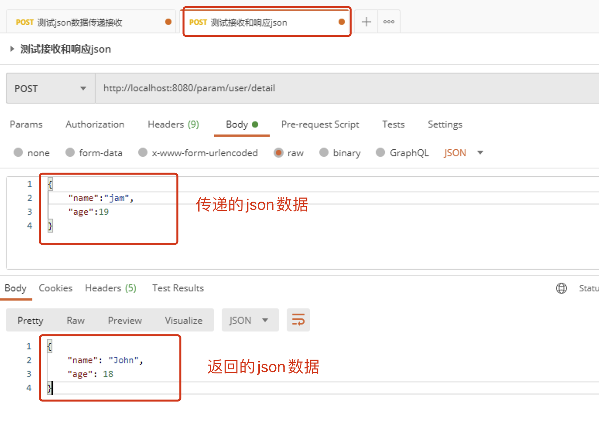
2.  类上使用@ResponseBody

    如果类中每个方法上都标记了 @ResponseBody 注解，那么这些注解就可以提取到类上。
    ```java
    @ResponseBody  //responseBody可以添加到类上,代表默认类中的所有方法都生效!
    @Controller
    @RequestMapping("param")
    public class ParamController {
    ```

#### 3.3.3 @RestController

类上的 @ResponseBody 注解可以和 @Controller 注解合并为 @RestController 注解。所以使用了 @RestController 注解就相当于给类中的每个方法都加了 @ResponseBody 注解。

RestController源码:

```java
@Target(ElementType.TYPE)
@Retention(RetentionPolicy.RUNTIME)
@Documented
@Controller
@ResponseBody
public @interface RestController {
 
  /**
   * The value may indicate a suggestion for a logical component name,
   * to be turned into a Spring bean in case of an autodetected component.
   * @return the suggested component name, if any (or empty String otherwise)
   * @since 4.0.1
   */
  @AliasFor(annotation = Controller.class)
  String value() default "";
 
}
```

### 3.4 返回静态资源处理

1.  **静态资源概念**

    资源本身已经是可以直接拿到浏览器上使用的程度了，**不需要在服务器端做任何运算、处理**。典型的静态资源包括：
    -   纯HTML文件
    -   图片
    -   CSS文件
    -   JavaScript文件
    -   ……
2.  **静态资源访问和问题解决**
    -   web应用加入静态资源

        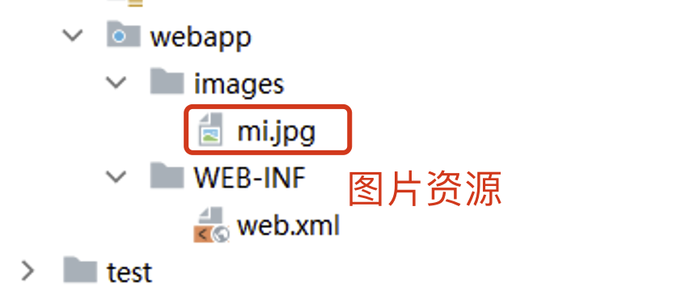
    -   手动构建确保编译

        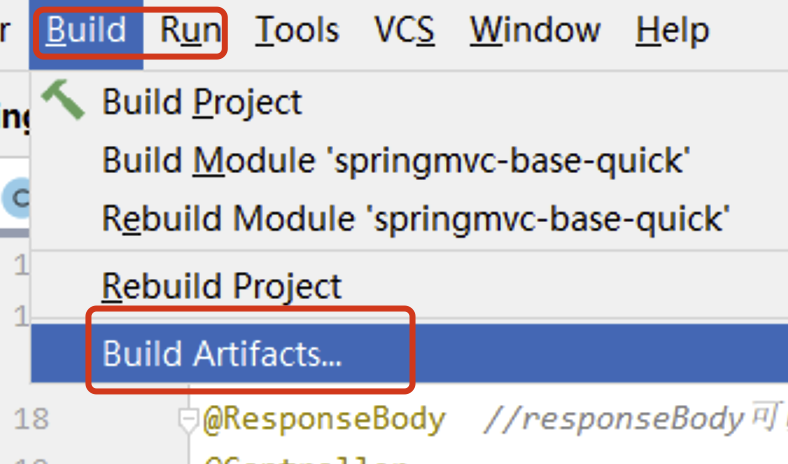

        

        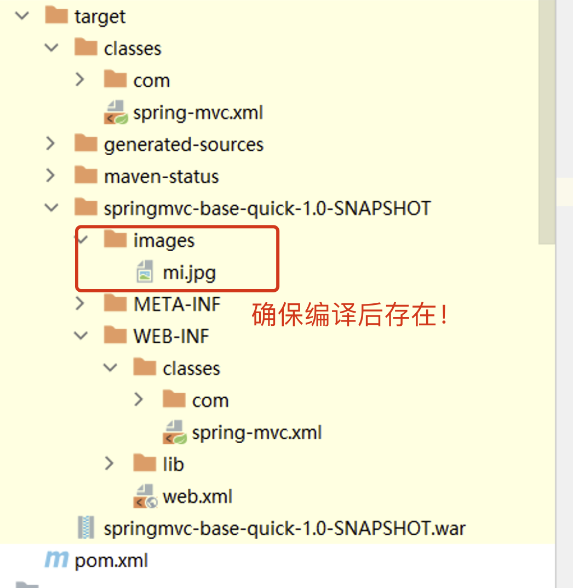
    -   访问静态资源

        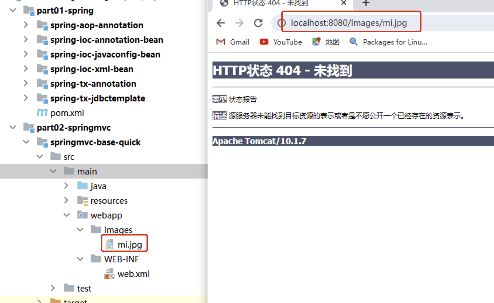
    -   问题分析
        -   DispatcherServlet 的 url-pattern 配置的是“/”
        -   url-pattern 配置“/”表示整个 Web 应用范围内所有请求都由 SpringMVC 来处理
        -   对 SpringMVC 来说，必须有对应的 @RequestMapping 才能找到处理请求的方法
        -   现在 images/mi.jpg 请求没有对应的 @RequestMapping 所以返回 404
    -   问题解决

        在 SpringMVC 配置配置类：
        ```java
        @EnableWebMvc  //json数据处理,必须使用此注解,因为他会加入json处理器
        @Configuration
        @ComponentScan(basePackages = "com.atguigu.controller") //TODO: 进行controller扫描
        //WebMvcConfigurer springMvc进行组件配置的规范,配置组件,提供各种方法! 前期可以实现
        public class SpringMvcConfig implements WebMvcConfigurer {

            //配置jsp对应的视图解析器
            @Override
            public void configureViewResolvers(ViewResolverRegistry registry) {
                //快速配置jsp模板语言对应的
                registry.jsp("/WEB-INF/views/",".jsp");
            }
            
            //开启静态资源处理 <mvc:default-servlet-handler/>
            @Override
            public void configureDefaultServletHandling(DefaultServletHandlerConfigurer configurer) {
                configurer.enable();
            }
        }
        ```
        再次测试访问图片：

        
    -   新的问题：其他原本正常的handler请求访问不了了

        handler无法访问

        解决方案：
        ```xml
        @EnableWebMvc  //json数据处理,必须使用此注解,因为他会加入json处理器
        ```

## 四、RESTFul风格设计和实战

### 4.1 RESTFul风格概述

#### 4.1.1 RESTFul风格简介


RESTful（Representational State Transfer）是一种软件架构风格，用于设计网络应用程序和服务之间的通信。它是一种基于标准 HTTP 方法的简单和轻量级的通信协议，广泛应用于现代的Web服务开发。

通过遵循 RESTful 架构的设计原则，可以构建出易于理解、可扩展、松耦合和可重用的 Web 服务。RESTful API 的特点是简单、清晰，并且易于使用和理解，它们使用标准的 HTTP 方法和状态码进行通信，不需要额外的协议和中间件。

总而言之，RESTful 是一种基于 HTTP 和标准化的设计原则的软件架构风格，用于设计和实现可靠、可扩展和易于集成的 Web 服务和应用程序！

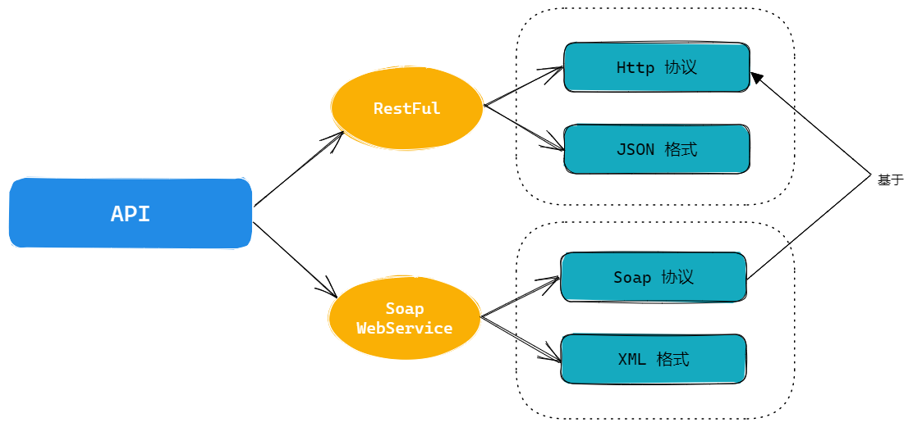

学习RESTful设计原则可以帮助我们更好去设计HTTP协议的API接口！！

#### 4.1.2 RESTFul风格特点

1.  每一个URI代表1种资源（URI 是名词）；
2.  客户端使用GET、POST、PUT、DELETE 4个表示操作方式的动词对服务端资源进行操作：GET用来获取资源，POST用来新建资源（也可以用于更新资源），PUT用来更新资源，DELETE用来删除资源；
3.  资源的表现形式是XML或者**JSON**；
4.  客户端与服务端之间的交互在请求之间是无状态的，从客户端到服务端的每个请求都必须包含理解请求所必需的信息。

#### 4.1.3 **RESTFul风格设计规范**

1.  **HTTP协议请求方式要求**

    REST 风格主张在项目设计、开发过程中，具体的操作符合**HTTP协议定义的请求方式的语义**。
    | 操作   | 请求方式   |
    | ---- | ------ |
    | 查询操作 | GET    |
    | 保存操作 | POST   |
    | 删除操作 | DELETE |
    | 更新操作 | PUT    |
2.  **URL路径风格要求**

    REST风格下每个资源都应该有一个唯一的标识符，例如一个 URI（统一资源标识符）或者一个 URL（统一资源定位符）。资源的标识符应该能明确地说明该资源的信息，同时也应该是可被理解和解释的！

    使用URL+请求方式确定具体的动作，他也是一种标准的HTTP协议请求！
    | 操作 | 传统风格                    | REST 风格                            |
    | -- | ----------------------- | ---------------------------------- |
    | 保存 | /CRUD/saveEmp           | URL 地址：/CRUD/emp&#xA;请求方式：POST     |
    | 删除 | /CRUD/removeEmp?empId=2 | URL 地址：/CRUD/emp/2&#xA;请求方式：DELETE |
    | 更新 | /CRUD/updateEmp         | URL 地址：/CRUD/emp&#xA;请求方式：PUT      |
    | 查询 | /CRUD/editEmp?empId=2   | URL 地址：/CRUD/emp/2&#xA;请求方式：GET    |

-   总结

    根据接口的具体动作，选择具体的HTTP协议请求方式

    路径设计从原来携带动标识，改成名词，对应资源的唯一标识即可！

#### 4.1.4 RESTFul风格好处

1.  含蓄，安全

    使用问号键值对的方式给服务器传递数据太明显，容易被人利用来对系统进行破坏。使用 REST 风格携带数据不再需要明显的暴露数据的名称。
2.  风格统一

    URL 地址整体格式统一，从前到后始终都使用斜杠划分各个单词，用简单一致的格式表达语义。
3.  无状态

    在调用一个接口（访问、操作资源）的时候，可以不用考虑上下文，不用考虑当前状态，极大的降低了系统设计的复杂度。
4.  严谨，规范

    严格按照 HTTP1.1 协议中定义的请求方式本身的语义进行操作。
5.  简洁，优雅

    过去做增删改查操作需要设计4个不同的URL，现在一个就够了。
    | 操作 | 传统风格                    | REST 风格                            |
    | -- | ----------------------- | ---------------------------------- |
    | 保存 | /CRUD/saveEmp           | URL 地址：/CRUD/emp&#xA;请求方式：POST     |
    | 删除 | /CRUD/removeEmp?empId=2 | URL 地址：/CRUD/emp/2&#xA;请求方式：DELETE |
    | 更新 | /CRUD/updateEmp         | URL 地址：/CRUD/emp&#xA;请求方式：PUT      |
    | 查询 | /CRUD/editEmp?empId=2   | URL 地址：/CRUD/emp/2&#xA;请求方式：GET    |
6.  丰富的语义

    通过 URL 地址就可以知道资源之间的关系。它能够把一句话中的很多单词用斜杠连起来，反过来说就是可以在 URL 地址中用一句话来充分表达语义。
    > [http://localhost:8080/shop](http://localhost:8080/shop "http://localhost:8080/shop") [http://localhost:8080/shop/product](http://localhost:8080/shop/product "http://localhost:8080/shop/product") [http://localhost:8080/shop/product/cellPhone](http://localhost:8080/shop/product/cellPhone "http://localhost:8080/shop/product/cellPhone") [http://localhost:8080/shop/product/cellPhone/iPhone](http://localhost:8080/shop/product/cellPhone/iPhone "http://localhost:8080/shop/product/cellPhone/iPhone")

### 4.2 RESTFul风格实战

#### 4.2.1 需求分析

-   数据结构： User {id 唯一标识,name 用户名，age 用户年龄}
-   功能分析
    -   用户数据分页展示功能（条件：page 页数 默认1，size 每页数量 默认 10）
    -   保存用户功能
    -   根据用户id查询用户详情功能
    -   根据用户id更新用户数据功能
    -   根据用户id删除用户数据功能
    -   多条件模糊查询用户功能（条件：keyword 模糊关键字，page 页数 默认1，size 每页数量 默认 10）

#### 4.2.2 RESTFul风格接口设计

1.  **接口设计**
    | 功能   | 接口和请求方式          | 请求参数                         | 返回值      |
    | ---- | ---------------- | ---------------------------- | -------- |
    | 分页查询 | GET  /user       | page=1\&size=10              | { 响应数据 } |
    | 用户添加 | POST /user       | { user 数据 }                  | {响应数据}   |
    | 用户详情 | GET /user/1      | 路径参数                         | {响应数据}   |
    | 用户更新 | PUT /user        | { user 更新数据}                 | {响应数据}   |
    | 用户删除 | DELETE /user/1   | 路径参数                         | {响应数据}   |
    | 条件模糊 | GET /user/search | page=1\&size=10\&keywork=关键字 | {响应数据}   |
2.  **问题讨论**

    为什么查询用户详情，就使用路径传递参数，多条件模糊查询，就使用请求参数传递？

    误区：restful风格下，不是所有请求参数都是路径传递！可以使用其他方式传递！

    在 RESTful API 的设计中，路径和请求参数和请求体都是用来向服务器传递信息的方式。
    -   对于查询用户详情，使用路径传递参数是因为这是一个单一资源的查询，即查询一条用户记录。使用路径参数可以明确指定所请求的资源，便于服务器定位并返回对应的资源，也符合 RESTful 风格的要求。
    -   而对于多条件模糊查询，使用请求参数传递参数是因为这是一个资源集合的查询，即查询多条用户记录。使用请求参数可以通过组合不同参数来限制查询结果，路径参数的组合和排列可能会很多，不如使用请求参数更加灵活和简洁。
        此外，还有一些通用的原则可以遵循：
    -   路径参数应该用于指定资源的唯一标识或者 ID，而请求参数应该用于指定查询条件或者操作参数。
    -   请求参数应该限制在 10 个以内，过多的请求参数可能导致接口难以维护和使用。
    -   对于敏感信息，最好使用 POST 和请求体来传递参数。

#### 4.2.3 后台接口实现

准备用户实体类：

```java
package com.atguigu.pojo;

/**
 * projectName: com.atguigu.pojo
 * 用户实体类
 */
public class User {

    private Integer id;
    private String name;

    private Integer age;

    public Integer getId() {
        return id;
    }

    public void setId(Integer id) {
        this.id = id;
    }

    public String getName() {
        return name;
    }

    public void setName(String name) {
        this.name = name;
    }

    public Integer getAge() {
        return age;
    }

    public void setAge(Integer age) {
        this.age = age;
    }

    @Override
    public String toString() {
        return "User{" +
                "id=" + id +
                ", name='" + name + '\'' +
                ", age=" + age +
                '}';
    }
}

```

准备用户Controller:

```java
/**
 * projectName: com.atguigu.controller
 *
 * description: 用户模块的控制器
 */
@RequestMapping("user")
@RestController
public class UserController {

    /**
     * 模拟分页查询业务接口
     */
    @GetMapping
    public Object queryPage(@RequestParam(name = "page",required = false,defaultValue = "1")int page,
                            @RequestParam(name = "size",required = false,defaultValue = "10")int size){
        System.out.println("page = " + page + ", size = " + size);
        System.out.println("分页查询业务!");
        return "{'status':'ok'}";
    }


    /**
     * 模拟用户保存业务接口
     */
    @PostMapping
    public Object saveUser(@RequestBody User user){
        System.out.println("user = " + user);
        System.out.println("用户保存业务!");
        return "{'status':'ok'}";
    }

    /**
     * 模拟用户详情业务接口
     */
    @PostMapping("/{id}")
    public Object detailUser(@PathVariable Integer id){
        System.out.println("id = " + id);
        System.out.println("用户详情业务!");
        return "{'status':'ok'}";
    }


    /**
     * 模拟用户更新业务接口
     */
    @PutMapping
    public Object updateUser(@RequestBody User user){
        System.out.println("user = " + user);
        System.out.println("用户更新业务!");
        return "{'status':'ok'}";
    }


    /**
     * 模拟条件分页查询业务接口
     */
    @GetMapping("search")
    public Object queryPage(@RequestParam(name = "page",required = false,defaultValue = "1")int page,
                            @RequestParam(name = "size",required = false,defaultValue = "10")int size,
                            @RequestParam(name = "keyword",required= false)String keyword){
        System.out.println("page = " + page + ", size = " + size + ", keyword = " + keyword);
        System.out.println("条件分页查询业务!");
        return "{'status':'ok'}";
    }
}
```

## 五、SpringMVC其他扩展

### 5.1 全局异常处理机制

#### 5.1.1 异常处理两种方式

开发过程中是不可避免地会出现各种异常情况的，例如网络连接异常、数据格式异常、空指针异常等等。异常的出现可能导致程序的运行出现问题，甚至直接导致程序崩溃。因此，在开发过程中，合理处理异常、避免异常产生、以及对异常进行有效的调试是非常重要的。

对于异常的处理，一般分为两种方式：

-   编程式异常处理：是指在代码中显式地编写处理异常的逻辑。它通常涉及到对异常类型的检测及其处理，例如使用 try-catch 块来捕获异常，然后在 catch 块中编写特定的处理代码，或者在 finally 块中执行一些清理操作。在编程式异常处理中，开发人员需要显式地进行异常处理，异常处理代码混杂在业务代码中，导致代码可读性较差。
-   声明式异常处理：则是将异常处理的逻辑从具体的业务逻辑中分离出来，通过配置等方式进行统一的管理和处理。在声明式异常处理中，开发人员只需要为方法或类标注相应的注解（如 `@Throws` 或 `@ExceptionHandler`），就可以处理特定类型的异常。相较于编程式异常处理，声明式异常处理可以使代码更加简洁、易于维护和扩展。

站在宏观角度来看待声明式事务处理：

整个项目从架构这个层面设计的异常处理的统一机制和规范。

一个项目中会包含很多个模块，各个模块需要分工完成。如果张三负责的模块按照 A 方案处理异常，李四负责的模块按照 B 方案处理异常……各个模块处理异常的思路、代码、命名细节都不一样，那么就会让整个项目非常混乱。

使用声明式异常处理，可以统一项目处理异常思路，项目更加清晰明了！

#### 5.1.2 基于注解异常声明异常处理

1.  声明异常处理控制器类

    异常处理控制类，统一定义异常处理handler方法！
    ```java
    /**
     * projectName: com.atguigu.execptionhandler
     * 
     * description: 全局异常处理器,内部可以定义异常处理Handler!
     */

    /**
     * @RestControllerAdvice = @ControllerAdvice + @ResponseBody
     * @ControllerAdvice 代表当前类的异常处理controller! 
     */
    @RestControllerAdvice
    public class GlobalExceptionHandler {

      
    }
    ```
2.  声明异常处理hander方法

    异常处理handler方法和普通的handler方法参数接收和响应都一致！

    只不过异常处理handler方法要映射异常，发生对应的异常会调用！

    普通的handler方法要使用@RequestMapping注解映射路径，发生对应的路径调用！
    ```java
    /**
     * 异常处理handler 
     * @ExceptionHandler(HttpMessageNotReadableException.class) 
     * 该注解标记异常处理Handler,并且指定发生异常调用该方法!
     * 
     * 
     * @param e 获取异常对象!
     * @return 返回handler处理结果!
     */
    @ExceptionHandler(HttpMessageNotReadableException.class)
    public Object handlerJsonDateException(HttpMessageNotReadableException e){
        
        return null;
    }

    /**
     * 当发生空指针异常会触发此方法!
     * @param e
     * @return
     */
    @ExceptionHandler(NullPointerException.class)
    public Object handlerNullException(NullPointerException e){

        return null;
    }

    /**
     * 所有异常都会触发此方法!但是如果有具体的异常处理Handler! 
     * 具体异常处理Handler优先级更高!
     * 例如: 发生NullPointerException异常!
     *       会触发handlerNullException方法,不会触发handlerException方法!
     * @param e
     * @return
     */
    @ExceptionHandler(Exception.class)
    public Object handlerException(Exception e){

        return null;
    }
    ```
3.  配置文件扫描控制器类配置

    确保异常处理控制类被扫描
    ```java
     <!-- 扫描controller对应的包,将handler加入到ioc-->
     @ComponentScan(basePackages = {"com.atguigu.controller",
     "com.atguigu.exceptionhandler"})
    ```

### 5.2 拦截器使用

#### 5.2.1 拦截器概念

拦截器和过滤器解决问题

-   生活中

    为了提高乘车效率，在乘客进入站台前统一检票

    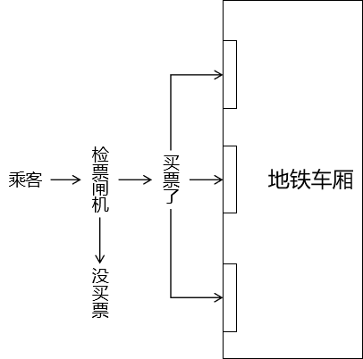
-   程序中

    在程序中，使用拦截器在请求到达具体 handler 方法前，统一执行检测

    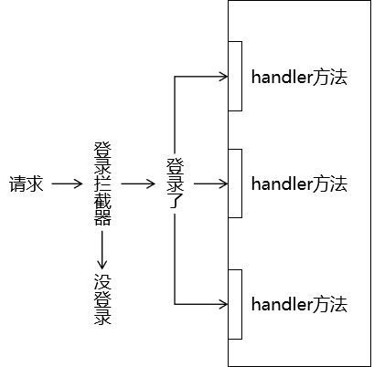

拦截器 Springmvc VS 过滤器 javaWeb：

-   相似点
    -   拦截：必须先把请求拦住，才能执行后续操作
    -   过滤：拦截器或过滤器存在的意义就是对请求进行统一处理
    -   放行：对请求执行了必要操作后，放请求过去，让它访问原本想要访问的资源
-   不同点
    -   工作平台不同
        -   过滤器工作在 Servlet 容器中
        -   拦截器工作在 SpringMVC 的基础上
    -   拦截的范围
        -   过滤器：能够拦截到的最大范围是整个 Web 应用
        -   拦截器：能够拦截到的最大范围是整个 SpringMVC 负责的请求
    -   IOC 容器支持
        -   过滤器：想得到 IOC 容器需要调用专门的工具方法，是间接的
        -   拦截器：它自己就在 IOC 容器中，所以可以直接从 IOC 容器中装配组件，也就是可以直接得到 IOC 容器的支持

选择：

功能需要如果用 SpringMVC 的拦截器能够实现，就不使用过滤器。


#### 5.2.2 拦截器使用

1.  创建拦截器类
    ```java
    public class Process01Interceptor implements HandlerInterceptor {

        // if( ! preHandler()){return;}
        // 在处理请求的目标 handler 方法前执行
        @Override
        public boolean preHandle(HttpServletRequest request, HttpServletResponse response, Object handler) throws Exception {
            System.out.println("request = " + request + ", response = " + response + ", handler = " + handler);
            System.out.println("Process01Interceptor.preHandle");
             
            // 返回true：放行
            // 返回false：不放行
            return true;
        }
     
        // 在目标 handler 方法之后，handler报错不执行!
        @Override
        public void postHandle(HttpServletRequest request, HttpServletResponse response, Object handler, ModelAndView modelAndView) throws Exception {
            System.out.println("request = " + request + ", response = " + response + ", handler = " + handler + ", modelAndView = " + modelAndView);
            System.out.println("Process01Interceptor.postHandle");
        }
     
        // 渲染视图之后执行(最后),一定执行!
        @Override
        public void afterCompletion(HttpServletRequest request, HttpServletResponse response, Object handler, Exception ex) throws Exception {
            System.out.println("request = " + request + ", response = " + response + ", handler = " + handler + ", ex = " + ex);
            System.out.println("Process01Interceptor.afterCompletion");
        }
    }
    ```
    拦截器方法拦截位置：

    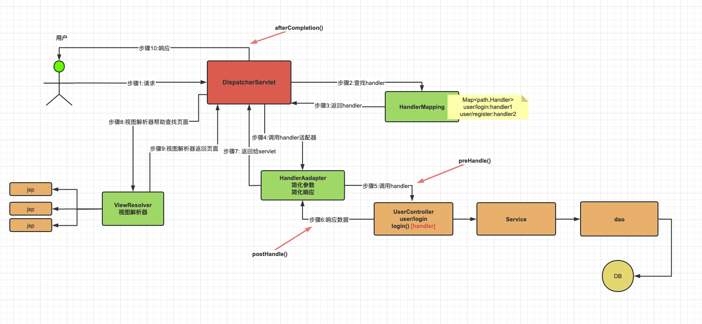
2.  修改配置类添加拦截器
    ```java
    @EnableWebMvc  //json数据处理,必须使用此注解,因为他会加入json处理器
    @Configuration
    @ComponentScan(basePackages = {"com.atguigu.controller","com.atguigu.exceptionhandler"}) //TODO: 进行controller扫描
    //WebMvcConfigurer springMvc进行组件配置的规范,配置组件,提供各种方法! 前期可以实现
    public class SpringMvcConfig implements WebMvcConfigurer {

        //配置jsp对应的视图解析器
        @Override
        public void configureViewResolvers(ViewResolverRegistry registry) {
            //快速配置jsp模板语言对应的
            registry.jsp("/WEB-INF/views/",".jsp");
        }

        //开启静态资源处理 <mvc:default-servlet-handler/>
        @Override
        public void configureDefaultServletHandling(DefaultServletHandlerConfigurer configurer) {
            configurer.enable();
        }

        //添加拦截器
        @Override
        public void addInterceptors(InterceptorRegistry registry) { 
            //将拦截器添加到Springmvc环境,默认拦截所有Springmvc分发的请求
            registry.addInterceptor(new Process01Interceptor());
        }
    }


    ```
3.  配置详解
    1.  默认拦截全部
        ```java
        @Override
        public void addInterceptors(InterceptorRegistry registry) {
            //将拦截器添加到Springmvc环境,默认拦截所有Springmvc分发的请求
            registry.addInterceptor(new Process01Interceptor());
        }

        ```
    2.  精准配置
        ```java
        @Override
        public void addInterceptors(InterceptorRegistry registry) {
            
            //将拦截器添加到Springmvc环境,默认拦截所有Springmvc分发的请求
            registry.addInterceptor(new Process01Interceptor());
            
            //精准匹配,设置拦截器处理指定请求 路径可以设置一个或者多个,为项目下路径即可
            //addPathPatterns("/common/request/one") 添加拦截路径
            //也支持 /* 和 /** 模糊路径。 * 任意一层字符串 ** 任意层 任意字符串
            registry.addInterceptor(new Process01Interceptor()).addPathPatterns("/common/request/one","/common/request/tow");
        }

        ```
    3.  排除配置
        ```java
        //添加拦截器
        @Override
        public void addInterceptors(InterceptorRegistry registry) {
            
            //将拦截器添加到Springmvc环境,默认拦截所有Springmvc分发的请求
            registry.addInterceptor(new Process01Interceptor());
            
            //精准匹配,设置拦截器处理指定请求 路径可以设置一个或者多个,为项目下路径即可
            //addPathPatterns("/common/request/one") 添加拦截路径
            registry.addInterceptor(new Process01Interceptor()).addPathPatterns("/common/request/one","/common/request/tow");
            
            
            //排除匹配,排除应该在匹配的范围内排除
            //addPathPatterns("/common/request/one") 添加拦截路径
            //excludePathPatterns("/common/request/tow"); 排除路径,排除应该在拦截的范围内
            registry.addInterceptor(new Process01Interceptor())
                    .addPathPatterns("/common/request/one","/common/request/tow")
                    .excludePathPatterns("/common/request/tow");
        }
        ```
4.  多个拦截器执行顺序
    1.  preHandle() 方法：SpringMVC 会把所有拦截器收集到一起，然后按照配置顺序调用各个 preHandle() 方法。
    2.  postHandle() 方法：SpringMVC 会把所有拦截器收集到一起，然后按照配置相反的顺序调用各个 postHandle() 方法。
    3.  afterCompletion() 方法：SpringMVC 会把所有拦截器收集到一起，然后按照配置相反的顺序调用各个 afterCompletion() 方法。

### 5.3 参数校验

> 在 Web 应用三层架构体系中，表述层负责接收浏览器提交的数据，业务逻辑层负责数据的处理。为了能够让业务逻辑层基于正确的数据进行处理，我们需要在表述层对数据进行检查，将错误的数据隔绝在业务逻辑层之外。

1.  **校验概述**

    JSR 303 是 Java 为 Bean 数据合法性校验提供的标准框架，它已经包含在 JavaEE 6.0 标准中。JSR 303 通过在 Bean 属性上标注类似于 @NotNull、@Max 等标准的注解指定校验规则，并通过标准的验证接口对Bean进行验证。
    | 注解                                                                                           | 规则                        |
    | -------------------------------------------------------------------------------------------- | ------------------------- |
    | @Null                                                                                        | 标注值必须为 null               |
    | @NotNull                                                                                     | 标注值不可为 null               |
    | @AssertTrue                                                                                  | 标注值必须为 true               |
    | @AssertFalse                                                                                 | 标注值必须为 false              |
    | @Min(value)                                                                                  | 标注值必须大于或等于 value          |
    | @Max(value)                                                                                  | 标注值必须小于或等于 value          |
    | @DecimalMin(value)                                                                           | 标注值必须大于或等于 value          |
    | @DecimalMax(value)                                                                           | 标注值必须小于或等于 value          |
    | @Size(max,min)                                                                               | 标注值大小必须在 max 和 min 限定的范围内 |
    | @Digits(integer,fratction)                                                                   | 标注值值必须是一个数字，且必须在可接受的范围内   |
    | @Past                                                                                        | 标注值只能用于日期型，且必须是过去的日期      |
    | @Future                                                                                      | 标注值只能用于日期型，且必须是将来的日期      |
    | @Pattern(value)                                                                              | 标注值必须符合指定的正则表达式           |
    | JSR 303 只是一套标准，需要提供其实现才可以使用。Hibernate Validator 是 JSR 303 的一个参考实现，除支持所有标准的校验注解外，它还支持以下的扩展注解： |                           |
    | 注解                                                                                                                                                                                                                                                                                                                                                | 规则                   |
    | ------------------------------------------------------------------------------------------------------------------------------------------------------------------------------------------------------------------------------------------------------------------------------------------------------------------------------------------------- | -------------------- |
    | @Email                                                                                                                                                                                                                                                                                                                                            | 标注值必须是格式正确的 Email 地址 |
    | @Length                                                                                                                                                                                                                                                                                                                                           | 标注值字符串大小必须在指定的范围内    |
    | @NotEmpty                                                                                                                                                                                                                                                                                                                                         | 标注值字符串不能是空字符串        |
    | @Range                                                                                                                                                                                                                                                                                                                                            | 标注值必须在指定的范围内         |
    | Spring 4.0 版本已经拥有自己独立的数据校验框架，同时支持 JSR 303 标准的校验框架。Spring 在进行数据绑定时，可同时调用校验框架完成数据校验工作。在SpringMVC 中，可直接通过注解驱动 @EnableWebMvc 的方式进行数据校验。Spring 的 LocalValidatorFactoryBean 既实现了 Spring 的 Validator 接口，也实现了 JSR 303 的 Validator 接口。只要在Spring容器中定义了一个LocalValidatorFactoryBean，即可将其注入到需要数据校验的 Bean中。Spring本身并没有提供JSR 303的实现，所以必须将JSR 303的实现者的jar包放到类路径下。 |                      |
    配置 @EnableWebMvc后，SpringMVC 会默认装配好一个 LocalValidatorFactoryBean，通过在处理方法的入参上标注 @Validated 注解即可让 SpringMVC 在完成数据绑定后执行数据校验的工作。
2.  **操作演示**
    -   导入依赖
        ```xml
        <!-- 校验注解 -->
        <dependency>
            <groupId>jakarta.platform</groupId>
            <artifactId>jakarta.jakartaee-web-api</artifactId>
            <version>9.1.0</version>
            <scope>provided</scope>
        </dependency>
                
        <!-- 校验注解实现-->        
        <!-- https://mvnrepository.com/artifact/org.hibernate.validator/hibernate-validator -->
        <dependency>
            <groupId>org.hibernate.validator</groupId>
            <artifactId>hibernate-validator</artifactId>
            <version>8.0.0.Final</version>
        </dependency>
        <!-- https://mvnrepository.com/artifact/org.hibernate.validator/hibernate-validator-annotation-processor -->
        <dependency>
            <groupId>org.hibernate.validator</groupId>
            <artifactId>hibernate-validator-annotation-processor</artifactId>
            <version>8.0.0.Final</version>
        </dependency>
        ```
    -   应用校验注解
        ```java
        import jakarta.validation.constraints.Email;
        import jakarta.validation.constraints.Min;
        import org.hibernate.validator.constraints.Length;

        /**
         * projectName: com.atguigu.pojo
         */
        public class User {
            //age   1 <=  age < = 150
            @Min(10)
            private int age;

            //name 3 <= name.length <= 6
            @Length(min = 3,max = 10)
            private String name;

            //email 邮箱格式
            @Email
            private String email;

            public int getAge() {
                return age;
            }

            public void setAge(int age) {
                this.age = age;
            }

            public String getName() {
                return name;
            }

            public void setName(String name) {
                this.name = name;
            }

            public String getEmail() {
                return email;
            }

            public void setEmail(String email) {
                this.email = email;
            }
        }

        ```
    -   handler标记和绑定错误收集
        ```java
        @RestController
        @RequestMapping("user")
        public class UserController {

            /**
             * @Validated 代表应用校验注解! 必须添加!
             */
            @PostMapping("save")
            public Object save(@Validated @RequestBody User user,
                               //在实体类参数和 BindingResult 之间不能有任何其他参数, BindingResult可以接受错误信息,避免信息抛出!
                               BindingResult result){
               //判断是否有信息绑定错误! 有可以自行处理!
                if (result.hasErrors()){
                    System.out.println("错误");
                    String errorMsg = result.getFieldError().toString();
                    return errorMsg;
                }
                //没有,正常处理业务即可
                System.out.println("正常");
                return user;
            }
        }
        ```
    -   测试效果

        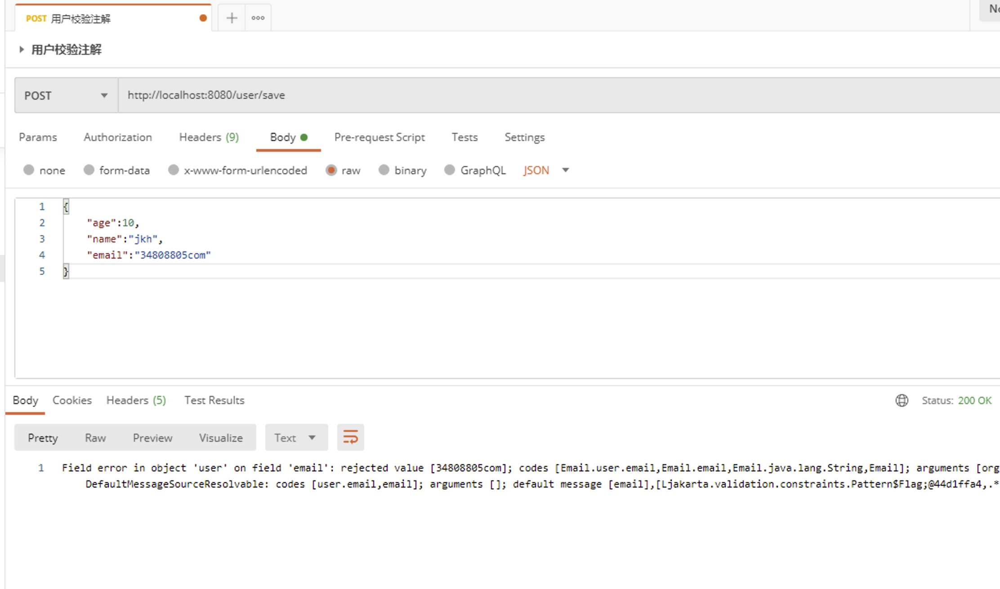
3.  **易混总结**

    @NotNull、@NotEmpty、@NotBlank 都是用于在数据校验中检查字段值是否为空的注解，但是它们的用法和校验规则有所不同。
    1.  @NotNull  (包装类型不为null)

        @NotNull 注解是 JSR 303 规范中定义的注解，当被标注的字段值为 null 时，会认为校验失败而抛出异常。该注解不能用于字符串类型的校验，若要对字符串进行校验，应该使用 @NotBlank 或 @NotEmpty 注解。
    2.  @NotEmpty (集合类型长度大于0)

        @NotEmpty 注解同样是 JSR 303 规范中定义的注解，对于 CharSequence、Collection、Map 或者数组对象类型的属性进行校验，校验时会检查该属性是否为 Null 或者 size()==0，如果是的话就会校验失败。但是对于其他类型的属性，该注解无效。需要注意的是只校验空格前后的字符串，如果该字符串中间只有空格，不会被认为是空字符串，校验不会失败。
    3.  @NotBlank （字符串，不为null，切不为"  "字符串）

        @NotBlank 注解是 Hibernate Validator 附加的注解，对于字符串类型的属性进行校验，校验时会检查该属性是否为 Null 或 “” 或者只包含空格，如果是的话就会校验失败。需要注意的是，@NotBlank 注解只能用于字符串类型的校验。
        总之，这三种注解都是用于校验字段值是否为空的注解，但是其校验规则和用法有所不同。在进行数据校验时，需要根据具体情况选择合适的注解进行校验。

## 六、SpringMVC总结

| 核心点         | 掌握目标                     |
| ----------- | ------------------------ |
| springmvc框架 | 主要作用、核心组件、调用流程           |
| 简化参数接收      | 路径设计、参数接收、请求头接收、cookie接收 |
| 简化数据响应      | 模板页面、转发和重定向、JSON数据、静态资源  |
| restful风格设计 | 主要作用、具体规范、请求方式和请求参数选择    |
| 功能扩展        | 全局异常处理、拦截器、参数校验注解        |
